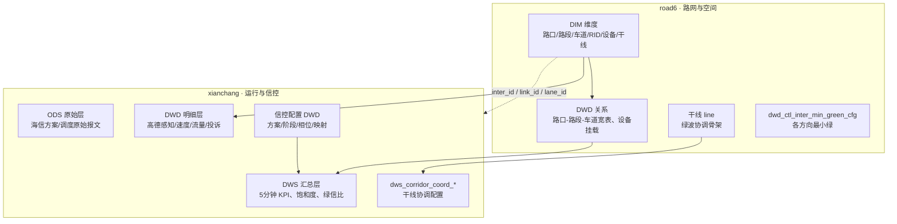
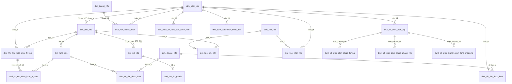

# PostgreSQL 路网与运行数据库参考

> 扫描时间：2026-06-18  
> 数据库：`ycx` @ `121.40.233.80:15432`  
> 路网 Schema：`road6`（`PGSCHEMA`）  
> 运行数据 Schema：`xianchang`（`PG_FLOW_SCHEMA`）

本文档供信号优化智能体、Skill Pack 脚本和人工排查使用，描述 **road6**（静态路网与空间关系）与 **xianchang**（动态指标、信控配置、现场数据）两个 Schema 的表结构、业务含义与关联方式。

---

## 1. 连接与环境变量

在项目根目录 `.env` 中配置（勿将密码提交到版本库）：

| 变量 | 说明 | 当前值示例 |
|------|------|-----------|
| `PGHOST` | 主机 | `121.40.233.80` |
| `PGPORT` | 端口 | `15432` |
| `PGUSER` / `PGPASSWORD` | 账号 | — |
| `PGDATABASE` | 库名 | `ycx` |
| `PGSCHEMA` | 路网 Schema | `road6` |
| `PG_CHANNEL_TABLE` | 路口渠化宽表 | `dwd_tfc_rltn_wide_inter_ft_link` |
| `PG_DIM_INTER_TABLE` | 路口维表 | `dim_inter_info` |
| `PG_DIM_LINK_TABLE` | 路段维表 | `dim_link_info` |
| `PG_FLOW_SCHEMA` | 流量/指标 Schema | `xianchang` |
| `PG_FLOW_TABLE` | 车道 5 分钟流量 | `dwd_tfc_lane_roadcross_flow_5mi` |
| `PG_INTER_LONLAT_SRS` | 路口坐标系 | `gcj02`（高德/国测局） |

**只读查询示例（psql）：**

```bash
psql -h $PGHOST -p $PGPORT -U $PGUSER -d $PGDATABASE
SET search_path TO road6, xianchang, public;
```

---

## 2. 总体架构

两个 Schema 分工明确：**road6 回答「空间上是什么」**，**xianchang 回答「运行得怎么样、怎么控」**。



### 2.1 数据分层约定

| 前缀 | 层级 | 典型用途 |
|------|------|----------|
| `dim_*` | 维度 | 路口、路段、车道、RID、设备、区域、字典 |
| `dwd_*` | 明细事实 | 关系宽表、原始/准原始时序、信控配置明细 |
| `dws_*` | 汇总服务 | 按 **星期 × 5 分钟时间片** 预聚合的 KPI，供智能体直接消费 |
| `ods_*` | 贴源 | 信号机厂商原始方案，一般不直接用于推理 |
| `sys_*` | 系统 | 操作日志、人工修订记录 |
| `tmp_*` / `*_copy*` / `*_his` | 临时/备份/历史 | 开发调试或拉链表，生产查询优先用主表 |

### 2.2 核心实体 ID

| ID | 长度 | 说明 | 跨 Schema |
|----|------|------|-----------|
| `inter_id` | 16 位 | 路口全局主键 | ✅ road6 ↔ xianchang 对齐（已验证流量表 813 个路口 100% 匹配） |
| `link_id` | 16~32 位 | 可计算路网路段（slink） | ✅ |
| `lane_id` | 16~100 位 | 车道 | ✅ |
| `rid_id` / `rid` | 32 位 | 高德微观路段 RID | road6.dim_rid_info；xianchang 速度/指标表 |
| `device_id` | 16~32 位 | 感知/信控设备 | road6 |
| `line_id` | 16 位 | 干线（同主路名 link 序列 + 信控路口序列） | road6 |
| `tfcunit_id` | 16~32 位 | 交通管控单元（大队/网格） | road6 |
| `cross_id` | 12 位 | GA/T 1049.2 路口编号 | xianchang 信控表 |
| `version_id` | 字符串 | 路网版本 | road6 当前启用 **`20260501`** |

### 2.3 时间片编码

| 粒度 | 字段 | 范围 | 含义 |
|------|------|------|------|
| 5 分钟 | `step_index` | 0–287 | 当日第 N 个 5 分钟片（`step_index * 5` 分钟 = 距 0:00 分钟数） |
| 2 分钟 | `step_index` | 0–719 | 当日第 N 个 2 分钟片 |
| 星期 | `day_of_week` | 1–7 | 1=周一 … 7=周日 |
| 日期 | `dt` | `yyyymmdd` | 部分 DWD 表使用 |
| 5 分钟窗口 | `stat_time` | timestamp | DWD 明细表窗口结束时刻 |

**转向编码 `turn_dir_no`：** `0`=方向聚合，`1`=左转（含调头），`2`=直行，`3`=右转。

**八方向编码 `dir8_code` / `f_dir_8`：** `0`=南向北，`1`=西南→东北，`2`=西向东，`3`=西北→东南，`4`=北向南，`5`=东北→西南，`6`=东向西，`7`=东南→西北。

---

## 3. 实体关系（逻辑关联）

库内 **仅 2 条显式外键**（均在 road6 干线模块）：

- `dim_line_inter_rltn.line_id` → `dim_line_info.line_id`
- `dim_line_link_rltn.line_id` → `dim_line_info.line_id`

其余关联通过 **业务主键** 连接，智能体查询时应显式 JOIN。



### 3.1 空间层级（由粗到细）

```
交通管控单元 tfcunit
  └── 路口 inter（dim_inter_info）
        ├── 进口/出口路段 link（dwd_tfc_rltn_wide_inter_ft_link，link_role=entrance/exit）
        │     └── 车道 lane（dwd_tfc_rltn_wide_inter_ft_lane / dim_lane_info）
        ├── 设备 device（dwd_tfc_rltn_devc_inter / devc_lane）
        └── 微观 RID（dim_rid_info，经 link.rid_ids_seq 映射）
干线 line（dim_line_info）
  ├── 有序 link 列表（dim_line_link_rltn）
  └── 有序信控路口列表（dim_line_inter_rltn，gap_to_prev_m < 1200m）
```

---

## 4. Schema `road6` — 路网与空间（34 张表）

当前启用路网版本：`dim_data_version.version_id = 20260501`。

### 4.1 维度表（DIM）

| 表名 | 行数≈ | 作用 | 主键/关联 |
|------|------:|------|-----------|
| `dim_data_version` | 1 | 路网版本开关 | `version_id`, `is_enable` |
| `dim_inter_info` | 30,916 | **路口维表**：名称、形态、坐标、是否信控、信号机编码 | PK: `(inter_id, version_id)`；信控路口 **5,447** 个 |
| `dim_link_info` | 58,571 | **路段维表**：起终点路口、几何、等级、长度、车道数、RID 序列 | PK: `(link_id, version_id)`；索引 `f_inter_id`, `t_inter_id` |
| `dim_lane_info` | 105,337 | **车道维表**：所属 link/inter、车道序号、功能码、几何 | `lane_id` + `link_id` + `inter_id` |
| `dim_rid_info` | 59,667 | **RID 维表**：高德微观路段，比 link 更细 | `rid_id`；`f_inter_id`, `t_inter_id` |
| `dim_device_info` | 15,981 | **设备台账**：卡口/电警/雷视/信号机等，含 `source_refs` 多源血缘 | `device_id` |
| `dim_line_info` | 293 | **干线定义**：同主路名 link 链 + 信控路口链（相邻信控间距 < 1.2km） | `line_id` |
| `dim_tfcunit_info` | 1 | **管控区域**：大队辖区/交通中区/信控网格边界 | `tfcunit_id` |
| `dim_navigate_inter_info` | 27,792 | 导航口径路口（与 dim_inter_info 类似，用途偏导航） | `inter_id` |
| `dim_rid_line_630` | 1,569 | RID 与干线名称映射（专项） | `rid_id` |
| `dici_name` | 334 | 字典名称 | — |

**历史/副本表（按需使用）：** `dim_*_his`、`dim_rid_info_copy1`、`ycx_road6_dim_inter_info`

### 4.2 关系与宽表（DWD）

| 表名 | 行数≈ | 作用 | 智能体常用 JOIN |
|------|------:|------|----------------|
| `dwd_tfc_rltn_wide_inter_ft_link` | 117,143 | **路口-路段方向关系**（进/出口、八方向、车道数） | `inter_id`, `link_id`, `link_role`, `dir8_code` |
| `dwd_tfc_rltn_wide_inter_ft_lane` | 210,674 | **路口-路段-车道宽表**（渠化明细） | `inter_id`, `link_id`, `lane_id`, `turn_move` |
| `dwd_tfc_rltn_wide_inter_ftrid` | 156,982 | 路口进口 RID → 出口 RID 转向关系 | `inter_id`, `f_rid_id`, `t_rid_id`, `turn_dir_no` |
| `dwd_tfc_rltn_wide_link_inter` | 0 | link 起终点路口及进出口角度 | 空表，暂不可用 |
| `dwd_tfc_rltn_wide_sinter_sinter_ridlist` | 37,127 | 信控路口对之间的 RID 路径列表 | `f_inter_id`, `t_inter_id`, `rid_list` |
| `dwd_tfc_rltn_devc_inter` | 11,955 | 设备↔路口（信号机/高点监控角色） | `device_id`, `inter_id`, `device_role` |
| `dwd_tfc_rltn_devc_lane` | 23,221 | 设备↔车道（流量/速度落车道） | `device_id`, `lane_id`, `phase_no` |
| `dwd_rltn_tfcunit_inter` | 863 | 管控网格↔路口 | `tfcunit_id`, `inter_id` |
| `dwd_rltn_tfcunit_link` | 0 | 管控网格↔路段（含覆盖比例） | 空表 |
| `dwd_rltn_tfcunit_device` | 1,001 | 管控网格↔设备 | |
| `dwd_rltn_rid_gaode` | 59,667 | 内部 RID ↔ 高德 RID 映射 | `rid_id`, `gaode_rid` |
| `dwd_ctl_inter_min_green_cfg` | 30,908 | **各方向最小绿**（JSON，键 `{方向}_{转向}`） | `inter_id`, `directions_min_green` |

**副本：** `dwd_tfc_rltn_devc_inter_copy1`

### 4.3 干线关系

| 表名 | 行数≈ | 作用 |
|------|------:|------|
| `dim_line_link_rltn` | 887 | line 内 link 有序序列（`seq_no` 从 1 起） |
| `dim_line_inter_rltn` | 770 | line 内信控路口有序序列；`gap_to_prev_m` 为与上一信控路口沿路距离（米） |

### 4.4 系统表

| 表名 | 行数≈ | 作用 |
|------|------:|------|
| `sys_operation_log` | 5,851 | 路口/路段/车道/设备人工操作日志 |
| `sys_link_info_recoad` | 28 | 路段修订记录 |
| `sys_tfc_rltn_devc_lane_recoad` | 1,423 | 设备-车道挂载修订记录 |

---

## 5. Schema `xianchang` — 运行数据与信控（62 张表）

### 5.1 信控配置（DWD · 方案/调度）

智能体做 **方案生成、相位分析** 时的核心来源。

| 表名 | 行数≈ | 作用 |
|------|------:|------|
| `dwd_ctl_inter_plan_cfg` | 1,179 | 配时方案头：周期、协调阶段、相位差、方案 JSON |
| `dwd_ctl_inter_plan_stage_timing` | 4,645 | 方案各阶段绿/黄/全红/最小绿/最大绿 |
| `dwd_ctl_inter_plan_stage_phase_rltn` | 15,284 | 阶段-相位 ring/barrier 关系 |
| `dwd_ctl_inter_signal_atom_lane_mapping` | 8,004 | **信号原子↔车道/转向映射**（配时下发通道转换） |
| `dwd_ctl_inter_stage_cfg` | 805 | 阶段基础配置 |
| `dwd_ctl_inter_stage_motor_flow_rltn` | 2,062 | 阶段-车流方向关系 |
| `dwd_ctl_inter_schedule_cfg` | 840 | 调度表（日期/星期/日计划） |
| `dwd_ctl_inter_day_plan_cfg` | 322 | 日计划头 |
| `dwd_ctl_inter_day_plan_period` | 3,086 | 日计划时段 |
| `dwd_ctl_inter_cycle_stage_exec_his` | 654 | 周期阶段执行历史 |
| `dwd_ctl_inter_period_plan_exec_his` | 654 | 时段方案执行历史 |
| `dwd_ctl_inter_timing_parse_quality_issue` | 520 | 方案解析质量问题 |
| `dwd_ctl_inter_manual_survey_issue` | 1,010 | 人工调研信控问题 |

**贴源 ODS（一般不直接推理）：** `ods_ctl_inter_scheme_hisense_raw`, `ods_ctl_inter_scheme_hisense_stage`, `ods_ctl_inter_schedule_period_raw`

### 5.2 交通感知明细（DWD · 时序）

| 表名 | 行数≈ | 粒度 | 作用 |
|------|------:|------|------|
| `dwd_tfc_lane_roadcross_flow_5mi` | 9,551,520 | 5min | **车道级流量**（`vehicle_count`, `volume`）；dt 覆盖 20260601–20260609，813 路口 |
| `dwd_tfc_inter_dir_perf_5min` | 7,947,071 | 5min | 高德路口进口×转向感知：排队、流量、停车、延误、LOS、溢出/失衡状态 |
| `dwd_amap_dimlink_speed_5mi` | 3,219,435 | 5min | 高德 link 速度 |
| `dwd_amap_rid_speed_15mi` | 1,204,693 | 15min | RID 速度 |
| `dwd_tfc_inter_index_2mi` | 2,383,211 | 2min | 路口级动态指标（四方向拆分） |
| `dwd_tfc_link_index_2mi` | 2,470,818 | 2min | link 级拥堵延时/速度 |
| `dwd_tfc_rid_index_2mi` | 2,250,350 | 2min | RID 级动态指标 |
| `dwd_tfc_line_index_2mi` | 243,360 | 2min | 干线级动态指标 |
| `dwd_tfc_tfcunit_index_2mi` | 1,440 | 2min | 交通单元级指标 |
| `dwd_tfc_rid_static` | 1,591 | 静态 | RID 静态指标 |
| `dwd_tfc_link_jamperiod_index_w` | 1,145 | 周 | 常发拥堵 link |

**副本/临时：** `dwd_amap_rid_speed_15mi_copy1`, `tmp_dwd_tfc_inter_dir_perf_5min`

### 5.3 汇总服务层（DWS · 智能体首选）

按 **`day_of_week` + `step_index`（5 分钟）** 预聚合，适合场景认知、问题诊断、方案校验。

| 表名 | 行数≈ | 核心指标 | 典型用途 |
|------|------:|----------|----------|
| `dws_inter_dir_turn_perf_5min_mm` | 7,238,632 | 排队、流量、停车、延误、LOS | **进口道×转向运行画像**（473 路口） |
| `dws_inter_approach_turn_perf_5min_mm` | 7,331,171 | 同上（approach 口径） | 进口道分析 |
| `dws_turn_saturation_5min_mm` | 821,497 | `turn_saturation` | **转向饱和度** |
| `dws_lane_saturation_5min_mm` | 1,311,055 | `lane_saturation`, `lane_flow` | 车道饱和度 |
| `dws_lane_capacity_5min_mm` | 1,330,543 | `lane_capacity` | 车道通行能力 |
| `dws_inter_link_turn_flow_5min_mm` | 1,348,704 | `turn_flow_total` | **转向小时流量**（优化器输入） |
| `dws_turn_min_green_5min_mm` | 947,088 | `min_green_time`, `green_time_plan` | 最小绿 vs 计划绿 |
| `dws_turn_green_utilization_5min_mm` | 821,365 | `green_utilization` | 绿灯利用率 / 空放 |
| `dws_inter_evaluation_5min_mm` | 173,414 | `saturation_max/avg`, `unbalance_index`, LOS | **路口综合评价** |
| `dws_inter_link_status_5min_mm` | 78,178 | link 级状态 | 上下游衔接 |
| `dws_link_index_5min_mm` | 988,273 | 拥堵延时、速度 | 路段运行 |
| `dws_line_val_index_5min_mm` | 325,644 | 干线指标 | 干线场景 |
| `dws_ctl_inter_turn_5min_his_mm` | 940,113 | 历史转向控制 | 方案评价 |
| `dws_area_comprehensive_index_5min_mm` | 2,012 | 区域拥堵延时、车速、在途量 | 区域场景 |

### 5.4 干线协调

| 表名 | 行数≈ | 作用 |
|------|------:|------|
| `dws_corridor_coord_cfg` | 89 | 干线协调配置头 |
| `dws_corridor_coord_group` | 1,273 | 协调组：路口序列、周期、相位差 JSON |
| `dws_corridor_coord_stop_mm` | 1,273 | 协调停车点 |

与 road6 的 `dim_line_info` / `dim_line_inter_rltn` 配合使用。

### 5.5 辅助维度与问题台账

| 表名 | 行数≈ | 作用 |
|------|------:|------|
| `dim_inter_entrance_weight` | 58,571 | 进口道权重 |
| `dim_lane_saturation_headway` | 14,257 | 车道饱和车头时距 |
| `dim_amap_link_lifecycle` | 200,409 | 高德 link 生命周期 |
| `dim_device_info_leishi` | 190 | 雷视设备补充 |
| `dwd_tfc_complaint_inter_issue` | 293 | 投诉问题台账 |
| `dwd_tfc_field_survey_inter_issue` | 86 | 现场调研问题 |
| `dici_info` | 242 | 字典 |
| `camera_hourly_vehicle` | 5,494,963 | 卡口小时车流量 |
| `hk_camera_0604` | 29,477 | 海康相机清单 |
| `base_all_dev_crossroad_*` | 349 | 路口设备贴源（20260610 快照） |

**临时表（勿用于生产）：** `tmp_link_rid_map`, `tmp_link_rid_total_len`, `tmp_rid_nds_map`, `tmp_rid_total_len`, `tmp_ztl_*`

---

## 6. 跨 Schema 关联速查

| 场景 | road6 表 | xianchang 表 | JOIN 条件 |
|------|----------|--------------|-----------|
| 路口基础 + 运行 KPI | `dim_inter_info` | `dws_inter_evaluation_5min_mm` | `inter_id` + `version_id='20260501'` |
| 渠化 + 转向流量 | `dwd_tfc_rltn_wide_inter_ft_link` | `dws_inter_link_turn_flow_5min_mm` | `inter_id`, `link_id`, `turn_dir_no` |
| 车道 + 饱和度 | `dim_lane_info` | `dws_lane_saturation_5min_mm` | `lane_id` |
| 方案 + 车道映射 | `dim_inter_info` | `dwd_ctl_inter_signal_atom_lane_mapping` | `inter_id` |
| 干线空间 + 协调 | `dim_line_inter_rltn` | `dws_corridor_coord_group` | `inter_ids_json` 包含关系 / 按 `line_id` 业务对齐 |
| link 指标 + 几何 | `dim_link_info` | `dws_link_index_5min_mm` | `link_id` |
| RID 速度 + 映射 | `dim_rid_info` + `dwd_rltn_rid_gaode` | `dwd_amap_rid_speed_15mi` | `rid` ↔ `gaode_rid` |

查询 road6 维表时建议加版本过滤：

```sql
WHERE version_id = (SELECT version_id FROM road6.dim_data_version WHERE is_enable = 1)
```

---

## 7. 智能体各阶段推荐数据表

与 `skillpacks/` 五环节闭环对齐：

| 环节 | 推荐表 | 说明 |
|------|--------|------|
| **场景认知** | `road6.dim_inter_info`, `dwd_tfc_rltn_wide_inter_ft_link`, `dws_inter_evaluation_5min_mm`, `dws_turn_saturation_5min_mm`, `dws_lane_capacity_5min_mm` | 供给（车道/渠化）+ 需求（流量/饱和度）+ 状态（LOS/失衡） |
| **问题诊断** | `dws_inter_dir_turn_perf_5min_mm`, `dws_turn_green_utilization_5min_mm`, `dwd_tfc_inter_dir_perf_5min`, `dwd_tfc_complaint_inter_issue`, `dwd_tfc_field_survey_inter_issue` | 溢流、空放、过饱和、失衡、投诉/调研证据 |
| **控制策略** | `dwd_ctl_inter_plan_cfg`, `dwd_ctl_inter_min_green_cfg`(road6), `dws_turn_min_green_5min_mm` | 现有方案约束、最小绿、可改善空间 |
| **方案生成** | `dws_inter_link_turn_flow_5min_mm`, `dwd_tfc_lane_roadcross_flow_5mi`, `dwd_ctl_inter_plan_stage_timing`, `dwd_ctl_inter_signal_atom_lane_mapping` | turnFlowTotal、相位绿信比、原子-车道映射 |
| **评价反馈** | `dws_inter_evaluation_5min_mm`, `dws_ctl_inter_turn_5min_his_mm`, `dwd_ctl_inter_cycle_stage_exec_his` | 前后 KPI 对比、执行历史 |
| **干线协调** | `road6.dim_line_info`, `dim_line_inter_rltn`, `xianchang.dws_corridor_coord_group`, `dws_line_val_index_5min_mm` | 路口序列、协调参数、干线 KPI |
| **区域管控** | `road6.dwd_rltn_tfcunit_inter`, `xianchang.dws_area_comprehensive_index_5min_mm` | 网格圈定、宏观指标 |

---

## 8. 常用 SQL 示例

### 8.1 按名称查信控路口

```sql
SELECT inter_id, inter_name, is_signalized, signal_controller_code,
       ST_AsText(ST_GeomFromText(geom_center)) AS center
FROM road6.dim_inter_info
WHERE version_id = '20260501'
  AND is_signalized = 1
  AND inter_name LIKE '%经十%舜华%'
LIMIT 20;
```

### 8.2 路口进口道渠化

```sql
SELECT inter_id, link_id, link_role, dir8_label, dir4_label,
       lane_num, c_lane_num, lane_info, turn_move
FROM road6.dwd_tfc_rltn_wide_inter_ft_link
WHERE version_id = '20260501'
  AND inter_id = :inter_id
ORDER BY link_clockwise_seq;
```

### 8.3 工作日早高峰转向饱和度（step 24–35 ≈ 07:00–08:00）

```sql
SELECT inter_id, link_id, turn_dir_no, step_index,
       turn_saturation, lane_saturation_detail
FROM xianchang.dws_turn_saturation_5min_mm
WHERE inter_id = :inter_id
  AND day_of_week = 1          -- 周一
  AND step_index BETWEEN 84 AND 95   -- 07:00–08:00
  AND is_deleted = 0
ORDER BY turn_saturation DESC;
```

### 8.4 转向流量（优化器 turnFlowTotal）

```sql
SELECT inter_id, link_id, turn_dir_no, step_index,
       turn_flow_total, avg_lane_flow_5min, lane_count
FROM xianchang.dws_inter_link_turn_flow_5min_mm
WHERE inter_id = :inter_id
  AND day_of_week = :dow
  AND step_index = :step
  AND is_deleted = 0;
```

### 8.5 当前配时方案与阶段

```sql
SELECT p.plan_no, p.plan_name, p.cycle_len_sec, p.offset_sec,
       t.stage_no, t.stage_seq_no, t.green_sec, t.yellow_sec, t.min_green_sec
FROM xianchang.dwd_ctl_inter_plan_cfg p
JOIN xianchang.dwd_ctl_inter_plan_stage_timing t
  ON p.inter_id = t.inter_id AND p.plan_no = t.plan_no
WHERE p.inter_id = :inter_id
  AND p.is_deleted = 0 AND t.is_deleted = 0
ORDER BY p.plan_no, t.stage_seq_no;
```

### 8.6 干线信控路口序列（绿波）

```sql
SELECT l.line_name, r.seq_no, r.inter_id, r.inter_name, r.gap_to_prev_m
FROM road6.dim_line_info l
JOIN road6.dim_line_inter_rltn r ON l.line_id = r.line_id
WHERE l.line_name LIKE '%舜华路%'
  AND l.is_deleted = 0 AND r.is_deleted = 0
ORDER BY r.seq_no;
```

---

## 9. 数据质量与使用注意

1. **坐标系**：路口/路段/车道几何为 **GCJ-02**（`.env` 中 `PG_INTER_LONLAT_SRS=gcj02`），与高德 JS API 一致。
2. **版本一致**：road6 所有维表/宽表查询应带 `version_id = '20260501'`（或查 `dim_data_version` 动态获取）。
3. **软删除**：xianchang 表普遍有 `is_deleted`，查询需 `is_deleted = 0`。
4. **空表**：`dwd_rltn_tfcunit_link`、`dwd_tfc_rltn_wide_link_inter` 当前无数据。
5. **覆盖范围**：流量表 `dwd_tfc_lane_roadcross_flow_5mi` 仅部分路口（813/30916）；DWS 汇总约 473 路口，使用前请确认目标 `inter_id` 是否有数。
6. **副本/临时表**：名称含 `_copy`、`_his`、`tmp_`、日期后缀的快照表仅作调试，优先使用主表。
7. **跨库**：项目运行时 MySQL（`MYSQL_*`）与 PostgreSQL 分工不同；**路网与交通指标以 PostgreSQL 为准**。

---

## 10. 相关项目文件

| 文件 | 说明 |
|------|------|
| `.env` | PG / 表名环境变量 |
| `docs/ARCHITECTURE.md` | 架构分层，参考资料目录说明 |
| `skillpacks/intersection/*/SKILL.md` | 各阶段技能包，可引用本文档作为数据字典 |
| `skillpacks/intersection/scene-cognition/scripts/calculate_saturation.py` | 饱和度计算（可对接 DWS 表） |
| `skillpacks/intersection/plan-generation/scripts/calculate_phase_splits.py` | 配时分割（可对接流量表） |

**维护建议：** 路网版本升级或新增 DWS 表后，重新执行 `information_schema` / `pg_stat_user_tables` 扫描并更新本文档第 4、5 节表清单与行数。
