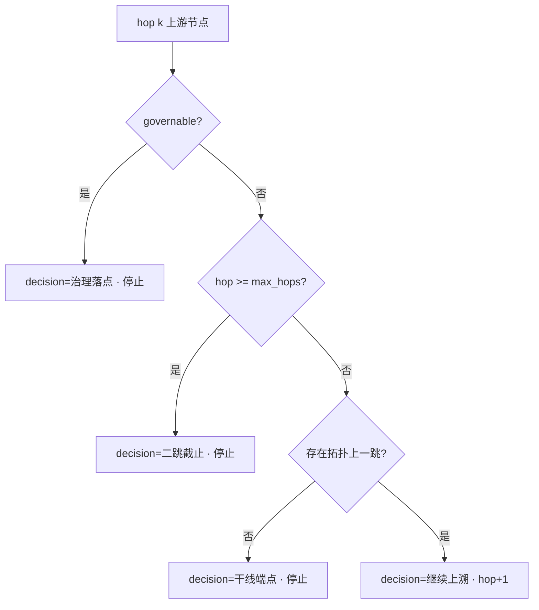

# 流量溯源规则（现行）

> 以仓库最新代码为准（2026-07-01）。实现索引：`upstream_governance_trace_service.py`、`upstream_topology_service.py`、`orchestrator._run_upstream_trace`、`utils/trace_approach.py`。

---

## 1. 触发与范围

| 项 | 规则 |
|----|------|
| 触发条件 | 选定进口道上任一转向 `turn_saturation ≥ trigger_saturation`（默认 **0.90**，`upstream_trace.trigger_saturation`） |
| 溯源进口 | **仅一条进口道**（见 §2） |
| 递归上限 | **5 跳**（`upstream_trace.max_hops`，含 hop1…hop5 上游节点） |
| 拓扑模型 | **单链**：沿用户选定 `corridor_dir8` 逐跳上溯，**不分叉**（已废弃「二跳三分叉」设计） |
| 路径真值 | `dim_link_info.geom`（`UpstreamTopologyService`）；禁止中心飞线 |

---

## 2. 单进口道选择（优先级）

| 优先级 | 用户表达 | 结果 |
|--------|----------|------|
| P0 | 进口 + 转向（如「西左转」） | 唯一 dir8 + turn_no |
| P1 | 方向组（如「东西向」「南北向」） | **组内第一个方位**：东西向→**东进口**(2)，南北向→**北进口**(0) |
| P2 | 具体进口（如「西进口」） | 唯一 dir8 |
| P3 | 未指定 | 过饱和进口中 **饱和度最高** 者 |

实现：`intersection_agent/utils/trace_approach.py` → `resolve_trace_approach()`。

---

## 3. 一跳 vs 多跳（用户可见）

| 跳 | 含义 | 何时出现 |
|----|------|----------|
| hop0 | 目标路口 + 选定进口 | 诊断/渠化阶段 |
| hop1 | 该进口 **地理上一路口** | **始终**（`resolve_approach_link` → `f_inter_id`） |
| hop2–5 | 继续沿同一走廊上溯 | 见 §4「不可治理 → 继续上溯」 |

**数据层一跳压缩**：`flow_trace_service.lock_one_hop()` 在同一 `(cor_dir8, cor_turn)` 取最大 `flow_share_ratio`，避免统计多跳叠加；展示上一跳以 **拓扑 link** 为主，correlate 为辅。

---

## 4. 可治理 / 不可治理判定（复查用）

代码：`upstream_governance_trace_service.is_governable()`  
阈值：`upstream_trace.full_saturation`（默认 **0.85**）、`upstream_trace.governable_green_util`（默认 **0.50**）。

### 4.1 输入

某上游节点 `inter_id` 的四进口道 profile（`DataFetcher.approach_profiles`），每项含：

- `turn_saturation_max`：该进口道各转向饱和度最大值  
- `green_util_min`：该进口道各转向绿灯利用率最小值（可为 null）

### 4.2 判定逻辑

```
has_slack_dir   = ∃ 进口道 turn_saturation_max < full_saturation
has_empty_green = ∃ 进口道 green_util_min 非空 且 green_util_min < governable_green_util

governable = has_slack_dir OR has_empty_green
```

| governable | 节点 decision | 递归 |
|------------|---------------|------|
| **true** | `治理落点` | **停止** |
| **false** 且 `hop < max_hops` 且有拓扑上一跳 | `继续上溯` | **hop + 1** |
| **false** 且 `hop >= max_hops` | `二跳截止`（文案沿用，实为溯源上限） | **停止** |
| 无拓扑上一跳 | `干线端点` | **停止** |

### 4.3 语义说明

- **可治理**：至少一个进口道未全饱和，或存在绿灯利用率空槽 → 可在该路口借调绿信比，作为跨路口协调落点。  
- **不可治理**：四向均 `turn_sat_max ≥ full_sat` **且** 无 `green_util_min < 0.5` → 本地信控空间不足，**继续沿走廊上溯**（若未达 5 跳）。  
- **注意**：目标路口（hop0）不参与 governable 判定；从 **hop1** 起判定。

### 4.4 决策流程



---

## 5. 上游路口十字渲染（feed_segments）

每个上游节点（hop ≥ 1）携带 `turn_split`：汇入下游走廊的来流按 `(cor_dir8, cor_turn)` 归一占比。

地图在 **该上游路口** 高亮对应进口道的 **完整 link 折线**（`f_inter` 上游路口 → 本上游路口），而非路口附近短截段：

- 对每个 `(cor_dir8, cor_turn)`：`resolve_approach_link(上游路口, cor_dir8)` → `dim_link_info.geom` 全路径  
- 线宽 / 透明度 ∝ `share_pct`  
- 标签：`feed_direction` + 百分比；可选展示 `from_inter_name`（上游的上游路口名）  

---

## 6. 阈值配置

见 `backend/rules/thresholds_extensions.yaml`：

```yaml
upstream_trace:
  trigger_saturation: 0.90
  full_saturation: 0.85
  governable_green_util: 0.50
  max_hops: 5
```

---

## 7. 已废弃设计

以下文档中的 **二跳三分叉**、**max_hops=2**、**多进口并行溯源** 描述已废弃，仅作历史参考：

- `docs/plans/2026-06-30-进口道流量溯源与上游治理落点-设计与计划.md`
- `docs/plans/2026-06-30-进口道流量溯源与上游治理落点-实施计划.md`

现行计划：`docs/plans/2026-07-01-流量溯源十字渲染与单进口收口.md`
