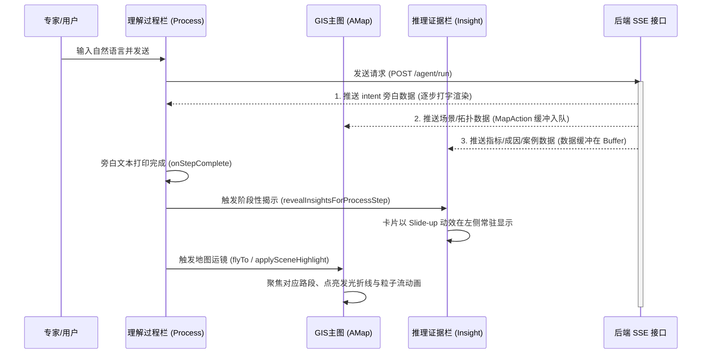

# 交通智能体演示系统 - 前端交互逻辑与数据流设计 (优化版)

本设计文档详细定义了前端系统在生命周期、状态转换、流式渲染（SSE）、人机协同反馈以及接口映射上的交互行为与控制流逻辑，特别针对流量溯源及渠化可视化部分的渲染与交互细节进行了深度补充。

---

## 一、 系统状态机与三栏协同生命周期

前端系统底层状态管理严格遵循“三栏分离协同”原则。



### 1. 粘性揭示机制 (Sticky Reveal Timing)
- 为了避免地图 and 侧栏信息抢跑，导致观众的视觉焦点游移，所有从 API 接收到的证据卡数据（`ProblemEvidence`, `RuntimeMetrics`）首先进入 `usePresentation` 的临时缓冲区（`dataInsightBuffer`）挂起。
- 只有当右侧的 **理解过程栏 (Process Panel)** 对应的步骤完成打印（触发 `onStepComplete` 事件）时，才调用 `revealInsightsForProcessStep` 将对应的证据卡状态从 `hidden` 变更为 `revealed`，并在左侧 **推理证据栏 (Insight Stack)** 渲染卡片。
- 一旦卡片揭示，它会处于常驻显示状态（Sticky），不会因为用户点击切换步骤而消失，从而使专家能够纵览所有已验证的历史诊断证据。

---

## 二、 高德地图 (AMap) 交互与流量溯源控制流

流量溯源是整个演示的重头戏，地图交互和发光粒子渲染需遵循如下逻辑：

### 1. 流量溯源图层初始化与销毁控制
- 当执行到第五幕“干线协调”时，主图层控制器调用 `UpstreamTraceLayer.ts`。
- **清除诊断覆盖物**：立即清空之前的路口红色虚线框 Polygon、车道级微观覆盖物、静态红黄拥堵 Marker，以避免杂乱视觉信息干扰。
- **构建溯源关系网**：
  - 读取 `phases.diagnosis.flow_trace.entry_traces` 或 `upstream_correlate_map`。
  - 按路口（`intersections`）和链路（`links`）逐个实例化发光折线层（`Polyline`），并将流动粒子 Marker 添加进 `requestAnimationFrame` (rAF) 的更新队列。

### 2. 溯源节点与气泡标签的 Click 交互逻辑
- **来向/去向节点 Marker 触发**：
  - 上游/下游节点 Marker 初始为仅带阴影和呼吸灯的发光圆点，其 `clickable` 属性设为 `true`。
  - 用户用鼠标点击节点 Marker 时，Marker 监听 `click` 事件，调用 `toggleLabel(nodeId)` 方法。
- **动态创建气泡 (Overlay Label)**：
  - 触发后，在节点上方偏移 `[10, -48]` 像素处弹出发光背景的磨砂玻璃气泡标签（`AMap.Marker` 带自定义 content）。
  - **标签展示数据**：
    - 上游来向：显示路口名、车流向（如“东向西直行”）、以及该来向路径所占的流量比例（`flow_share_ratio`，如 `42%`）。
    - 下游去向：显示下游路口名、当前承接转向（如“直行”）、去向流量占比及下游是否发生拥堵饱和（如 `[直行 ➔ 下游保护路口 55% 饱和]`）。
  - 用户再次点击该节点，气泡淡出隐藏。同一时间默认仅展开最大占比（`defaultOpenUpstreamId`）的上游气泡，保持界面简洁。

---

## 三、 微观渠化小窗与指标数据联动

### 1. 弹出时机
- 右下角的**渠化小窗**在理解过程前两步时处于折叠或隐藏状态。
- 从第三步“指标加载与溢出验证”起，随着地图缩放至车道级精度，渠化小窗自动从右下角 Slide-in 弹出。

### 2. 指标数据注入与车道渲染
- 渠化小窗读取 `cognition.arms` （各进口车道拓扑）。
- 每一个车道（Lane）组件监听 `runtimeMetrics` 中该转向车道的平均排队比和排队长度：
  - 排队比 $< 0.6$ ➔ 车道指示器箭头渲染为**安全绿**。
  - 排队比 $0.6 \sim 0.9$ ➔ 车道指示器箭头渲染为**警戒橙**。
  - 排队比 $\ge 0.9$ ➔ 车道指示器箭头渲染为**溢流红**，并在车道顶部叠加闪烁的 `!` 报警。
- 点击渠化小窗，小窗可水平向左滑动展开为**“配时环图（TimingRingMiniWindow）”**，展示环图配时分配，实现渠化与信号配时的立体化比对。

---

## 四、 协同反馈、修改再生成及异常状态处理

### 1. SSE 实时状态及断线重连交互
- 底部全局流水线状态栏左侧显示一个微小的信号状态灯。
- 当 `EventSource` 处于 `connecting` 态时，指示灯呈黄色慢速闪烁；处于 `open`（已连接）态时，指示灯呈翠绿发光常亮；处于 `closed` 或 `error`（断开/异常）态时，显示红色警戒状态，并自动向专家弹出 Toast：
  > 🔌 **网络提示**：实时路口数据流断开，正在尝试第 1/3 次重连；或您可以选择【使用预置演示数据（Mock Mode）】继续演示。

### 2. 方案修改再生成（Plan Re-generation）流程
当专家对生成的候选方案不满意，在底部输入 Dock 提交修改意见时：

```
[专家键入修改词] ➔ [选择重启点(方案生成)] ➔ [点击“修改再生成”]
                                             │
┌────────────────────────────────────────────┘
▼
[底部抽屉方案卡片转为骨架屏 Loading 遮罩] ➔ [底部进度条“输出方案”节点闪烁]
                                             │
┌────────────────────────────────────────────┘
▼
[接收 POST /plan/regenerate 响应] ➔ [方案卡片 Slide-in 重新推入更新]
                                             │
└────────────────────────────────────────────➔ [高亮变更的配时秒数 (3秒黄底高亮渐灭)]
```

- **秒数差异对比标记**：
  - 新方案推入后，前端会将新方案参数与旧方案缓存进行 Differ 比较。
  - 若“东向西直行绿灯”从 `45s` 调整为了 `48s`，则在面板数字 `48` 背后渲染一个黄色发光渐变背景（`animation: highlight-fade 2s ease-out`），使专家的视线能瞬间锁定由其修改意见直接导致的配时秒数微调结果。
- **回滚与退出监听**：
  - 方案一旦下发（接受并执行），前端在后台启动对 `/intersection/load/stream` 指标流的持续监听。
  - 若回滚条件（如 `下游排队比 > 1.05` 触发），前端大屏顶部将弹出醒目的红色“触发自动回滚，方案已重置为历史配时”强告示横幅。

---

## 五、 方案生成与多方案比选数据交互逻辑

配合阶段方案生成与方案比选的 UI 面板（参考方案生成与方案对比图），前端对应的数据流通路及接口契约细化如下：

### 1. 视图切换与状态管理 (View Switching)
- 前端通过底部抽屉面板的局部状态键 `planActiveTab` 控制子视图切换：
  - `activeTab === 'stage_generation'` ➔ 呈现**阶段方案微调与供需强度图**。
  - `activeTab === 'plan_comparison'` ➔ 呈现**多方案比选矩阵与干线协调范围图**。
- 地图根据 `planActiveTab` 的变化执行联动：
  - 切换到 `stage_generation` 时，地图自动平滑 FlyTo 缩放聚焦至**当前路口微观车道层**，并为各个转向以蓝/绿/橙色箭头标注其行驶流向。
  - 切换到 `plan_comparison` 时，地图平滑 Zoom Out 至**干线或区域宏观路网层**，重点展示绿波协调路径与各协调节点（发光圈）。

### 2. 阶段方案生成数据流与图表渲染 (Stage Plan Data Flow)
- **阶段卡片数据源**：
  - 各阶段放行方向、前/后秒数读取自 `response.plan.recommended.timing.phase_stage_timing_list[]` 数组。
  - 前端计算并显示差值：`delta = post_green_time_s - pre_green_time_s`。
- **供需强度条形图数据源**：
  - 供给强度（Capacity）与需求强度（Demand）数据来自信控服务加载的流量状态或 API 注入元数据。
  - 计算各转向的供需比（Volume-to-Capacity Ratio, $V/C$）：`ratio = demand_intensity / supply_intensity`。当 $V/C > 1.0$ 时，条形图超限并标红，表示该转向严重饱和，亟需增加放行秒数。
- **方向示意图与 AMap 交互**：
  - 地图图层拉取路口的转向连线（Turn Links），直行流线赋色天蓝（`#00f0ff`），左转流线赋色橘黄（`#ff9900`），与小窗的图例保持一致，增强空间感知。

### 3. 多方案比选矩阵与干线协调图数据流 (Comparison Matrix & Corridor Flow)
- **多方案比选矩阵数据源**：
  - 顶部候选方案卡片（数量动态不固定）的通行效率、延误和风险级别读取自 `plan.candidates[]` 对应的指标字段，支持水平滚动加载。
  - **供需比对比矩阵表**：读取 `plan.candidates[].vc_predictions`（各方案对各进口道未来供需比的预测数据）。
  - **预测供需比色条渲染**：前端将供需比数值映射为 HSL 颜色渐变：
    - $V/C \le 0.7$ ➔ 发光纯绿 `hsl(140, 70%, 40%)`。
    - $V/C = 0.9$ ➔ 警戒黄 `hsl(45, 80%, 50%)`。
    - $V/C \ge 1.0$ ➔ 拥堵红 `hsl(0, 70%, 50%)`。
  - 整体综合供需比优于临界值 $0.85$ 时，表格单元格右侧挂载绿色带有微光动效的 `“优”` 状态标签（对应 `badge: 'excellent'`）。
- **干线协调图（Corridor Diagram）数据源**：
  - 读取推荐方案中的协调路口配置：`plan.recommended.corridor_nodes`。
  - 连线渲染：前端 Canvas/SVG 组件读取路段的拥堵状态，若是目标协调段，绘制为绿色 `━━`；若是已发生反向溢流或严重拥堵的路段，绘制为红色 `━━`，与 Inset 缩略地图中的高动态路网路况完美同步。
