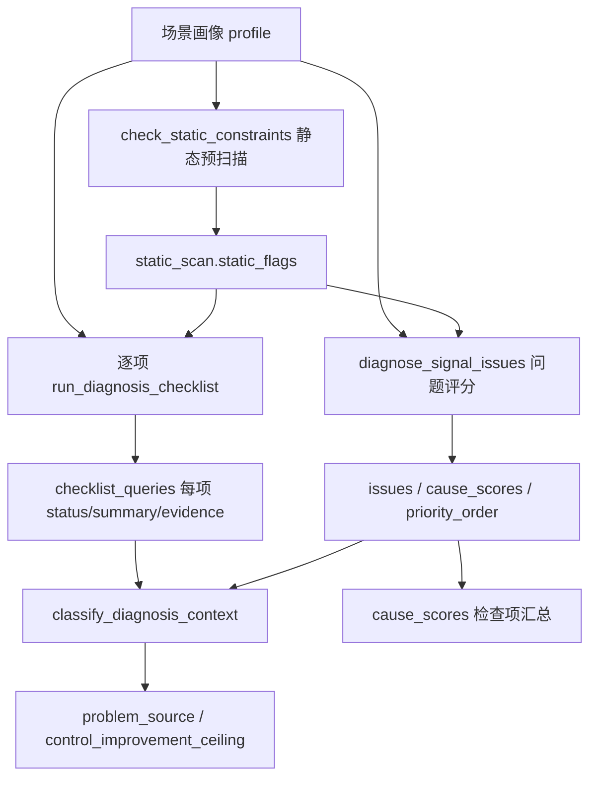

# 路口问题诊断 · 检查项数据处理与判定逻辑

> **面向读者**：交通信号控制与路口治理专家，用于排查诊断结论、核对数据依据、校准阈值。  
> **机器真源**：`diagnosis_checklist.yaml`（检查单清单）、`thresholds.yaml`（阈值）、`run_diagnosis_checklist.py`（逐项判定）、`check_static_constraints.py`（静态预扫描）、`score_intersection_issues.py`（问题评分与成因汇总）。  
> **版本**：与 `diagnosis_checklist.yaml` v1.0.0 对齐。

---

## 1. 执行流程概览

**检查顺序**：静态 → 动态 → 特殊 → `cause_scores` 成因汇总（最后一项）。

**每项输出状态**：

| status | 含义 |
| --- | --- |
| `passed` | 有数据，未触发问题 |
| `triggered` | 有数据，命中问题/风险 |
| `no_data` | 缺少关键字段，无法判定 |
| `error` | 脚本异常 |

**画像字段读取优先级**（`_diagnosis_inputs`）：多数动态指标按 `traffic_state` → `demand_profile` → `metrics_summary` / `metrics` 顺序取第一个有效数值；控制类指标读 `control_profile`（或兼容 `signal`）；上下文标签读 `context_tags` + `context` 字典 + `quality_tags`。

---

## 2. 静态预扫描（所有静态项共用）

`check_static_constraints.py` 在逐项检查前执行一次，产出 `static_scan`，供多项检查复用。

| 扫描逻辑 | 输入字段 | 产出 flag.code | 严重度 |
| --- | --- | --- | --- |
| 漏斗效应标记 | `supply_profile.static_flags` 含 `funnel_effect` | `funnel_effect` | high |
| 进出口数量不匹配 | `static_flags` 含 `more_entrances_than_exits` | `entrance_exit_mismatch` | medium |
| 断面/车道不匹配 | `exit_lane_deficit` / `in_out_lane_mismatch` / `road_section_mismatch` | `road_section_mismatch` | medium |
| 专用导向车道但相位≤2 | `channelization` 转向车道 + `control_profile.phase_sequence` | `phase_channel_mismatch` | high |
| 右转车道过窄 | 右转车道 `width_m` < 3.25m 或 `static_flags` 含 `right_turn_lane_narrow` | `right_turn_lane_narrow` | medium |
| 相邻路口间距过短 | `adjacent_inter_spacing_m` < 150m | `short_spacing_chain` | medium |
| 出入口距路口过近 | `driveway_spacing_m` 低于道路等级阈值（主干100/次干80/支路50m） | `driveway_too_close` | medium |
| 公交/出入口/强吸引点 | `context.aoi_sources`（场景认知 §1.3） | `bus_stop` / `driveway_interference` / `strong_attractor` | medium |
| 进口能力不足 | `approach_capacity_ratio` < 1.0 | `approach_capacity_deficit` | medium |
| 流向 V/C 过高 | `movement_vc_ratio` > 1.0 | `movement_capacity_deficit` | high |
| 车道组能力不均衡 | `lane_group_capacity_unbalance` > 1.0 | `lane_group_capacity_unbalance` | medium |
| 绕行时间长 | `detour_time_min` > 30min | `tidal_detour_pressure` | medium |
| 出口道数不足 | `exit_lane_merge_diff` > 0 | `outlet_capacity_mismatch` | high |
| 慢行设施不足 | `no_bike_lane` / `excessive_crosswalks` / `bike_waiting_area_insufficient` | 同名 code | medium |
| 学校/医院 POI | `context_tags` 含 school/hospital | `special_poi_protection` | medium |

---

## 3. 静态检查项

### 3.1 `phase_channel_mismatch` — 相位相序与渠化是否匹配

| 项目 | 说明 |
| --- | --- |
| **类别** | static |
| **关联问题码** | `phase_channel_mismatch` |
| **专家方法** | `专家经验调试/路口交通问题诊断方法.md` §1（EXP-DIAG-011） |
| **主要画像字段** | `supply_profile.channelization`、`control_profile.stage_detail[].release_movements`、`phase_sequence` |

**数据处理**：
1. `diagnosis_static_logic.analyze_phase_channel_match` 按信号阶段 + 逐进口方向核查（规则 A–D）。
2. `check_static_constraints` 将命中写入 `static_scan.phase_channel_analysis` 与 `phase_channel_mismatch` flag。
3. 无渠化，或既无 `stage_detail` 又无 `phase_sequence` → `no_data`。

**判定逻辑**（任一命中 ❌ → 触发；同进口直左同放、放行与渠化字段不能互证等仅输出复核提示，不单独触发）：

| 规则 | 条件摘要 |
| --- | --- |
| A | 阶段内对向一方放直行、另一方放左转，且任一方进口车道数 ≥ 3 |
| B | 阶段内两条垂直进口同时放直行 |
| C | 有左转专用道但无对应左转专用位；或左转仅与对向直行同放且该进口车道数 ≥ 3 |
| D | 有专用直行车道/左转车道，但全方案无对应转向放行 |

**专家复核要点**：输出对齐报告模板 `phaseChannelMatch`（每进口：车道功能、左转专用相位、判定、命中规则）。右转车流不纳入相位约束判定。

---

### 3.2 `lane_flow_mismatch` — 渠化设计与车流量是否匹配

| 项目 | 说明 |
| --- | --- |
| **阈值** | `channelization.*`（结构偏差、转向占比、饱和度失衡）；辅助指标 `static.lane_utilization_cv`、`static.lane_mismatch_index` 供证据回链 |
| **专家方法** | `专家经验调试/路口交通问题诊断方法.md` §2（EXP-DIAG-012） |
| **关联问题码** | `lane_mismatch` |

**数据处理**：
- 按进口方向汇总车道功能配置比（左:直:右）与流量占比；混行车道按可服务转向均分。
- `diagnosis_static_logic.analyze_lane_flow_match` 执行规则 A–D。
- 分转向饱和度读 `traffic_state.movement_saturation` / `demand_profile.movement_volume`。
- 某进口无渠化或无转向流量 → 跳过该进口；全部进口均缺数据 → `no_data`。

**判定逻辑**（任一进口或路口级命中 ❌ → 触发）：

| 规则 | 条件摘要 |
| --- | --- |
| A | 左转流量占比 ≥ 25% 且无左转专用道（含仅混行） |
| B | 直行流量占比 ≥ 60% 且有效直行车道 ≤ 1 且直行饱和度 ≥ 0.85 |
| C | 结构偏差指数（\|配置比 − 流量比\| 之和）≥ 0.50 |
| D | 同进口某转向饱和度 ≥ 0.90 且另一转向 ≤ 0.50 |

---

### 3.3 `funnel_effect` — 进出口漏斗效应

| 项目 | 说明 |
| --- | --- |
| **专家方法** | `专家经验调试/路口交通问题诊断方法.md` §3（EXP-DIAG-013） |
| **关联问题码** | `lane_mismatch` |

**数据处理**：
- `diagnosis_static_logic.analyze_funnel_effect` 按进口方向 × 对向出口成对排查进口**直行动线**能否承接。
- 左转、右转、左直混行不计入直行断面；勿简单比较进出口总车道数。
- 无进出口 link 数据且无预扫描标记 → `no_data`；回退 `supply_profile.static_flags` / `funnel_details`（由 `check_static_constraints` 预扫描）。

**判定逻辑**（任一对命中 ❌ → 触发）：

| 规则 | 条件摘要 |
| --- | --- |
| A | 进口直行车道数 > 对向出口车道总数 |
| B | 有进口的方向数 > 有出口的方向数 |

---

### 3.4 `adjacent_spacing` — 相邻路口间距是否过短

| 项目 | 说明 |
| --- | --- |
| **阈值** | `adjacent_spacing_m` < **150m** |
| **关联问题码** | `green_wave_break` |

**数据处理**：读 `supply_profile.adjacent_inter_spacing_m`；认可 `short_spacing_chain` flag。

**判定逻辑**：

| 条件 | 结果 |
| --- | --- |
| 间距 ≤ 0 | no_data |
| 间距 < 150m 或 static_scan 命中 | **触发** |
| 否则 | passed |

---

### 3.5 `road_segment_interference` — 公交站点、出入口、强吸引点干扰

| 项目 | 说明 |
| --- | --- |
| **关联问题码** | `external_disturbance`；出入口类另加 `downstream_blockage` |
| **主要画像字段** | `context.aoi_sources`；回退 `scenario_report.basicScenario.attractionSources`（场景认知 §1.3） |
| **场景认知回链** | `profile_checklist_ref: aoi_sources` |

**数据处理**（来源：场景认知 800m 半径 AOI/POI 检索）：
- `type=公交站` → `bus_stop`
- POI 出入口（`accessRole`）或停车场出入口 POI → `driveway_interference`
- `type` 为学校/医院/商圈/港区/园区/查验口/收费站，或面状停车场 → `strong_attractor`
- 补充：`driveway_spacing_m` 低于道路等级阈值 → `driveway_too_close`（静态预扫描）

**判定逻辑**：

| 条件 | 结果 |
| --- | --- |
| 无 `aoi_sources` / `attractionSources` 字段 | no_data |
| 已检索但无干扰类型命中 | passed（has_data=true） |
| 存在任一干扰证据 | **触发** |
| 出入口/过近类证据 | 额外标记 `downstream_blockage` |

---

### 3.6 `slow_traffic_facilities` — 慢行设施与右转空间

| 项目 | 说明 |
| --- | --- |
| **阈值** | `conflict.risk_high` = **0.60** |
| **关联问题码** | `pedestrian_protection_gap`；冲突高时加 `phase_sequence_conflict` |

**数据处理**：
- static_flags / context_tags：`no_bike_lane`、`excessive_crosswalks`、`bike_waiting_area_insufficient`、`right_turn_lane_narrow`、`special_poi_protection`
- 冲突标签：`pedestrian_conflict`、`bike_conflict`
- `traffic_state.conflict_risk`

**判定逻辑**：

| 条件 | 结果 |
| --- | --- |
| 无 flag、无标签、conflict_risk=0 | passed（已检索） |
| 存在慢行不足证据 **或** conflict_risk ≥ 0.60 | **触发** |

---

## 4. 动态检查项

### 4.1 `demand_pressure_perception` — 需求压力感知（高饱和持续）

| 项目 | 说明 |
| --- | --- |
| **阈值** | 路口饱和度 ≥ **0.8**（`saturation.high`）连续持续 ≥ **2h** |
| **关联问题码** | — |
| **场景认知回链** | `profile_checklist_ref: inter_evaluation` |

**数据处理**（`source_raw.inter_evaluation` → 回退 `traffic_state.high_saturation_duration_h`）：
- 从 `inter_evaluation` 5min 时序取 `saturation_max` / `saturation_avg`
- 连续步长均 ≥ 0.8 且累计 ≥ 2h → **触发**

**判定逻辑**：无时序且无预置时长 → no_data；存在 ≥2h 连续高饱和窗口 → **触发**。

---

### 4.2 `spillback` — 排队溢出与锁死风险

| 项目 | 说明 |
| --- | --- |
| **阈值** | `spillback_risk` ≥ **0.80**；`queue_storage_ratio` ≥ **0.80** |
| **关联问题码** | `spillback` |
| **场景认知回链** | `profile_checklist_ref: turn_perf` |

**数据处理**：
- `spillback_risk`、`queue_storage_ratio` ← state/metrics
- 若 `queue_storage_ratio=0` 且 `queue_m`、`storage_m` 均有值：`queue_storage_ratio = queue_m / storage_m`

**判定逻辑**：spillback 与 queue_ratio 均为 0 → no_data；任一超阈值 → **触发**。

---

### 4.4 `downstream_blockage` — 下游阻塞/出口干扰

| 项目 | 说明 |
| --- | --- |
| **阈值** | `spillback.risk_high` = **0.80**（组合判定） |
| **关联问题码** | `downstream_blockage` |
| **场景认知回链** | `profile_checklist_ref: turn_perf` |

**数据处理**：
- `spillback_risk` ← `traffic_state`
- 外部标签：`illegal_parking`、`driveway_interference`、`construction`、`incident`、`bus_stop`

**判定逻辑**：

| 条件 | 结果 |
| --- | --- |
| spillback=0 且无外部标签 | no_data |
| (spillback ≥ 0.80 **且** 存在外部标签) **或** 存在 construction/incident/driveway_interference | **触发** |
| 否则 | passed |

> **与 `spillback` 项区别**：本项强调「溢流 + 外部扰动」组合，或施工/事故/出入口类强证据；单独高溢流由 `spillback` 项覆盖。

---

### 4.5 `service_imbalance` — 进口/相位服务失衡

| 项目 | 说明 |
| --- | --- |
| **阈值** | `imbalance_index` ≥ **0.30**；`movement_saturation_gap`（转向车流饱和度极差）≥ **0.60** |
| **持续判定** | 指标需**连续 15 分钟**（3 个 5min 步长）均超过阈值才触发 |
| **关联问题码** | `service_imbalance` |
| **场景认知回链** | `profile_checklist_ref: inter_evaluation` |

**数据处理**：
- `imbalance_index` ← `inter_evaluation.unbalance_index` 时序
- `movement_saturation_gap` ← 各步长 `turn_saturation` 的 max-min 极差时序
- 时序来源：`profile.source_raw`（场景认知 PG 加载后写入）

**判定逻辑**：无时序 → no_data；存在任一指标连续 15 分钟超阈值 → **触发**。

**问题描述结构**：
- **根因判断**：`各进口、流向或相位绿时供给与需求分布不匹配。`
- **问题详细描述**（`issue_detail`）：各失衡时段窗口；若窗口内存在**同一时刻**转向饱和度极差 ≥ max(0.30, 阈值×0.5)，补充极差峰值时刻的最饱和/最不饱和方向（避免窗口均值掩盖真实对比）

---

### 4.6 `empty_green` — 空放/绿灯利用率偏低

| 项目 | 说明 |
| --- | --- |
| **阈值** | 分转向绿灯利用率 < **0.60** |
| **持续判定** | 指标需**连续 15 分钟**（3 个 5min 步长）均低于阈值才触发 |
| **关联问题码** | `empty_green` |
| **场景认知回链** | `profile_checklist_ref: green_utilization` |

**数据处理**：
- 仅使用 `source_raw.green_utilization` 时序
- 路口级 5 分钟步长利用率 = 各进口×转向利用率按 **`green_time_plan`（回退 `min_green_time`）** 加权平均
- 权重来源：`source_raw.min_green` 同时段记录，或 `control_profile.min_green_detail`
- 优先按 **进口×转向** 判定；路口整体低利用窗口可拆解到各方向

**判定逻辑**：无时序 → no_data；任一分转向连续 15 分钟绿灯利用率 < 0.60 → **触发**；问题描述含**时段 + 方向**及窗口内平均绿灯利用率。

---

### 4.7 `cycle_timing` — 周期过长/过短

| 项目 | 说明 |
| --- | --- |
| **阈值** | 周期 > **190s** 或 < **60s** |
| **关联问题码** | `cycle_timing_issue` |
| **场景认知回链** | `profile_checklist_ref: plan_cfg` |

**数据处理**：`current_cycle_s` ← `control_profile` → metrics

**判定逻辑**：cycle ≤ 0 → no_data；超上下限 → **触发**。

---

### 4.7 `plan_granularity` — 配时方案精细度不足

| 项目 | 说明 |
| --- | --- |
| **阈值** | 时段方案数 ≤ **5**；时段波动指数 ≥ **0.35** |
| **关联问题码** | `plan_granularity` |
| **场景认知回链** | `profile_checklist_ref: schedule_cfg` |

**数据处理**：
- `time_plan_count` ← control/metrics
- `period_variation_index` ← state/metrics
- `special_scene_uncovered` ← control 布尔值或标签 `special_scene_uncovered`

**判定逻辑**：三项均无证据 → no_data；方案数 ≤5 **或** 波动指数超阈 **或** 特殊场景未覆盖 → **触发**。

---

## 5. 特殊检查项

### 5.1 `attractor_demand_pressure` — 强吸引点超过承载能力

| 项目 | 说明 |
| --- | --- |
| **阈值** | 到达量/能力比：第1年 > **0.20**；第2年 > **0.40**；第3年 > **0.60** |
| **关联问题码** | `external_disturbance` |

**数据处理**：
- `attractor_arrival_capacity_ratio` ← metrics/context
- `attractor_year` ← metrics/context（默认第1年）
- 强吸引点判定：标签 `strong_attractor`/`school`/`hospital` 或 `context.strong_attractor`

**判定逻辑**：

| 条件 | 结果 |
| --- | --- |
| 无强吸引点证据且 ratio=0 | no_data |
| 有强吸引点 **且** (ratio=0 或 ratio > 对应年份阈值) | **触发** |
| 有强吸引点但 ratio 未超阈 | passed |

> ratio=0 且有强吸引点标签时仍触发，表示「定性识别到吸引点但缺量化比」——专家应补采到达量与能力数据。

---

### 5.2 `special_demand` — 学校/医院/公交/货运/应急/施工等特殊需求

| 项目 | 说明 |
| --- | --- |
| **关联问题码** | `pedestrian_protection_gap`、`external_disturbance` |

**数据处理**：
- context_tags：`school`、`hospital`、`port`、`freight`、`bus_priority`、`emergency`、`construction`
- static_scan：`special_poi_protection`

**判定逻辑**：无 POI 标签且无 static_poi → passed（已检索）；存在任一 → **触发**。

---

### 5.3 `public_complaint` — 投诉或现场调研

| 项目 | 说明 |
| --- | --- |
| **关联问题码** | `public_complaint` |
| **场景认知回链** | `profile_checklist_ref: complaint_records` |

**数据处理**：
- `context.complaints` 列表
- `context.field_survey` 列表
- 标签 `complaint`

**判定逻辑**：三者皆空 → passed；任一非空 → **触发**。

---

## 6. 成因汇总项

### 6.1 `cause_scores` — 拥堵成因六维评分

| 项目 | 说明 |
| --- | --- |
| **类别** | summary |
| **输出维度** | supply / demand / control / order / event / data_quality |

**数据处理**（在全部检查项与 `diagnose_signal_issues` 完成后执行）：
1. 遍历 `diagnosis.issues`，按问题码权重累加六维桶（权重来自 `cause_dimension_map`）。
2. 存在 `quality_tags` 时，`data_quality` 加分。
3. `static_scan.has_structural_constraint=true` 时，`supply` 额外 +0.25。
4. 归一化到 0–1。

**判定逻辑**：无 cause_scores → no_data；最高维 ≥ **25%** → triggered（用于提示主因维度）；否则 passed。

---

## 7. 专家经验检查项（待实现）

以下项已在 `diagnosis_checklist.yaml` 登记，`requires_human_review: true`，但 **运行时脚本尚未注册 evaluator**，当前会返回 `no_data`（摘要：「未实现检查项」）。专家排查时请直接参考源经验 ID 与阈值配置人工判定。

| item_id | 标签 | 经验 ID | 配置阈值键 |
| --- | --- | --- | --- |
| `expert_expert_rule` | 交通秩序与外部事件干扰 | EXP-DIAG-003 | （无自动阈值） |

> **已合并至常规检查项**：`EXP-DIAG-002` 动态供需失衡 → `demand_pressure_perception` / `attractor_demand_pressure` / `cycle_timing`；`EXP-DIAG-004` 路口服务失衡 → `service_imbalance`；`EXP-DIAG-006` 绿灯损失或空放 → `empty_green`。

---

## 8. 问题评分层（`diagnose_signal_issues`）与检查单关系

检查单给出逐项 **是否触发**；`score_intersection_issues.py` 在此基础上生成可排序的 **问题列表**（含 score、severity、control_leverage）。二者判定条件基本一致，但评分层额外包含：

| 仅评分层产生的问题 | 触发条件 |
| --- | --- |
| `manual_intervention` | `manual_intervention_count` ≥ 3 或标签 |
| `green_wave_break` | 绿波通过率 < 0.55 或相位差偏差 ≥ 10s |
| `stable` | 无任何问题命中时的占位项 |

**信控改善上限**（`control_improvement_ceiling`）由 `classify_diagnosis_context.py` 综合：静态项触发 ≥2 且无高杠杆动态问题 → `low`；外部干扰主导 → `none`/`low`；动态失衡为主且 control 成因 ≥35% → `high`。

---

## 9. 诊断优先级（专家排查建议顺序）

1. **安全**：慢行保护不足 → `pedestrian_protection_gap`
2. **扩散**：`spillback` → `downstream_blockage`
3. **供需**：`demand_pressure_perception` → `attractor_demand_pressure`
4. **效率**：`service_imbalance` → `empty_green` → `cycle_timing`
5. **结构**：`lane_flow_mismatch` → `funnel_effect` → 路段侧干扰类
6. **体验**：`public_complaint` → `special_demand`

---

## 10. 阈值速查表

完整注释见 `skillpacks/intersection/common/thresholds.yaml`。

| 阈值键 | 值 | 用于检查项 |
| --- | ---: | --- |
| `spillback.risk_high` | 0.80 | spillback, downstream_blockage |
| `queue.queue_storage_ratio_high` | 0.80 | spillback, downstream_blockage |
| `queue.long_queue_m` | 100 | service_imbalance |
| `conflict.risk_high` | 0.60 | slow_traffic_facilities |
| `imbalance.diagnosis` | 0.30 | service_imbalance |
| `imbalance.movement_saturation_gap` | 0.60 | service_imbalance |
| `imbalance.sustained_minutes` | 15 | service_imbalance |
| `green.low_utilization_diagnosis` | 0.60 | empty_green |
| `imbalance.sustained_minutes` | 15 | service_imbalance, empty_green |
| `cycle.max_s` / `cycle.min_s` | 190 / 60 | cycle_timing |
| `plan.min_time_plans` | 5 | plan_granularity |
| `plan.period_variation_index` | 0.35 | plan_granularity |
| `static.adjacent_spacing_m` | 150 | adjacent_spacing |
| `static.lane_utilization_cv` | 0.35 | lane_flow_mismatch |
| `static.lane_mismatch_index` | 0.50 | lane_flow_mismatch |
| `channelization.left_turn_share_high` | 0.25 | lane_flow_mismatch |
| `channelization.structure_deviation_index` | 0.50 | lane_flow_mismatch |
| `channelization.saturation_imbalance_high` | 0.90 | lane_flow_mismatch |
| `phase_channel.small_intersection_max_lanes` | 3 | phase_channel_mismatch |
| `demand.high_saturation_duration_h` | 2 | demand_pressure_perception |
| `saturation.high` | 0.8 | demand_pressure_perception |
| `green_wave_pass_rate` | 0.55 | 评分层（`green_wave_break`） |
| `offset_deviation_s` | 10 | 评分层（`green_wave_break`） |

---

## 11. 专家排查清单（实操）

对某项结论存疑时，建议按以下步骤核对：

1. **查 `checklist_queries[].status`**：区分「真通过」与「缺数据未判」。
2. **查 `evidence`**：核对 metric、value、threshold 是否与现场认知一致。
3. **查 `static_constraints.static_flags`**：静态项是否由预扫描 flag 驱动。
4. **查 `profile_checklist_ref`**：回链场景认知阶段同源检查项（如 `turn_perf`、`inter_evaluation`）。
5. **查 `uncertainty`**：全局数据缺口说明。
6. **对照本章阈值表**：判断是否需要调整 `thresholds.yaml` 或补采字段。

---

*文档生成依据：`run_diagnosis_checklist.py`、`check_static_constraints.py`、`score_intersection_issues.py`、`diagnosis_demand_pressure_logic.py`、`diagnosis_checklist.yaml`、`thresholds.yaml`。*
