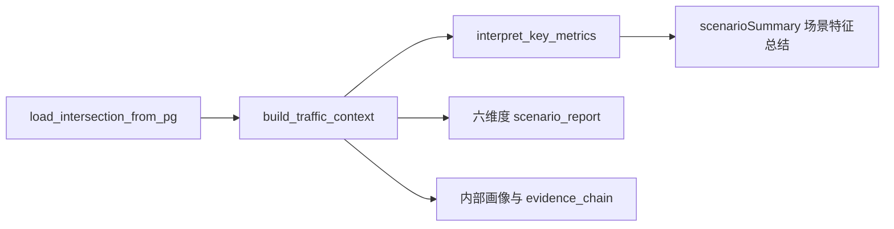

# 路口场景认知 · 六维度指标口径

> 本文对齐前端 `SceneProfileView` 的“场景特征总结 + 六维度分析”。模板真源为 `../../common/专家经验调试/交通路口场景认知与指标解读报告模板.json`，阈值真源为 `../../common/thresholds.yaml`。

## 总体流程



1. `load_intersection_from_pg` 按检查单逐项查询 PG，输出 `task`、`raw`、`checklist_queries`。
2. `build_traffic_context` 计算内部画像，并组装 `scenario_report` 初稿。
3. `interpret_key_metrics` 从 5 分钟 DWS 时序提取饱和、排队、绿灯、流量、失衡、配时等洞察。
4. 最终展示顺序固定为 `scenarioSummary` 场景特征总结，然后是六维度分析。

## 时段口径

| 时段 | 时间窗口 | 说明 |
| --- | --- | --- |
| 早高峰 | 07:00-09:00 | 由 `step_index * 5min` 映射 |
| 白平峰 | 10:00-16:00 | 同上 |
| 晚高峰 | 17:00-19:00 | 同上 |

只有单时段聚合输入时，只填充对应时段，其余保持 `null`（前端显示 `-`），并在 `quality_tags` / `uncertainty` 说明证据不足；不得把单时段数据扩写为全天规律。

## 场景特征总结：`scenarioSummary`

`scenarioSummary` 是展示入口，不是独立分析维度。它归纳六维度结果，回答“是什么样的路口、呈现什么运行规律”。

| portrait 字段 | 主要来源 |
| --- | --- |
| 等级定位、形态特征 | 维度1 `basicScenario` / `supply_profile` |
| 空间约束、外部荷载 | 维度1 + 维度6，上游间距、静态约束、AOI、事件 |
| 流量规律、转向特征 | 维度2 + `metrics_insights.demand_pattern` |
| 供需匹配 | 维度3，总能力、总需求、饱和度 |
| 运行状态 | 维度4，饱和、排队、延误、绿灯利用、LOS |
| 配时特征 | 维度5，时段划分、周期、相位相序 |
| 时间规律 | 维度6 + 5 分钟时序洞察 |

## 维度1：路口基础场景刻画（`basicScenario`）

**目标**：描述静态供给与空间环境，不做运行评价。

| 展示模块 | 关键字段 | 数据来源 |
| --- | --- | --- |
| 1.1 节点属性 | 路口编号/名称、道路等级组合、道路功能、几何形态、进口道、出口道、待行区、慢行设施、公交设施 | `road6.dim_inter_info`、`dwd_tfc_rltn_wide_inter_ft_link`、`dwd_tfc_rltn_wide_inter_ft_lane` |
| 1.2 空间协同概括 | 方向、上游路口、距离(m) | 进口 link 与 `dim_link_info.length_m` |
| 1.3 周边交通发生源/吸引源 | 类型、名称、方位/距离、影响时段、影响方式、出入口角色 | `xianchang.ods_amap_aoi_info` + `xianchang.ods_amap_poi_info`，路口中心 800m |

约定：

- 路口形态归一为十字、T型、Y型、五叉、环岛、畸形。
- `spatialCoordination.upstreamByDirection` 和维度6 `upstreamDownstream.relations` 仅展示上游关联。
- 待行区、慢行设施、公交设施等无 PG 来源时保持空值，不臆造。

## 维度2：流量与需求特征（`flowAndDemand`）

**目标**：刻画交通需求规模、时间分布、流向结构与来源去向。

| 展示模块 | 关键字段 | 数据来源 |
| --- | --- | --- |
| 2.1 转向流量 | 进口道、转向、早高峰、晚高峰、白平峰 | `xianchang.dws_inter_link_turn_flow_5min_mm` |
| 2.2 转向流量占比 | 进口道、时段、左转、直行、右转 | 由转向流量聚合 |
| 2.3 时间分布 | 曲线形态、高峰时段、峰值流量、集中度、主次流向、潮汐特征 | 转向流量时序 + `metrics_insights.demand_pattern` |
| 2.4 流量溯源 | 分进口转向 TOP3 来源与去向 | `xianchang.dws_tfc_inter_turn_flow_correlate_m` |
| 2.5 非机动车与行人流量 | 时段、非机动车、行人、过街方向 | 任务输入或现场数据 |

聚合口径：

- 转向流量按进口道 × 转向 × 时段聚合，时段内取均值并换算为 pcu/h。
- 转向占比 = 同进口同一时段各转向流量 / 进口总流量。
- 流量溯源按 `trace_type=UPSTREAM/DOWNSTREAM` 分组，各组按占比取 TOP3。

## 维度3：通行能力与供给特征（`capacityAndSupply`）

**目标**：描述供给能力及供需匹配程度。

| 展示模块 | 关键字段 | 数据来源 |
| --- | --- | --- |
| 3.1 车道级饱和流率 | 进口转向、车道数、平均饱和车头时距、平均饱和流率、测定条件 | `xianchang.dim_lane_saturation_headway` |
| 3.2 进口转向通行能力 | 进口道、转向、三时段通行能力 | `xianchang.dws_lane_capacity_5min_mm` |
| 3.3 路口总通行能力 | 时段、总能力、实际总需求、饱和度 | 能力表 + 转向流量 + `dws_inter_evaluation_5min_mm` |

核心口径：

```text
saturation = volume / capacity
movement_saturation = min(1.5, movement_volume / movement_capacity)
```

- 路口总能力为各转向能力按时段求和。
- 实际总需求为转向流量按时段求和。
- 饱和度优先取 DWS `saturation_max`，其次用需求/能力计算；无能力值时不臆造。

## 维度4：运行状态特征（`operationalStatus`）

**目标**：联合饱和、排队、延误、停车、绿灯利用、失衡和 LOS 描述运行压力。

| 展示模块 | 关键字段 | 数据来源 |
| --- | --- | --- |
| 4.1 转向运行指标 | 进口道、转向、时段、饱和度、最大排队、平均延误、平均停车次数、绿灯利用率 | `dws_turn_saturation_5min_mm`、`dws_inter_dir_turn_perf_5min_mm`、`dws_turn_green_utilization_5min_mm` |
| 4.2 失衡指数与服务水平 | 时段、饱和度、失衡指数、服务水平 | `dws_inter_evaluation_5min_mm` |

聚合口径：

- 转向饱和度、最大排队按时段取 max。
- 延误、停车次数、绿灯利用率按时段取 avg。
- LOS 按时段取最差等级。
- 绿灯利用率输出为百分比；空放率由 `100 - 绿灯利用率` 推导。

## 维度5：现状配时方案特征解析（`signalTimingFeatures`）

**目标**：解析当前控制方案结构，不输出调整建议。

| 展示模块 | 关键字段 | 数据来源 |
| --- | --- | --- |
| 5.1 时间段与周期 | 日期类型、时段划分数量、时间段划分明细 | `dwd_ctl_inter_schedule_cfg`、`dwd_ctl_inter_plan_cfg` |
| 5.2 相位相序 | 放行顺序、使用时段、总结描述 | `dwd_ctl_inter_plan_stage_timing` |
| 配时特征概述 | 时段数、周期、相位数、绿信比、最小绿 | 控制画像聚合 |

约定：

- 能解析日计划时段时，按星期、日方案、开始时间排序。
- 能解析阶段明细时，输出阶段号、相序、放行车流、绿/黄/全红、绿信比。
- 周期与阶段总时长不一致时只作为数据核验事实，不在本阶段给出调整建议。

## 维度6：时空特征建模与关联规律（`spatiotemporalPatterns`）

**目标**：把运行指标放入时间和空间关系中，描述拥堵演化与外部影响。

| 展示模块 | 关键字段 | 数据来源 |
| --- | --- | --- |
| 6.1 拥堵时段画像 | 时段区间、拥堵程度、发展阶段 | `metrics_insights.intersection_saturation` / `dws_inter_evaluation_5min_mm` |
| 6.2 最大排队长度时变曲线 | 时段、进口方向、转向、最大排队、存储比、描述 | `dws_inter_dir_turn_perf_5min_mm` |
| 6.3 上下游关联特征 | 方向、上游路口、间距、本方向最大排队、是否影响关联路口 | 维度1 相邻路口明细 + 排队 |
| 6.4 吸引源影响关联 | 吸引源名称、距离、影响方式、对应时段、本路口对应状态 | AOI / POI / 现场上下文 |
| 异常事件影响 | 事件类型、描述、影响时段、影响车道、影响范围 | 施工、活动、应急事件输入 |

约定：

- 拥堵时段来自高饱和 / 过饱和时序窗口；无时序时只回退单点拥堵状态。
- 是否影响关联路口 = 本方向最大排队长度 >= 上游间距（两者都有数据时）。
- 吸引源与事件只描述关联状态，不推断最终成因。

## 共用规则

- 检查单状态、表映射和 raw 键以 [checklist_rules.md](checklist_rules.md) 为准。
- 阈值只从 `thresholds.yaml` 读取，文档不复制阈值明细。
- `build_traffic_context` 负责确定性计算；`interpret_key_metrics` 只增强时序洞察和自然语言表达。
- `evidence` 与 `evidence_chain` 必须保留，供问题诊断阶段通过 `profile_evidence_ref` 回链。
- 本阶段不输出问题归因、主因判断、治理建议或配时秒数。
