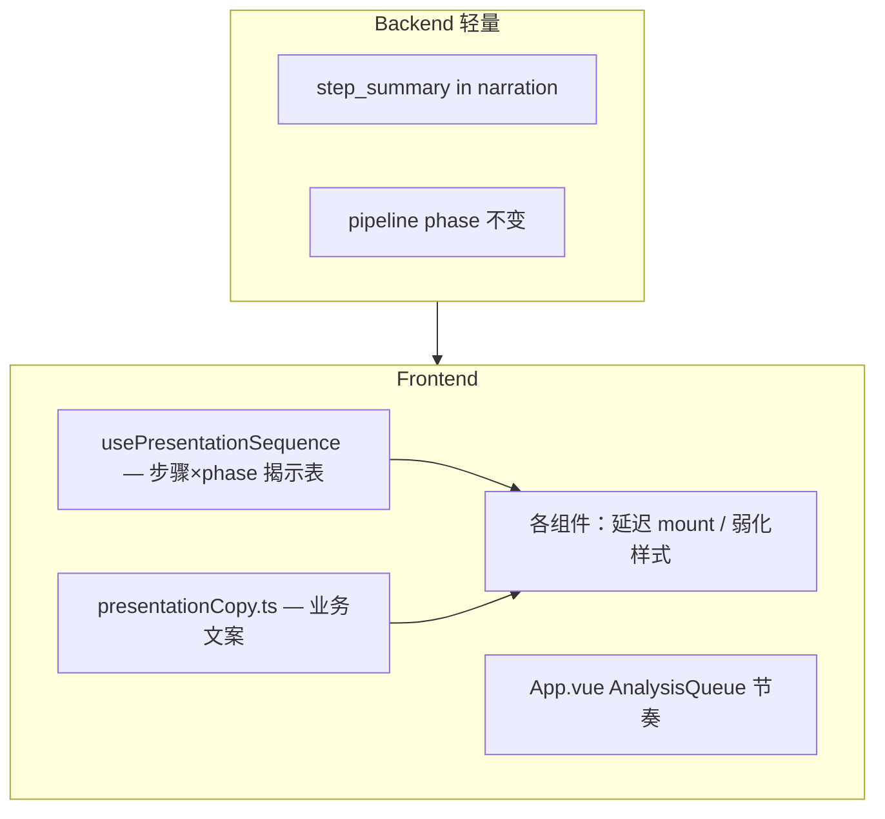

# 领导汇报 · 叙事逻辑与地图呈现重构 — 开发方案

> 版本：2026-06-28 **v2（已确认方向）**  
> 状态：**已实现**（2026-06-28）  
> 前置：[需求理解](./2026-06-28-领导演示叙事与地图呈现重构-需求理解.md)

---

## 1. 方案总览

### 1.1 设计原则（对齐 C1–C4）

| 原则 | 说明 |
|------|------|
| **全真能力** | 8 步、语音、固化、配时环、绿波、MetricStrip、InsightStack 等全部保留 |
| **时序揭示** | 功能不删，只改「何时出现」；避免多组件同时抢焦点 |
| **业务文案** | 步骤名、TTS、理解过程首行改为交警/指挥语境，禁止报幕腔 |
| **无演示壳** | 不新增 demo/pro 切换、故事进度条、幕标题；`DEMO_MODE` 仅后端数据锚定 |
| **故事对内** | 开发用「呈现阶段」编排时序；UI 只显示现有「理解过程」步骤 |

### 1.2 架构思路



**不做**：`presentationMode`、`StoryActProgress`、`demo_ui` 用户可见开关。

---

## 2. 呈现阶段（仅开发文档用，不进 UI）

用于对齐地图动作与组件揭示顺序；**界面上仍显示 8 个理解步骤**。

### 2.1 单点诊断

| 呈现阶段 ID | 对应 STEP_INDICES | 合并的 pipeline phase | 界面焦点 |
|-------------|-------------------|------------------------|----------|
| `S1` | UNDERSTAND | idle, conversation | 右栏理解问题；地图不动 |
| `S2` | INTERSECTION | — | 路口匹配；若有 skill 则本步展示历史约束 |
| `S3` | COGNITION | locate, links, channelization | 飞入 + 渠化 + 轴路名；link 明细折叠 |
| `S4` | DATA_FETCH | traffic, direction, saturation, imbalance, granularity, timing, corridor | 逐项揭示但 **HUD/条带错峰** |
| `S5` | PROBLEM_EVIDENCE | evidence | 证据 note + InsightStack |
| `S6` | RULE | rule | 规则结论；配时环/绿波可在本步 **首次** 自动展开 |
| `S7` | SUGGESTION | conclusion | 建议 note + 确认 |
| `S8` | SKILL | skill absorption, build | 吸收面板 + 左抽屉 |

**S4 关键**：子 phase SSE **照常推送**（不改 orchestrator），前端 `usePresentationSequence` 控制：

- 同一阶段内 MetricStrip、失衡横幅、多 HUD **不要同时 mount**
- 优先：关注方向 pulse → 核心饱和度 HUD → 再揭示 MetricStrip → 配时/干线小窗在 S6 或用户点工具栏

### 2.2 干线（单点之前）

| 阶段 | phase | 焦点 |
|------|-------|------|
| H1 | corridor_scan 开始 | 理解过程 + 道路名 |
| H2 | corridor_scan 完成 | 地图沿路高亮 + 侧栏列表（精简每行字段，不删列表） |
| H3 | 用户选型 | 选中路口高亮 → 切单点 S3 起 |

### 2.3 步骤文案改造（示例）

| 现标签 | 建议标签（可微调） |
|--------|-------------------|
| 理解问题 | 理解描述 |
| 匹配路口 | 锁定路口 |
| 路口认知 | 路口结构 |
| 获取数据 | 运行数据 |
| 问题验证 | 问题印证 |
| 规则诊断 | 原因诊断 |
| 生成建议 | 治理建议 |
| 技能固化 | 经验固化 |

理解过程每步结构：

```
[步骤标签]
首行结论（≤40 字，业务口吻）
--- 可选折叠 ---
明细（link 列表、Skill ID、规则名等，原样保留）
```

---

## 3. 地图呈现：分层时序（不删除层）

### 3.1 层清单（全部保留）

| 层 | 组件 | 揭示策略 |
|----|------|----------|
| L0 | 高德底图 | 全程；S3 起 zoom≥17.5 |
| L1 | link 描边 | S3 短暂 → S4 仅关注/保护 |
| L2 | 3D 渠化 | S3 起 |
| L3 | 路臂标签 | S3 仅轴路名 |
| L4 | HUD | S4 错峰，同时 ≤1 张主 HUD |
| L5 | 证据 note | S5 |
| L6 | 建议 note | S7 |
| L7 | MetricStrip | S4 后半或 S5 前 **首次** slide-up |
| L8 | 失衡横幅 | 与 L4 合并时机，避免与 L7 同帧 |
| L9 | 图例 | S3 起，常显简化版 |
| L10 | 配时环 / 绿波小窗 | S6 或工具栏点击（按钮 **保留**） |
| L11 | InsightStack | S5 与证据同步 |
| L12 | 工具栏按钮 | **始终保留** |

### 3.2 底图

- S3 `fly_to_intersection` 强制路口级 zoom
- 可选：`setFeatures` 弱化无关 POI（地图能力调整，非删功能）

### 3.3 空格暂停

- 行为不变（子步骤边界）
- Toast 文案：`分析暂停 · 空格继续`（**禁止**「第 N 幕」）

---

## 4. 后端改动（最小）

| 改动 | 说明 |
|------|------|
| `map_presentation_service.py` | narration 增加 `step_summary`（≤40 字，业务口吻，与 `text` 并存） |
| `build_links_narration_payload` | 首行轴路名摘要；link 明细仍在 `text` |
| orchestrator emitter | 不改状态机；可选在 narration meta 带 `focus_step_index` 供前端对齐 |

SSE 示例：

```json
{
  "action": "narration",
  "phase": "direction",
  "text": "【关注】南北向 …",
  "step_summary": "南北向饱和度偏高，与描述一致。",
  "focus_step_index": 3
}
```

测试：`RT-PRES-SUMMARY` — summary 非空且 ≤40 字。

---

## 5. 前端改动

### 5.1 新增

| 模块 | 职责 |
|------|------|
| `composables/usePresentationSequence.ts` | phase / step_index → 各层 `revealed` 布尔表 |
| `config/presentationCopy.ts` | 步骤标签、折叠区标题、Skill 命中话术 |
| `UnderstandingProcessPanel` 折叠块 | 「查看详情」展开 link/Skill ID/规则 |

### 5.2 修改

| 文件 | 要点 |
|------|------|
| `constants.ts` | 更新 `ANALYSIS_STEP_LABELS`（8 步仍在） |
| `voice_narration.json` | 引导语业务化；**更新** `voiceStepSync.spec.ts` |
| `useUnderstandingProcess.ts` | 优先展示 `step_summary`；`text` 进折叠区 |
| `App.vue` | `usePresentationSequence` 驱动 overlay 揭示；AnalysisQueue 逻辑不变 |
| `ChannelizationStageOverlay.vue` | v-show / 动画按 sequence，**不 v-if 永久移除** |
| `WorkbenchLayout.vue` | 工具栏按钮保留；InsightStack 按 S5 揭示 |
| `CorridorScanSidebar.vue` | 行内字段精简（名 + 饱和度 + 排名），不删列能力 |

### 5.3 经验命中（S2）

在 **锁定路口** 步骤正文首行（非独立报幕横幅）：

```
发现历史经验：本路口晚高峰曾诊断过，约束「垂直方向不能溢出」将纳入本次方案。
```

- Skill ID 在折叠区
- TTS 新增模板 `skillReuseHint`（写入 `voice_narration.json`）

### 5.4 禁止出现的 UI 元素

- StoryActProgress / 幕进度条
- 「演示模式」「专业模式」切换
- 「第一幕」「报幕」「样例」eyebrow
- 「经验已沉淀 ✓ 再来一次」等排练感按钮（可保留普通「新对话」）

---

## 6. 汇报脚本与彩排

| 顺序 | 路径 | 输入 |
|------|------|------|
| 1 | 单点首诊 | 奥体西路×经十路 + 约束 → 固化 |
| 2 | 单点复用 | 同上 |
| 3 | 干线 | 奥体西晚高峰哪些路口堵 → 选型 → 单点 |

彩排：`DEMO_MODE=1 bash scripts/dev-v2.sh`（仅数据；UI 与生产一致）。

---

## 7. 实施分期

| 阶段 | 内容 | 预估 |
|------|------|------|
| **P0** | 文案表定稿 + REGRESSION_TEST_SPEC | 0.5d |
| **P1** | 步骤标签、step_summary、理解过程折叠、TTS | 1.5d |
| **P2** | usePresentationSequence + 地图层时序 | 2d |
| **P3** | S4 错峰（MetricStrip/HUD/横幅） | 1.5d |
| **P4** | 干线侧栏精简 + 选型衔接 | 1d |
| **P5** | 单点/干线彩排 + regression | 1d |

**合计**：约 **6.5 人日**

---

## 8. 风险

| 风险 | 缓解 |
|------|------|
| 错峰揭示导致技术人员觉得「东西不见了」 | 折叠/延迟而非删除；稍早步骤结束即揭示 |
| 改 voice_narration.json | 必跑 voiceStepSync.spec.ts |
| step_summary 与 data 不一致 | 后端同数据源生成 + 单测 |

---

## 9. 功能保留对照表（验收用）

| 能力 | 保留 | 改动类型 |
|------|------|----------|
| 理解过程 8 步 | ✅ | 文案 + 首行摘要 + 折叠 |
| 语音 TTS 全流程 | ✅ | 文案 |
| 空格 / Esc 暂停 | ✅ | toast 文案 |
| 3D 渠化 + 底图融合 | ✅ | 时序 |
| link 高亮 / 关注保护色 | ✅ | 时序 |
| MetricStrip | ✅ | S4 延后揭示 |
| 失衡横幅 | ✅ | 错峰 |
| InsightStack | ✅ | S5 同步 |
| 证据 / 建议 note | ✅ | 时序 |
| 配时环 / 干线绿波 | ✅ | S6 或手动 |
| 工具栏按钮 | ✅ | 保留 |
| 经验吸收 + Skill 抽屉 | ✅ | trace 文案 |
| 治理确认 / 固化确认 | ✅ | 不变 |
| 干线扫描 + 侧栏 | ✅ | 行展示精简 |

---

*确认后可按 P0 起开发；无「演示模式」分支，一套 UI 面向所有用户。*
