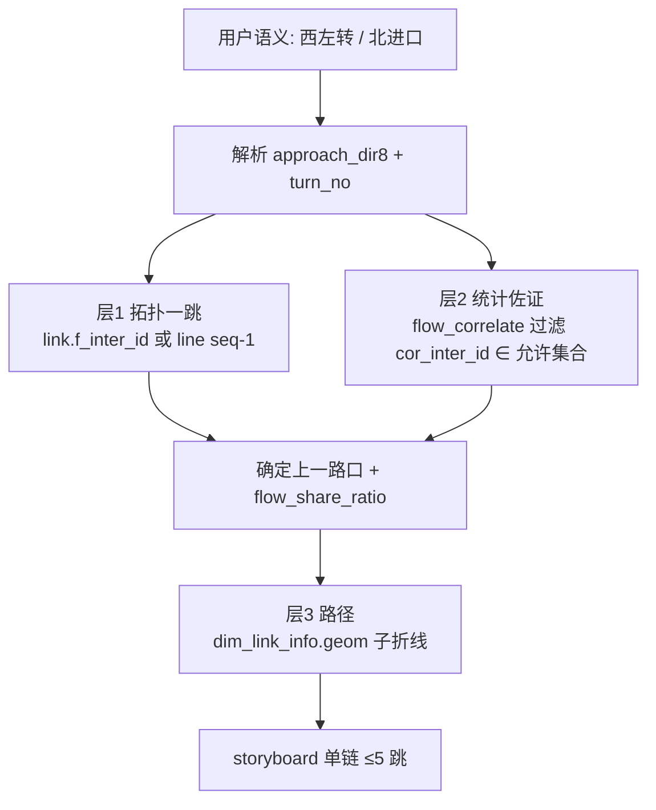

# 流量溯源干线 geom 重构计划

**日期：** 2026-06-30  
**状态：** 已实施（Phase 0–4）  
**演示路口：** `011wwe28ctu00001`（奥体西路×经十路）  
**目标：** 用户说「西左转 / 北进口」时，沿**正确地理方向**的单条干线向上溯源；路径**必须**来自 `dim_link_info.geom`，禁止两点飞线；地图指标**合并展示一次**（饱和度 + 失衡 + 排队）。

---

## 0. 问题陈述（用户反馈 × 嗅探结论）

| # | 用户反馈 | 嗅探结论 |
|---|----------|----------|
| 1 | 饱和度出现两遍，应合并失衡系数 + 饱和度 + 排队长度 | 渠化阶段 `direction_groups` 分组标 + `enrichSaturationHints` + 排队标签叠加，同一进口多次出现饱和文案 |
| 2 | 西左转应往西溯源，上一跳应是转山西路（经十路与转山西路） | **link 拓扑正确**，**flow_correlate 一跳错误**（见 §1.3） |
| 3 | 北进口应往北溯源 | 北进口 link 邻接为「奥体西路与解放东路路口」；当前算法未强制使用该邻接 |
| 4 | 路径为空 / 两点直线 | storyboard `edge.path` 曾为空；即使有 path，未绑定干线 geom 段 |
| 5 | 必须先摸清干线、路口、geom、流量关系再重构 | 本节已完成首轮嗅探，结论见 §1 |

---

## 1. 数据嗅探结论（2026-06-30 实测）

### 1.1 双 Schema 分工

| Schema | 库 | 职责 |
|--------|-----|------|
| `road6` | `ycx` | 空间：路口中心、link 折线 geom、干线序、渠化宽表 |
| `xianchang` | `ycx` | 运行：饱和度、排队、`dws_tfc_inter_turn_flow_correlate_m` 溯源 |

连接：`backend/.env`，`PGVERSION_ID=20260501`。

### 1.2 核心表与关系

```
dim_inter_info (inter_id, inter_name, geom_center)
       ↑ f_inter_id / t_inter_id
dim_link_info (link_id, geom LineString, f_inter_id, t_inter_id)
       ↑ link_id
dwd_tfc_rltn_wide_inter_ft_link (inter_id, dir8_code, dir8_label, link_role)
       ↑ 同一 inter_id + dir8
dim_line_inter_rltn (line_id, seq_no, inter_id, gap_to_prev_m)
       ↑ line_id
dim_line_info (line_name)
       ↑ inter_id + f_dir8 + turn
dws_tfc_inter_turn_flow_correlate_m (cor_inter_id, flow_share_ratio, trace_type=UPSTREAM)
```

**语义要点：**

- `f_dir8_no`：行车方向编码（6 = 西进口，车辆由西向东驶入路口）。
- `flow_share_ratio`：关联转向「途经」比例（可 >100%，**不可**简单相加；UI 展示为「流量占比 xx%」）。
- `trace_type=UPSTREAM`：统计意义上的上游来源，**不等于**地理相邻上一路口。

### 1.3 演示路口关键实测（`011wwe28ctu00001`）

**进口道 link 邻接（地理真值）：**

| 进口 | `f_inter_id` 上一路口 | 说明 |
|------|----------------------|------|
| 西进口 | `011wwe289qc00001` 经十路与转山西路路口 | 与用户期望一致 |
| 北进口 | `011wwe28fmc00001` 奥体西路与解放东路路口 | 北侧邻接 |
| 东进口 | `011wwe291ey00001` 奥体中路与经十路路口 | 东侧邻接 |
| 南进口 | `011wwe28cnj00001` 岔口 | 南侧邻接 |

**干线 `dim_line_inter_rltn` 上一跳（经十路主线）：**

- `seq_no=3` 为本路口；`seq_no=2` = **经十路与转山西路路口**（`gap_to_prev_m≈877m`，与西进口 link 长度一致）。

**`flow_correlate` 西左转一跳（当前代码会选的）：**

| 排名 | 关联路口 | coverage | 相对目标方位角 |
|------|----------|----------|----------------|
| 1 | 奥体中路与经十路路口 | 61.9% | **87.7°（正东）** |
| … | … | … | … |

**根因：** `lock_one_hop()` 在 `(f_dir8, turn)` 组内取 `flow_share_ratio` 最大者，**不做** link 邻接 / 干线 seq / 方位角校验 → 统计「途经」路口替代地理「上一路口」→ **方向完全反了**。

### 1.4 现有代码路径（待替换）

| 模块 | 现状 | 问题 |
|------|------|------|
| `flow_trace_service.lock_one_hop` | 同方位 max coverage | 无拓扑约束 |
| `upstream_governance_trace_service.one_hop_for_approach` | 进口道内 max coverage | 同上 |
| `map_presentation_service._road_path_for_entry` | 选最长进口 link 折线 | 未截取「本跳」段；fallback 仍可能飞线 |
| `orchestrator._run_upstream_trace` | NLU 方向 → approaches | 已支持转向优先，但未绑定干线 |

---

## 2. 目标架构（重构后）

### 2.1 溯源链构建：三层校验



**层 1 — 拓扑一跳（主真值）：**

1. 由 `dwd_tfc_rltn_wide_inter_ft_link` + `dim_link_info` 取目标路口 `approach_dir8` 进口 link 的 `f_inter_id`。
2. 若该进口属于某条 `dim_line_inter_rltn` 干线，取 `seq_no - 1` 路口为候选；**两者一致时置信度最高**。
3. 递归上一跳：在上一路口，沿**来车走廊**（`feeding_dir8` = 驶出方向指向本路口的进口）继续，而非 `build_tree` 当前「除来流外其它 arm 乱搜」。

**层 2 — 统计佐证（辅真值）：**

- 从 `flow_correlate` 取 `(f_dir8, turn)` 行，**仅保留** `cor_inter_id` ∈ {拓扑一跳, 干线 seq±1 窗口} 的记录。
- 展示 `flow_share_ratio` 为「流量占比」；若拓扑路口无 correlate 行，标注「待核查」但仍画拓扑路径。

**层 3 — geom 路径（强制）：**

- 路径 = `dim_link_info.geom` 中 `f_inter_id → t_inter_id` 对应 link 的折线（GCJ-02）。
- 多跳：拼接 hop 间 link geom；禁止 `[[lon1,lat1],[lon2,lat2]]` 作为最终输出（仅允许调试 fallback 且单测断言为 0）。

### 2.2 方向语义对照表（实现必须固化）

| 用户表达 | `f_dir8_no` | 行车方向 | 拓扑上游方位 | 演示路口期望上一跳 |
|----------|-------------|----------|--------------|-------------------|
| 西进口 / 西左转 | 6 | 西向东 | **西**（bearing ≈ 270°） | 经十路与转山西路 |
| 北进口 | 0 | 北向南 | **北**（≈ 0°） | 奥体西路与解放东路 |
| 东进口 | 2 | 东向西 | **东**（≈ 90°） | 奥体中路与经十路 |
| 南进口 | 4 | 南向北 | **南**（≈ 180°） | 岔口 |

**方位校验：** `bearing(target → cor)` 与进口期望方位差 ≤ 45°，否则剔除（即使 coverage 更高）。

### 2.3 地图标注合并（一次展示）

**渠化阶段（运行数据揭示后）：** 每进口**一个**文本框：

```
关注 西进口          （或 保护 南北向）
饱和 1.08 · 失衡 0.53 · 排队 ~85m
```

- 去掉 `direction_groups` 把同一饱和度复制到东/西或南/北的逻辑。
- 去掉第二遍 `enrichSaturationHints` 叠加。
- 关注/保护色带与文本框在 direction → saturation 阶段**持续**，不闪退。

**溯源阶段：** 上游节点标签仅保留：

```
上游1
★ 经十路与转山西路路口
饱和 0.xx · 流量占比 yy%
```

不在此阶段重复展示渠化侧同款饱和/排队卡。

---

## 3. 实施阶段

### Phase 0 — 数据嗅探脚本固化（1–2 天）

**交付：** `backend/scripts/probe_upstream_topology.py`

| 任务 | 内容 |
|------|------|
| T0.1 | 封装 §1.3 全部 SQL：进口邻接、干线 seq、flow_correlate TOP N、方位角、link geom 长度 |
| T0.2 | 输出对照报告：`topo_hop` vs `correlate_hop` vs `bearing_ok` |
| T0.3 | 支持 `--inter`、`--dir8`、`--turn`；写入 `artifacts/upstream-probe/{inter}.json` |
| T0.4 | 扩展 `probe_schema_and_demo.py` 列嗅探 `dim_line_inter_rltn`、`dim_link_info.geom` |

**验收：** 对 `011wwe28ctu00001` 西左转，报告 `topo_hop = 经十路与转山西路`，并标记 `correlate_hop = 奥体中路…` 为 **MISMATCH**。

---

### Phase 1 — 后端拓扑溯源服务（3–4 天）

**新建：** `backend/intersection_agent/services/upstream_topology_service.py`

| 任务 | 内容 |
|------|------|
| T1.1 | `resolve_approach_link(inter_id, dir8) → {link_id, geom, upstream_inter_id}` |
| T1.2 | `resolve_line_prev(inter_id, approach_dir8) → upstream_inter_id \| None` |
| T1.3 | `pick_upstream_hop(inter, dir8, turn, window) → {cor_inter_id, flow_pct, source: topo\|correlate\|merged}` |
| T1.4 | `build_hop_path(upstream_inter, target_inter, approach_dir8) → list[[lng,lat]]` 仅来自 geom |
| T1.5 | 方位角过滤 + correlate 白名单交集 |
| T1.6 | 单元测试：mock link/line 行 + 真实 `011wwe28ctu00001` 快照 JSON |

**改造：**

| 文件 | 改动 |
|------|------|
| `upstream_governance_trace_service.py` | `one_hop_for_approach` → 委托 `UpstreamTopologyService`；递归沿来流走廊 |
| `flow_trace_service.py` | `build_entry_traces` 同步拓扑一跳；保留 correlate 作 split |
| `map_presentation_service.py` | `_upstream_edge_path` 只接受 service 返回的 geom path；删除飞线 fallback |
| `orchestrator.py` | 维持「转向语义单链」；storyboard 写入 `path_source: link_geom` |

**验收（后端）：**

```bash
cd backend && .venv/bin/python scripts/probe_upstream_topology.py --inter 011wwe28ctu00001 --dir8 6 --turn 1
# 期望 topo_hop.name 含「转山西路」

.venv/bin/python -m pytest tests/test_upstream_topology*.py tests/test_upstream_storyboard.py -q
```

---

### Phase 2 — Storyboard 与 SSE 契约（1 天）

| 任务 | 内容 |
|------|------|
| T2.1 | `UpstreamStoryboardEdge` 增加 `path_points≥2`、`path_source`、`flow_pct` |
| T2.2 | 节点增加 `topo_hop` 序号、`bearing_deg`（可选，调试用） |
| T2.3 | 单链强制：`parallel=false` 当用户指定转向 |
| T2.4 | 更新 `docs/REGRESSION_TEST_SPEC.md` §7c：RT-TRACE-07 拓扑一跳、RT-TRACE-08 geom 禁飞线 |

---

### Phase 3 — 前端渲染与标注合并（2 天）

| 任务 | 内容 |
|------|------|
| T3.1 | `resolveEdgePath`：若 `path.length<2` **不渲染**并打 warn（不再飞线） |
| T3.2 | 粒子方向 = geom 首点→末点（上游→目标） |
| T3.3 | `buildRoleArmLabels` 合并 `饱和 + 失衡 + 排队` 一行；移除重复 enrich |
| T3.4 | 溯源 `us-label` 不重复渠化指标 |
| T3.5 | Playwright：`西左转` 场景断言上一跳名称含「转山西路」、折线点数 ≥ 3、无飞线 |

**验收（E2E）：**

```bash
LABEL=westleft PROMPT='奥体西路与经十路交叉口，下午四点西左转排队过长' node scripts/verify-upstream-trace.mjs
# 截图 + JSON：upstream_name 匹配 /转山西路/，edge.path_points >= 3
```

---

### Phase 4 — 回归与文档（1 天）

| 任务 | 内容 |
|------|------|
| T4.1 | `bash scripts/regression.sh` 全绿 |
| T4.2 | 更新 `docs/流量溯源表结构信息.md`：拓扑一跳 vs 统计途经 |
| T4.3 | 更新 `docs/PG_DATABASE_SCHEMA.md`：补充 flow_correlate + line_inter_rltn 联查示例 |
| T4.4 | `PROJECT_LOGIC.md` 溯源章节替换为新三层架构图 |

---

## 4. 关键 SQL 模板（实施时直接复用）

### 4.1 进口拓扑上一跳

```sql
SELECT l.link_id, l.f_inter_id AS upstream_inter_id, fi.inter_name,
       ST_AsText(l.geom) AS geom_wkt, ST_Length(l.geom::geography) AS len_m
FROM road6.dwd_tfc_rltn_wide_inter_ft_link wl
JOIN road6.dim_link_info l ON l.link_id = wl.link_id AND l.version_id = wl.version_id
JOIN road6.dim_inter_info fi ON fi.inter_id = l.f_inter_id AND fi.version_id = l.version_id
WHERE wl.inter_id = :inter_id AND wl.version_id = :version_id
  AND wl.link_role IN ('entrance','进口')
  AND wl.dir8_code = :dir8
LIMIT 1;
```

### 4.2 干线 seq 上一跳

```sql
SELECT prev.inter_id, prev.inter_name, prev.seq_no, l.line_name
FROM road6.dim_line_inter_rltn cur
JOIN road6.dim_line_inter_rltn prev ON prev.line_id = cur.line_id AND prev.seq_no = cur.seq_no - 1
JOIN road6.dim_line_info l ON l.line_id = cur.line_id
WHERE cur.inter_id = :inter_id AND cur.is_deleted = 0;
```

### 4.3 correlate 过滤（仅允许拓扑候选）

```sql
SELECT cor_inter_id, flow_share_ratio
FROM xianchang.dws_tfc_inter_turn_flow_correlate_m
WHERE inter_id = :inter_id AND f_dir8_no = :dir8 AND turn_dir_no = :turn
  AND trace_type = 'UPSTREAM' AND cor_inter_id = ANY(:allowed_ids)
  AND period_type = :period AND day_of_week = ANY(:days)
ORDER BY flow_share_ratio DESC LIMIT 1;
```

---

## 5. 风险与决策

| 风险 | 缓解 |
|------|------|
| 拓扑上一跳无 correlate 数据 | 仍展示拓扑链，流量占比显示「—」 |
| 一路口多干线 | 优先与用户进口 dir8 匹配的 line（经十路西进口 → 经十路 line） |
| geom 存储方向与行车方向相反 | `_orient_path_endpoints` 以 `f_inter → t_inter` 为准，单测覆盖 |
| 递归 5 跳越出干线 | 超过 line 端点时停止，叙事「已达干线端点」 |

**明确不做（本期）：**

- 不改用 `trace_type=DOWNSTREAM` 替代 UPSTREAM。
- 不用纯 LLM 推断上一路口。
- 不在无 geom 时默许飞线（宁可少画一段）。

---

## 6. 总体验收标准（用户可感知）

1. **西左转 @ 奥体西路×经十路：** 地图只显示**一条**向西的发光干线，上一跳标签为「经十路与转山西路路口」，折线沿经十路弯曲，**不是**向东到奥体中路。
2. **北进口：** 上一跳为北侧邻接路口（解放东路×奥体西路），折线沿奥体西路 geom。
3. **任意跳：** 路径折线点数 ≥ 3（除非 link 本身仅 2 点且距离 < 50m）。
4. **指标：** 每个进口仅**一个**文本框，含饱和 + 失衡 + 排队（有数据则显示），无重复饱和行。
5. **回归：** `scripts/regression.sh` + `verify-upstream-trace.mjs` 全通过。

---

## 7. 工期估算

| 阶段 | 人日 | 依赖 |
|------|------|------|
| Phase 0 嗅探固化 | 1–2 | — |
| Phase 1 拓扑服务 | 3–4 | Phase 0 |
| Phase 2 契约 | 1 | Phase 1 |
| Phase 3 前端 | 2 | Phase 2 |
| Phase 4 回归文档 | 1 | Phase 3 |
| **合计** | **8–10** | |

**建议执行顺序：** Phase 0 → 1 → 2 → 3 → 4；Phase 0 与 Phase 3 标注合并可并行。

---

## 8. 与当前补丁的关系

近期已做但**不足以**解决本问题的改动：

- `upstreamStoryboard` 时禁止 `drawHighlights`（红色遮罩）✓
- `_turn_specific_dir8s` 单链收口 ✓
- `_road_path_for_entry` 填 path（仍可能选错 link / 方向）△
- `buildRoleArmLabels`（未合并失衡/排队）△

本计划将**替换**一跳选取与路径构建核心逻辑，而非继续叠补丁。
