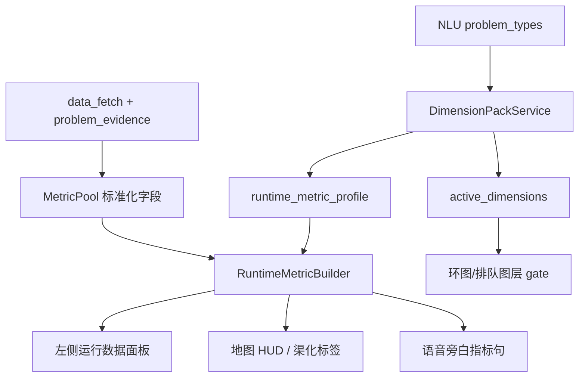

# 诊断驱动运行数据差异化呈现 · 开发计划

> 日期：2026-07-01  
> 状态：**待实施**  
> 关联：[`2026-06-29-路口诊断UI优化与诊断闭环-设计与计划.md`](./2026-06-29-路口诊断UI优化与诊断闭环-设计与计划.md)、[`2026-06-29-四类问题动态诊断与三级经验沉淀.md`](./2026-06-29-四类问题动态诊断与三级经验沉淀.md)、[`docs/路口专家经验规则.md`](../路口专家经验规则.md)、[`docs/路口指标证据计算说明.md`](../路口指标证据计算说明.md)

---

## 0. 背景与问题

0630 已落地 NLU 四类问题分类（`congestion` / `spillback` / `empty_green` / `conflict`）与 `active_dimensions` 维度包，但**左侧「运行数据」面板与 `update_metrics` 推送仍为固定模板**（四向饱和度 + 延误 + 失衡 + 转向绿灯利用），与问题类型无关。

**已接入 `active_dimensions` 的能力**：配时环图小窗、渠化排队标签。  
**未接入的能力**：运行数据面板条目选取、排序、弱化/隐藏；地图 HUD 指标；语音旁白指标侧重点。

**目标**：实现「诊断驱动 + 数据可视化」——用户说什么问题，左侧运行数据、渠化图标注、地图 HUD 就突出该问题的主指标，弱化或隐藏无关指标。

---

## 1. 指标呈现矩阵（需求真源）

多类型叠加时取**并集**，同一指标只出现一次；排序按**主问题类型**（NLU `problem_types[0]`，多选时按优先级：冲突 > 溢出 > 空放 > 拥堵）决定主指标区块置顶。

| 用户问题 | 主指标（面板置顶 + 地图强调） | 辅助指标（次区块） | 应弱化 / 隐藏 |
|----------|------------------------------|-------------------|---------------|
| **拥堵** | 饱和度、延误、平均/最大排队、常发命中率 | 关键转向饱和、方向失衡 | 空放率不应前置 |
| **空放** | 绿灯利用率、空放率、低利用转向、绿信比 | 相位环图、周期、可让绿方向 | 延误/排队不应抢主位 |
| **溢出** | 最大排队、排队存储比、溢流风险、上游/下游关联 | 常发性、干线/走廊节点 | 单纯饱和度只做背景 |
| **冲突** | 渠化匹配、相位相序、冲突类型、机非/左转混行证据 | 车道功能、进口结构、现场/投诉证据 | 饱和度/延误只做补充 |

### 1.1 指标 → 数据字段映射

| 展示标签 | 内部 key | 主要来源 |
|----------|----------|----------|
| 饱和度（进口/转向） | `saturation` | `cognition.metrics_by_arm` / `evidence.by_turn` / `traffic_flow.saturation_rate` |
| 延误指数 | `delay_index` | `evaluation.delay_index` |
| 平均排队 | `avg_queue_m` | `problem_evidence.metrics.avg_queue_m` |
| 最大排队 | `max_queue_m` | `problem_evidence.metrics.max_queue_m` |
| 常发命中率 | `chronic` | `problem_evidence.chronic`（`congested_days` / `window_days`） |
| 关键转向饱和 | `turn_saturation` | `evidence.by_turn` / `flowTimingGovernance.primary_diagnosis.turn_balance` |
| 方向失衡 | `imbalance_index` | `evaluation.imbalance_index` |
| 绿灯利用率 | `green_utilization` | `evaluation.green_utilization` / `by_turn.green_utilization` |
| 空放率 | `empty_green_rate` | `evaluation.empty_green_rate` |
| 低利用转向 | `low_util_turn` | `by_turn` 中 `green_utilization < threshold` |
| 绿信比 | `green_split` | `timing_profile` / `traffic_flow` 相位绿信比 |
| 周期 | `cycle_len` | `timing_profile.cycle_len_sec` / plan cfg |
| 可让绿方向 | `spare_turn` | `primary_diagnosis.turn_balance.spare` |
| 排队存储比 | `queue_storage_ratio` | `problem_evidence.metrics.queue_storage_ratio_max` |
| 溢流风险 | `spillback_risk` | `problem_evidence.metrics.spillback_risk_max` |
| 上游/下游关联 | `corridor_context` | `problem_evidence.corridor_context` / 流量溯源（若启用） |
| 渠化匹配 | `channel_match` | 规则命中 + `cognition.arms` 车道功能 |
| 相位相序 | `phase_sequence` | `timing_profile.stage_conflicts` / 规则 `phase_sequence_conflict` |
| 冲突类型 | `conflict_type` | 诊断规则 evidence / `stage_conflicts[].冲突流向` |
| 机非/左转混行 | `nonmotor_conflict` | 规则 + 渠化转向类型 |
| 车道功能 | `lane_function` | `cognition.arms[].lanes` |
| 现场/投诉证据 | `complaint` | `problem_evidence.external_evidence`（可选，演示线可降级） |

### 1.2 呈现强度枚举

每条运行数据项增加 `emphasis`（前端排序与样式用）：

| emphasis | 含义 | 样式 |
|----------|------|------|
| `primary` | 主指标 | 默认置顶、高亮 severity |
| `secondary` | 辅助 | 主区块之后 |
| `background` | 背景补充 | 小字/低对比，列表末尾 |
| `hidden` | 不展示 | 不进入面板与 HUD |

---

## 2. 设计原则

1. **单一事实源**：延续 `problem_dimension_packs.yaml` + `DimensionPackService`，扩展 `runtime_metric_profile`，禁止在前端硬编码四套 if-else。
2. **诊断驱动**：`problem_types` → `runtime_metric_profile` → 运行数据面板 / 地图标注 / 语音 cue 共用同一 profile。
3. **有数据才展示**：`emphasis != hidden` 且字段非空才 push；缺失不显示「暂无」占位（与 §7 空数据规则一致）。
4. **多类型叠加**：维度并集 + 主类型决定排序；冲突与溢出并存时，安全类（冲突）主指标优先于效率类。
5. **左看数、右看建议**：左侧面板只放数据与验证证据，治理秒数/绿信比调整结论仍在右侧治理建议卡。

---

## 3. 配置契约扩展

### 3.1 `problem_dimension_packs.yaml` 新增段

```yaml
version: 1.2.0
# ... 现有 focus_categories / presentation_dimensions ...

runtime_profiles:
  congestion:
    primary: [approach_saturation, delay_index, avg_queue_m, max_queue_m, chronic]
    secondary: [turn_saturation, imbalance_index]
    background: [green_utilization]
    hidden: [empty_green_rate]
  empty_green:
    primary: [green_utilization, empty_green_rate, low_util_turn, green_split]
    secondary: [ring_diagram, cycle_len, spare_turn]
    background: [approach_saturation]
    hidden: [delay_index, avg_queue_m, max_queue_m]
  spillback:
    primary: [max_queue_m, queue_storage_ratio, spillback_risk, corridor_context]
    secondary: [chronic, corridor_node]
    background: [approach_saturation]
    hidden: [empty_green_rate, imbalance_index]
  conflict:
    primary: [channel_match, phase_sequence, conflict_type, nonmotor_conflict]
    secondary: [lane_function, arm_structure, complaint]
    background: [approach_saturation, delay_index]
    hidden: [chronic, green_split]
```

### 3.2 `DimensionPackService` 新方法

```python
def runtime_profile(self, problem_types: list[str]) -> dict[str, list[str]]:
    """合并多类型的 primary/secondary/background/hidden 列表（hidden 优先覆盖）。"""
```

### 3.3 API / SSE meta 扩展（可选，便于前端调试）

```json
{
  "problem_types": ["spillback"],
  "active_dimensions": ["flow", "channelization", "queue", "spillback", "downstream_block"],
  "runtime_metric_profile": {
    "primary": ["max_queue_m", "queue_storage_ratio", "spillback_risk", "corridor_context"],
    "secondary": ["chronic"],
    "background": ["approach_saturation"],
    "hidden": ["empty_green_rate", "imbalance_index"]
  }
}
```

---

## 4. 架构与数据流



**新增模块（建议）**：

| 模块 | 位置 | 职责 |
|------|------|------|
| `RuntimeMetricBuilder` | `backend/.../runtime_metric_builder.py`（或前端 `runtimeMetricProfile.ts`） | 按 profile 从 payload 抽取指标行 |
| `buildNarrativeRuntimeItems` | 改造 `frontend-v2/src/utils/narrativeStack.ts` | 消费 profile + emphasis 排序 |
| `resolveRuntimeMetricsForUpdate` | 改造 `App.vue` update_metrics 分支 | 不再固定推四向饱和+延误 |

> **推荐**：profile 解析放后端（与 dimension pack 同源），`update_metrics` action 直接携带 `runtime_items: [{key, label, value, emphasis}]`，前端只做渲染，避免双端漂移。

---

## 5. 分阶段实施

### 阶段 R1 · 配置与契约（后端）

| # | 任务 | 文件 | 验收 |
|---|------|------|------|
| R1.1 | 扩展 `problem_dimension_packs.yaml` `runtime_profiles` | `config/problem_dimension_packs.yaml` | YAML 校验通过 |
| R1.2 | `DimensionPackService.runtime_profile()` + 多类型合并规则 | `dimension_pack_service.py` | `test_dimension_pack_service.py` 新增 4+ 用例 |
| R1.3 | `RuntimeMetricBuilder.build(payload, profile)` | 新建 `runtime_metric_builder.py` | 四类各一条单元测试，断言 primary 集合 |
| R1.4 | orchestrator `update_metrics` 携带 `runtime_items` + meta `runtime_metric_profile` | `orchestrator.py` | SSE/API meta 与 items 一致 |
| R1.5 | 冲突类指标：从 `timing_profile` / 规则 evidence 抽取 `stage_conflicts` | `problem_evidence_service.py` 或 builder | mock 下冲突场景有 `phase_sequence` 行 |

**合并规则（R1.2）**：

- `primary` / `secondary`：多类型并集去重。
- `hidden`：任一类标记 hidden 则隐藏（保守）。
- `background`：仅在未 hidden 且未 primary 时生效。
- 主排序类型：`conflict` > `spillback` > `empty_green` > `congestion`（取 `problem_types` 中最高优先级）。

---

### 阶段 R2 · 左侧运行数据面板（前端）

| # | 任务 | 文件 | 验收 |
|---|------|------|------|
| R2.1 | `buildNarrativeRuntimeItems` 接收 `runtimeMetricProfile` 或 `runtimeItems` | `narrativeStack.ts` | 四类 spec 各一条 |
| R2.2 | 按 `emphasis` 排序：primary → secondary → background；hidden 过滤 | `narrativeStack.ts` | 空放场景延误条目 hidden |
| R2.3 | `IntersectionNarrativeStack` 传入 `problemTypes` / profile | `IntersectionNarrativeStack.vue`, `WorkbenchLayout.vue` | props 贯通 |
| R2.4 | 样式：`sev-*` + `emphasis-primary/secondary/background` | `IntersectionNarrativeStack.vue` | 背景项视觉弱化 |
| R2.5 | 删除 `App.vue` 固定 metrics 组装，改读 `action.runtime_items` | `App.vue` | 与后端契约一致；保留 cognition 降级 |

**面板条目示例（拥堵）**：

```
✓ 东进口饱和度 0.92 · 偏高          [primary]
✓ 延误指数 1.88                     [primary]
✓ 最大排队 126 m                    [primary]
✓ 近 7 天有 5 天偏堵                [primary]
✓ 西左转饱和度 1.44 · 过饱和        [secondary]
✓ 方向失衡 0.38 · 各进口差异大      [secondary]
```

**面板条目示例（空放）**：

```
✓ 绿灯利用率 0.42                   [primary]
✓ 空放率 0.22                       [primary]
✓ 北左转绿灯利用 0.26 · 偏低        [primary]
✓ 绿信比 东直行 0.35                [primary]
✓ 周期 156 s                        [secondary]
✓ 可让绿：北左转                    [secondary]
（无延误指数、无排队行）
```

---

### 阶段 R3 · 地图与渠化可视化对齐

| # | 任务 | 文件 | 验收 |
|---|------|------|------|
| R3.1 | 渠化 `applyArmSceneLabels`：按 profile 选择 line2（排队/绿灯利用/饱和） | `channelizationPhase.ts`, `channelArmLabels.ts` | 空放 line2 优先绿灯利用 |
| R3.2 | 溢出：强化 `applyQueueLengthHighlight`，饱和仅背景色 | `channelizationAmap.ts` | spillback 场景排队条为主视觉 |
| R3.3 | 冲突：进口标注车道功能 / 冲突点（若有数据） | `mapMarkers.ts` 或 channelization | conflict 场景有相位/车道标签 |
| R3.4 | `map_presentation_service` traffic/direction 阶段 HUD 按 profile 裁剪 | `map_presentation_service.py` | 溢出阶段 HUD 以排队/溢流为主 |
| R3.5 | `active_dimensions` 与 `runtime_profile` 一致性校验（hidden 维度不触发图层） | 后端测试 | spillback hidden `empty_green_rate` 不出现在 HUD |

---

### 阶段 R4 · 语音与理解过程对齐

| # | 任务 | 文件 | 验收 |
|---|------|------|------|
| R4.1 | 运行数据步旁白：按主类型选模板（非一律「饱和度偏高」） | `voice_narration.json`, `voiceCueExtractors.ts` | 四类 voice spec |
| R4.2 | `summarizeNarrationForVoice`：空放不读延误；溢出不读整体饱和 | `voiceTextSummarize.ts` | 已有 P1 计划合并 |
| R4.3 | 理解过程 step_summary 与面板主指标一致 | `App.vue` enqueueProcess | 步骤 3 摘要含正确主指标词 |

---

### 阶段 R5 · 回归与文档

| # | 任务 | 文件 | 验收 |
|---|------|------|------|
| R5.1 | 新增 TC-ID 写入 `REGRESSION_TEST_SPEC.md` | 见 §6 | 评审通过 |
| R5.2 | 更新 `TEST_SCENARIO_MATRIX.md` 四类指标列 | 文档 | 与矩阵 §1 一致 |
| R5.3 | `bash scripts/regression.sh` 全绿 | — | backend + frontend |
| R5.4 | 四类各一条 e2e 冒烟（mock 即可） | `tests/test_sse.py` 或新 `test_runtime_profile_e2e.py` | meta.profile 断言 |

---

## 6. 回归测试用例（TC-ID 草案）

写入 [`docs/REGRESSION_TEST_SPEC.md`](../REGRESSION_TEST_SPEC.md) 前可先按下列 ID 实现。

| TC-ID | 场景 | 输入示例 | 断言 |
|-------|------|----------|------|
| RT-RUNTIME-01 | 拥堵主指标 | 「晚高峰南北向拥堵」 | `runtime_items` 含饱和/延误/排队/常发；无 `empty_green_rate` primary |
| RT-RUNTIME-02 | 空放主指标 | 「东向绿灯空放严重」 | primary 含绿灯利用/空放率；`delay_index` hidden 或 background |
| RT-RUNTIME-03 | 溢出主指标 | 「排队溢出堵死」 | primary 含 max_queue/spillback_risk；饱和仅 background |
| RT-RUNTIME-04 | 冲突主指标 | 「左转与直行冲突」 | primary 含 phase_sequence/channel_match；饱和 background |
| RT-RUNTIME-05 | 多类型叠加 | 「拥堵且溢出」 | hidden 并集生效；排序以 spillback 优先于 congestion |
| RT-RUNTIME-06 | API/SSE 一致 | 任一场景 | `meta.runtime_metric_profile` 与 `update_metrics.runtime_items` emphasis 一致 |
| RT-RUNTIME-07 | 无数据降级 | 缺 queue 字段 | 不 push 最大排队行，不报错 |
| RT-RUNTIME-08 | 地图 gate | 空放 | `ring` 图层 on；`queue` 排队标签 off（已有 spec 延伸） |

---

## 7. 空数据与弱化规则

| 规则 | 说明 |
|------|------|
| 无字段不展示 | 不做「—」占位 |
| background 最多 2 项 | 避免又变回「全指标墙」 |
| hidden 绝对不出现在面板/HUD/语音主句 | 包括 `empty_green_rate`（拥堵）、`delay_index`（空放） |
| 多类型 hidden 优先 | 任一类 hidden 即隐藏 |
| 常发拥堵 | 仅 `congestion` / `spillback` 的 primary 或 secondary 出现 |
| 投诉证据 | `external_evidence` 缺失时不展示；演示 mock 可配置 |

---

## 8. 实施顺序与依赖

```
R1 配置与后端 builder
  ↓
R2 左侧面板（依赖 R1 runtime_items）
  ↓
R3 地图/渠化（可与 R2 并行，共用 profile）
  ↓
R4 语音（依赖 R1 profile 或 R2 条目）
  ↓
R5 回归与文档
```

**预估工作量**：R1–R2 为核心（约 2–3 人日）；R3–R4 各 1 人日；R5 0.5 人日。

---

## 9. 验收清单（产品走查）

- [ ] 四类问题各输入一句，左侧运行数据**主指标不同**，且符合 §1 矩阵
- [ ] 空放场景：面板顶部无延误/排队；环图小窗出现
- [ ] 溢出场景：排队米数/溢流风险置顶；饱和度条目在底部或仅渠化背景色
- [ ] 冲突场景：面板出现相位/渠化相关行；饱和度不在顶部
- [ ] 拥堵场景：不出现空放率置顶
- [ ] 语音运行数据步与面板主指标一致
- [ ] `bash scripts/regression.sh` 通过
- [ ] `REGRESSION_TEST_SPEC.md` 已登记 RT-RUNTIME-01～08

---

## 10. 非目标（本轮不做）

- POI/AOI 图层（数据未就绪，沿用 UI 优化计划决策）
- 流量溯源干线 geom 全量重开（演示线已精简，溢出「上下游」先用 `corridor_context` 占位）
- 右侧「问题验证」卡文案重构（仅运行数据区差异化）
- 修改 `voice_narration.json` 时须同步 `voiceStepSync.spec.ts`（规则不变）

---

## 11. 风险与缓解

| 风险 | 缓解 |
|------|------|
| 冲突类字段 mock 不全 | R1.5 补 mock evidence；无数据时冲突 primary 降级为渠化结构描述 |
| 前后端双端组装漂移 | 优先后端 `RuntimeMetricBuilder` 统一出 `runtime_items` |
| 多类型叠加排序争议 | 固定优先级表 + 产品走查一轮 |
| 叙事精简分支与 main 能力差异 | profile 用 YAML 配置，演示/完整模式可切换 hidden 集 |

---

*文档版本：v1.0 · 2026-07-01*
