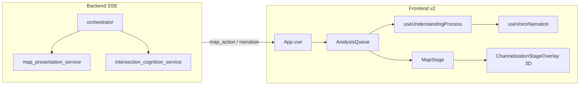
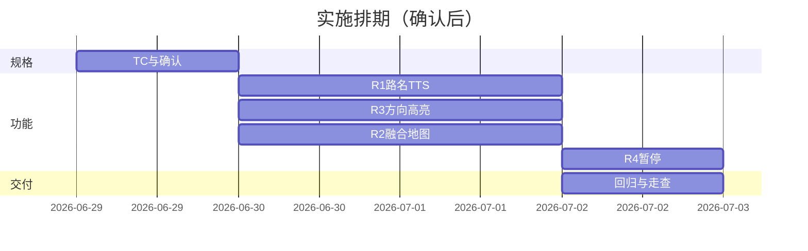

# 地图 · 语音 · 方向高亮 · 演示暂停 — 开发计划

> 版本：2026-06-28  
> 状态：**已实现** — 2026-06-28 交付  
> 关联约束：[REGRESSION_POLICY.md](./REGRESSION_POLICY.md) · [REGRESSION_TEST_SPEC.md](./REGRESSION_TEST_SPEC.md)

---

## 1. 背景与目标

当前 v2 工作台已具备：高德底图、3D 渠化全屏、理解过程 8 步、SSE 驱动演示、`AnalysisQueue` 步骤间节奏、`highlightDirs` / `protectedDirs` 地图描边、固定 TTS 引导语。

用户反馈四类体验缺口（见需求描述与截图）：

| # | 需求摘要 | 当前缺口 |
|---|---------|---------|
| R1 | 认知阶段播报具体路名（如「东西向为经十路、南北向为奥体西路」） | 路名仅出现在理解过程长文本；TTS 认知步为泛化句 |
| R2 | 渠化图需叠加真实地图，类似导航视角 | 渠化全屏时地图 `fade-out` 隐藏，二者互斥 |
| R3 | 各数据子步骤强调关注方向 vs 保护方向，颜色区分 | 地图 link 已有橙/绿；3D 渠化、理解过程、TTS 未统一 |
| R4 | 空格键暂停，粒度 = 当前子步骤跑完、下一步不开始 | 仅有治理确认 `pause`、SSE `abort`；无用户演示暂停 |

**交付标准**：四项需求全部实现 + `bash scripts/regression.sh` 全绿 + 新增 TC 写入 REGRESSION_TEST_SPEC。

---

## 2. 现状架构（简要）



**子步骤粒度（与 R4 对齐）**：

- 每个 SSE `map_scene`（及配对的 `narration`）在 `App.vue` 中对应 **一条** `AnalysisQueue` 任务。
- 任务内：`handleNarration` → 理解过程打字 → `await whenProcessIdle()` → 地图高亮 / 渠化更新。
- 因此 **「子步骤」= 一个 narration phase**（如 `links`、`direction`、`saturation`），与用户需求一致。

**已有可复用能力**：

- `AnalysisQueue.pause()` / `resume()` — 在 **任务边界** 阻塞（`analysisQueue.ts`）
- `voiceCueExtractors.ts` — 饱和度/失衡/证据 TTS 模板（**未接入** `App.vue`）
- `map_presentation_service.links_summary()` — 含 `road_name` 的 link 列表
- `direction_groups.py` / `constraint_resolver` — 关注/保护方向推导

---

## 3. 外部参考与方案选型

### 3.1 地图 + 渠化叠加（R2）

| 方案 | 说明 | 优劣 |
|------|------|------|
| **A. 融合视图（推荐）** | 保留高德底图可见，3D 渠化半透明叠在路口中心；不再 `channelizationLocked` 全屏遮罩 | 改动集中在前端；贴合「导航 + 渠化」直觉 |
| B. AMap.CustomLayer | 用 link 几何在 Canvas/SVG 上绘制简化渠化，随地图平移缩放 | 与现有 Three.js 重复建设；几何对齐工作量大 |
| C. GLCustomLayer + THREE | 官方示例将 Three 场景绑到地图坐标 | 长期最优，但需重构 `channelizationLayer.js` 坐标系 |
| D. 画中画 | 地图主视图 + 右下角 MiniWindow 渠化 | 已有 SVG 小窗，但不符合「主舞台融合」预期 |

**参考**：[高德 JS API 2.0 CustomLayer](https://lbs.amap.com/api/javascript-api-v2/guide/layers/customlayer)、[CustomLayer-SVG 示例](https://lbs.amap.com/demo/javascript-api-v2/example/selflayer/cus-svg)、阿里云交通云控「数字化路网 + 二三维渠化组件」分层思路。

**决策**：Phase 1 采用 **方案 A（融合视图）**；Phase 2（可选）评估 GLCustomLayer 地理对齐。

### 3.2 流式演示暂停（R4）

| 模式 | 行为 | 采用 |
|------|------|------|
| Abort 整流 | 切断 SSE，丢失后续步骤 | ❌ 不符合「暂停后可继续」 |
| 队列边界 pause | 当前 task 跑完，后续 task 在 `waitWhilePaused` 阻塞 | ✅ 与 ChatGPT「当前段落完成再停」一致 |
| 服务端 checkpoint | 需改 orchestrator | ❌ 过重，Phase 1 不做 |

**参考**：Vercel AI SDK `start-step` / `finish-step` 分步语义；AnalysisQueue 已等价于前端 `finish-step` 边界。

---

## 4. 分项设计

### 4.1 R1 — 路名播报与文案优化

#### 4.1.1 后端：轴路名摘要

在 `map_presentation_service.py` 新增：

```python
def axis_roads_summary(cognition: dict) -> dict[str, str]:
    """按东西向/南北向聚合 dominant road_name。例：{'东西向':'经十路','南北向':'奥体西路'}"""
```

逻辑要点：

- 数据源：`cognition.links`（进口优先）+ `arms` 兜底
- 按 `DIR4_TO_GROUP` 映射到 `东西向` / `南北向`
- `road_name` 清洗：去掉 `:` 后缀段、去重、取出现频次最高或最长稳定名
- 输出写入 narration payload：

```json
{
  "action": "narration",
  "phase": "links",
  "text": "…",
  "axis_roads": { "东西向": "经十路", "南北向": "奥体西路" },
  "speakable": "东西向为经十路，南北向为奥体西路。东进口 4 车道、西进口 5 车道…"
}
```

`orchestrator` 在 `highlight_links` / `links` phase 使用 `speakable` 字段（或单独 `action: speakable_narration`）供前端 TTS。

#### 4.1.2 文案规范（TTS + 面板）

| 场景 | 现文案 | 目标文案（示例） |
|------|--------|------------------|
| 认知 TTS | 「正在建立路口认知…」 | 「经十路与奥体西路交叉口，东西向为经十路，南北向为奥体西路，正在加载进出口渠化。」 |
| link 面板 | 逐条 listing | 保留明细，首行增加轴路名摘要 |
| 分向饱和度 TTS | 无 | 「关注南北向，饱和度 0.92，处于拥堵；东西向为保护方向，饱和度 0.61。」 |
| 整体饱和度 | 无 | 复用 `voiceCueExtractors.buildSaturationVoiceCue` |

#### 4.1.3 前端：TTS 接线

1. `voice_narration.json` 增加 templates：
   - `axisRoads`: `{interName}，{ewLabel}为{ewRoad}，{nsLabel}为{nsRoad}。`
   - `directionFocus`: `关注{focusGroup}，饱和度{value}，{state}。`
   - `directionProtected`: `{protectGroup}为保护方向，饱和度{value}。`
2. 新增 `buildCognitionVoiceCue` / `buildDirectionVoiceCue`（或扩展 `voiceCueExtractors.ts`）
3. `App.vue`：在 `handleNarration` / `map_scene` 完成后 `voice.enqueue`（**非**仅 `onStepStart` 固定 guide）
4. `handleProcessStepVoice(COGNITION)` 改为：有 `axis_roads` 时播摘要，否则 fallback 原 guide

#### 4.1.4 测试

| TC-ID | 断言 |
|-------|------|
| RT-VOICE-AXIS | mock cognition 含经十路/奥体西路，`axis_roads_summary` 输出正确 |
| RT-VOICE-COG-TTS | vitest：`buildCognitionVoiceCue` 含两轴路名 |
| RT-SSE-LINKS | SSE `links` narration 含 `axis_roads` meta |

---

### 4.2 R2 — 地图 + 渠化融合视图

#### 4.2.1 交互目标

- 认知阶段起：**高德底图始终可见**（道路名、周边 POI、卫星/矢量风格保留）
- 路口中心叠加 **半透明 3D 渠化**（车道、箭头、排队条）
- 缩放/平飞时渠化随路口中心锚定（现有 `fly_to_intersection` 逻辑保留）
- 取消「纯黑底 + 全屏独占」模式；`chan-mode` 改为 `blended-mode`

#### 4.2.2 实现步骤

**MapStage.vue**

- 移除 `v-show="viewMode === 'map'"` 对地图容器的隐藏；渠化时地图保持渲染
- `map-fade-out` 改为 `map-dim`（opacity ~0.85，可选 slight blur）
- `ChannelizationStageOverlay`：`fullscreen` 改为 **绝对定位 overlay**（`pointer-events: none` 于空白区，车道区可交互）
- 背景：`#1a2030` 实心底 → **透明**，露出地图

**channelizationLayer.js / ChannelizationCanvas3D.vue**

- 画布背景 alpha = 0
- 车道底色降低不透明度，保留高亮可读性
- 可选：overlay 四角显示路名标签（东：经十路）

**highlight_links 行为**

- 不再 `channelizationLocked = true` 完全锁地图交互；改为 `blendedChannelization = true`
- 用户仍可拖地图（演示模式可配置 `demoLockPan: false`）

#### 4.2.3 后续增强（Phase 2，本计划不阻塞交付）

- 用 link `path` 在高德上画进口道中心线（已有 `linkOverlays` Polyline）
- 评估 `AMap.GLCustomLayer` 将 Three 场景绑经纬度

#### 4.2.4 测试

| TC-ID | 断言 |
|-------|------|
| RT-UI-BLEND | 渠化阶段 DOM 同时存在 `.map-canvas` 与 channelization overlay，地图 opacity > 0 |
| RT-UI-FLY | `fly_to_intersection` 后地图 center 接近路口坐标 |

---

### 4.3 R3 — 关注 / 保护方向统一高亮

#### 4.3.1 语义与配色（全站统一）

| 角色 | 语义 | 色值 | 适用层 |
|------|------|------|--------|
| **关注方向** | NLU / 证据 `focused` / `highlightDirs` | `#ff6b4a` 暖橙 + pulse | 地图 link、3D 车道、HUD、理解过程、TTS |
| **保护方向** | `quantitative_constraints.protected_directions` | `#6dffb5` 绿 | 同上 |
| **非相关方向** | 其他方向组 | `#4a5568` 灰 + dim 40% | 3D/SVG 渠化 |

#### 4.3.2 后端

- `build_map_scene` 增加：
  - `focus_groups: string[]`
  - `protected_groups: string[]`
  - `direction_roles: { group, role: 'focus'|'protect'|'neutral', saturation }[]`
- `_direction_metric_lines` 在文本前加角色前缀：`【关注】南北向 …` / `【保护】东西向 …`

#### 4.3.3 前端

| 模块 | 改动 |
|------|------|
| `MapStage` | 已有 highlight/protect 描边；补充 `focusedDirs` → 与 highlight 合并或 badge |
| `ChannelizationCanvas3D` | 新增 prop `protectedDirs`；`applyDirectionRoleHighlight(focus, protect)` |
| `channelizationLayer.js` | 按方向组 dim 非关注车道；保护方向绿色描边 |
| `ChannelizationMiniWindow` / `channelizationDraw.ts` | SVG 路径支持 protect 色 |
| `useUnderstandingProcess` | 可选：`enqueue` 时传入 `highlights: { focus, protect }`，面板内关键字 `<mark>` |
| `InsightStack` / 运行数据卡 | metric 行增加 `role` badge |
| `ChannelizationLegend` | 固定图例：🟠 关注方向 · 🟢 保护方向 |

#### 4.3.4 数据阶段联动

每个 data fetch 子 phase 的 `map_scene` 已带 `highlight_dirs`；扩展为：

- `saturation` phase → 关注组 pulse + 保护组 green outline
- `direction` phase → 分向 HUD 按 role 着色
- 证据阶段 → 保持现有 marker，与图例一致

#### 4.3.5 测试

| TC-ID | 断言 |
|-------|------|
| RT-UI-DIR-ROLE | NLU 南北向 + 保护东西向 → highlightDirs 含南/北，protectedDirs 含东/西 |
| RT-MAP-SCENE-ROLE | `build_map_scene` 返回 `direction_roles` |
| RT-CHAN-PROTECT | vitest：3D adapter 传入 protect 时非关注车道 alpha < 1 |

---

### 4.4 R4 — 空格键演示暂停（子步骤粒度）

#### 4.4.1 行为定义

| 动作 | 效果 |
|------|------|
| **空格**（演示进行中） | 进入暂停：当前 `AnalysisQueue` task **执行完毕**（含理解过程打字 `whenProcessIdle`、当前 TTS cue 播完） |
| 暂停态 | 不启动下一 task；SSE 仍接收但任务在 `waitWhilePaused` 等待；**不** abort 后端 |
| **空格**（暂停态） | 恢复：后续 task 顺序执行 |
| **Esc**（可选） | 完全中断：abort SSE + reset queue + 与「新消息」同等清理 |
| 输入框聚焦时 | 空格不触发暂停（避免与输入冲突） |

与 ChatGPT 对齐：**当前子步骤完整呈现，下一步不开始**。

#### 4.4.2 实现

**新增 `usePresentationPause.ts`（或 composable）**

```typescript
interface PresentationPause {
  paused: Ref<boolean>
  toggle(): void
  pause(): void
  resume(): void
}
```

**AnalysisQueue 扩展**

- 保持现有 `pause()`；App 全局 `paused` 时调用 `analysisQueue.pause()`
- 可选：`enqueue(task, pauseMs)` 在 `pauseMs` sleep 前也检查 paused（当前已在下一 task 入口检查，足够）

**语音**

- 新增 `voice.pauseDrain()`：不再 dequeue 新 cue，**不** interrupt 正在播放的
- 恢复后继续 drain queue

**理解过程**

- 当前 task 内 typing 不受影响
- 暂停时不从 pending 队列取 **下一条** enqueue（需在 `useUnderstandingProcess` 增加 `paused` gate，或保证仅通过 AnalysisQueue 单线程调用 — 后者已满足）

**SSE 缓冲**

- 维持现状：事件持续 enqueue；pause 仅阻塞执行
- 极端情况：暂停过久导致队列堆积 — 可接受；恢复后按序播放

**UI**

- 底部状态条：「⏸ 已暂停 · 按空格继续」
- 演示时短暂 toast；与 `hideInputDock` 不冲突

#### 4.4.3 与现有 pause 的关系

- `startSuggestionConfirmPause` 继续调用 `analysisQueue.pause()` — 统一由 `PresentationPause` 管理，避免双重 resume 竞态
- 新分析 / abort：`presentationPause.reset()` + `analysisQueue.reset()`

#### 4.4.4 测试

| TC-ID | 断言 |
|-------|------|
| RT-PAUSE-BOUNDARY | vitest：enqueue A→B，A 执行中 pause，A 完成，B 不执行直至 resume |
| RT-PAUSE-VOICE | 暂停后 queue 中 cue 不播放，当前 cue 可播完 |
| RT-PAUSE-KEY | e2e/组件：Space 切换 paused 状态（mock keydown） |

---

## 5. 实施阶段与工期估算

| 阶段 | 内容 | 预估 | 依赖 |
|------|------|------|------|
| **P0 规格** | REGRESSION_TEST_SPEC 增 TC；本计划确认 | 0.5d | 用户确认 |
| **P1 R1 路名 TTS** | 后端 axis_roads + 前端 voice 接线 + 文案 | 1.5d | — |
| **P2 R3 方向高亮** | map_scene 扩展 + 3D/SVG/面板/图例 | 2d | — |
| **P3 R2 融合地图** | MapStage 布局 + 3D 透明底 | 2d | 可与 P2 并行 |
| **P4 R4 暂停** | PresentationPause + 键盘 + voice gate | 1d | — |
| **P5 联调回归** | regression.sh + 演示路口走查 | 1d | P1–P4 |

**合计**：约 **8 人日**（1 人全职）；P2/P3 可并行缩短日历时间。



---

## 6. 文件改动清单（预估）

### Backend

| 文件 | 改动 |
|------|------|
| `map_presentation_service.py` | `axis_roads_summary`、`speakable`、map_scene roles |
| `intersection_cognition_service.py` | links 上可选 `direction_group` 字段 |
| `orchestrator.py` | narration payload 携带 axis_roads / speakable |
| `tests/test_map_presentation.py` | RT-VOICE-AXIS、RT-MAP-SCENE-ROLE |
| `tests/test_sse.py` | links phase meta |

### Frontend

| 文件 | 改动 |
|------|------|
| `voice_narration.json` | 新 templates |
| `voiceCueExtractors.ts` | cognition/direction cues |
| `voiceStepSync.ts` / spec | 认知步 fallback 逻辑 |
| `App.vue` | voice enqueue、pause composable、keydown |
| `MapStage.vue` | blended 布局 |
| `ChannelizationStageOverlay.vue` | 透明 overlay |
| `channelizationLayer.js` | 方向 role 着色 |
| `ChannelizationCanvas3D.vue` | protectedDirs |
| `channelizationDraw.ts` | protect 色 |
| `ChannelizationLegend.vue` | 图例 |
| `utils/analysisQueue.ts` | 可选 isPaused 查询 |
| `composables/usePresentationPause.ts` | **新建** |
| `*.spec.ts` | 上述 TC |

### Docs

| 文件 | 改动 |
|------|------|
| `REGRESSION_TEST_SPEC.md` | § 新增 RT-VOICE-AXIS / RT-UI-BLEND / RT-PAUSE-* |
| `TEST_SCENARIO_MATRIX.md` | 速查行 |
| `backend/docs/CHANGELOG.md` | 变更记录 |
| `frontend-v2/docs/PROGRESS.md` | 勾选完成项 |

---

## 7. 验收标准（用户最终验收）

1. **R1**：奥体西路×经十路口案例，语音明确播报「东西向为经十路、南北向为奥体西路」类句式；理解过程首行同义摘要。
2. **R2**：认知/渠化阶段可见高德底图（路名、周边环境），渠化叠加其上非纯黑全屏。
3. **R3**：用户指定关注南北向时，南北向橙红强调、东西向绿色保护色，地图 + 渠化 + 理解过程 + 图例一致。
4. **R4**：演示中按空格，当前子步骤（如「分向饱和度-南北向」）完整展示后停住；再按空格继续下一子步骤；SSE 不中断。
5. **回归**：`bash scripts/regression.sh` 全绿。

---

## 8. 风险与缓解

| 风险 | 缓解 |
|------|------|
| 3D 透明后对比度不足 | 车道描边加粗；地图 dim 0.85；高亮时提高 opacity |
| 路名 PG 数据缺失 | fallback 到 `intersection.name` 解析 + link_id 缩写 |
| 暂停期间 SSE 堆积 | 恢复后顺序播放；必要时 MAX_QUEUE 告警（仅日志） |
| TTS 过长 | speakable 限制 80 字内，细节留面板 |
| 高德 Key 配额 | 融合视图不增加 API 调用 |

---

## 9. 不在本次范围

- 服务端 SSE checkpoint / 断点续播
- GLCustomLayer 地理精确对齐 Three 场景（Phase 2）
- 移动端触摸暂停手势
- 修改 Skill 匹配 / orchestrator 确认流（除 narration meta 外）

---

## 10. 确认项

请确认以下决策后回复「**确认开发**」或提出修改意见：

- [ ] **R2 方案 A**：地图可见 + 半透明 3D 叠加（非 CustomLayer 重绘）
- [ ] **R4 空格键**：输入框未聚焦时生效；Esc 完全中断（可选）
- [ ] **配色**：关注 `#ff6b4a` / 保护 `#6dffb5` 沿用现有地图色
- [ ] **工期**：约 8 人日，确认后一次性交付 + 自动化测试

---

## 11. 呈现同步栅栏（2026-06-28 增补）

> **完整规范见 [PRESENTATION_SYNC_BARRIER.md](./PRESENTATION_SYNC_BARRIER.md)** — 后续开发必读。

要点：

1. 步骤切换前 `await whenPresentationSettled()`，同步 **理解过程 + TTS + 吸收面板**。
2. TTS 只播关键点（`voiceTextSummarize`），面板仍展示全文。
3. 渠化融合视图：底图可见、overlay 透明、渠化时 pan 偏移为 0。

---

*文档作者：开发计划（待用户确认）*  
*下一步：用户确认 → 按 REGRESSION_POLICY 先补 TC-ID → 分阶段实现 → `regression.sh` 全绿交付*
