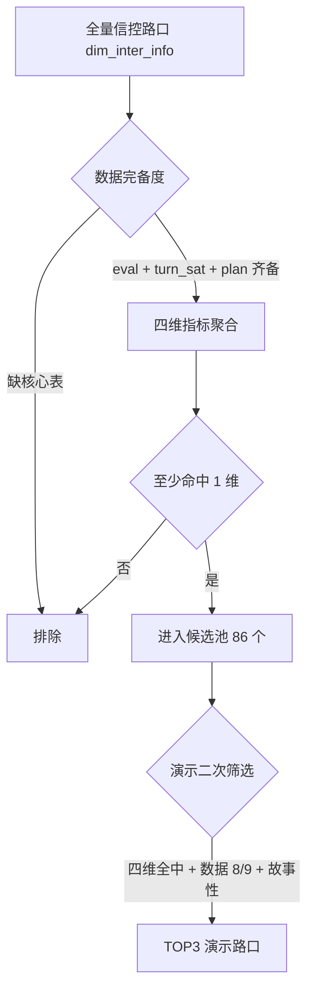

# 路口四维筛选与演示路口清单

> **版本**：2026-06-27  
> **诊断主线**：饱和度 / 失衡 / 空放 / 溢出 四维问题 → **信控配时与流量不匹配**（治理落脚点）  
> **关联配置**：`backend/config/demo_intersections.yaml`  
> **查询 SQL**：`backend/scripts/filter_four_dimension_intersections.sql`  
> **全量结果 Excel**：`docs/sql_queries/路口四维筛选结果.xlsx`  
> Sheet：**早高峰** / **平峰** / **晚高峰**（中文列名）+ **查询SQL**（完整三段 SQL）  
> 生成：`cd backend && uv run python scripts/generate_four_dimension_xlsx.py`

---

## 1. 诊断目标与治理落脚点

路口诊断聚焦四个运行维度，治理建议必须落脚到 **「信号配时和流量不匹配」**：

| 维度 | 代码 | 现象 | 配时不匹配含义 |
|------|------|------|----------------|
| **饱和度** | `saturation` | 关键方向过饱和、排队持续 | 高流量方向有效绿灯不足 |
| **失衡** | `imbalance` | 各进口/转向服务差异大 | 绿信比与流量结构错位 |
| **空放** | `empty_green` | 绿灯期间无车或少车通过 | 低需求方向占用过多绿灯 |
| **溢出** | `spillback` | 排队回溢、存储空间耗尽 | 周期/相位清空不足，加剧上下游传导 |

系统在 `FlowTimingGovernanceService` 中输出 `match_verdict`（`strong` / `weak` / `mismatch` / `insufficient`）和四维 `problems[]`，叙事主轴为：

> 高流量转向的有效绿灯占比偏低，存在明显的 **流量-配时失配**。

**筛选前提**：凡进入候选池的路口，至少在上述四维中命中 **1 项及以上**，即认定存在信控可改善问题（非纯静态供给或外部事件主导）。

---

## 2. 筛选逻辑

### 2.1 两步筛选



### 2.2 时段与日历

**时段定义**（与 `docs/路口场景认知与问题诊断检查单.md` 一致；`step_index` 计算见 `data_window.py`）：

| 时段 | 时钟时间 | step_index | DWS day_of_week | 说明 |
|------|----------|------------|-----------------|------|
| **早高峰** | 07:00–09:00 | 84–107 | 5（周五） | 上班集中出行 |
| **平峰** | 10:00–16:00 | 120–191 | 5（周五） | 检查单称「白平峰」 |
| **晚高峰** | 17:00–19:00 | 204–227 | 5（周五） | 下班集中出行 |

`step_index` 口径：`step_index × 5` = 距 0:00 的分钟数（5min 粒度，见 `PG_DATABASE_SCHEMA.md`）。

**信控方案时段对照**（`dwd_ctl_inter_day_plan_period` 高频划分，与评价时段相近但不完全一致）：

| 方案时段 | 出现频次 | 对应评价时段 |
|----------|----------|--------------|
| 07:00–09:00 | 106 路口 | 早高峰 |
| 16:30–19:00 | 148 路口 | 晚高峰（偏晚 30min） |
| 13:30–16:30 | 147 路口 | 平峰后半段 |
| 11:30–13:30 | 131 路口 | 平峰中段 |

| 项目 | 取值 | 说明 |
|------|------|------|
| 演示锚定日 | **2026-06-13（周五）** | 落在 DWD 窗口内 |
| DWD 日历 | 2026-06-08 ~ 2026-06-16 | 474 路口有 DWD |
| 筛选结果行数 | 早高峰 88 / 平峰 78 / 晚高峰 86 | 2026-06-27 导出 |

### 2.3 四维判定阈值

与检查单、`flow_timing_governance_service.py`、`thresholds.yaml` 一致：

| 维度 | 命中条件（满足任一即命中） | 阈值键 |
|------|---------------------------|--------|
| **S 饱和度** | `LEAST(saturation_max, 1.5) >= 0.80` | `saturation.high` |
| **I 失衡** | `unbalance_index >= 0.30` **或** `turn_saturation_spread >= 0.60` | `imbalance.diagnosis` / `imbalance.movement_saturation_gap` |
| **E 空放** | `green_utilization_min < 0.60` **或** `green_utilization_avg < 0.60` | `green.low_utilization_diagnosis` |
| **B 溢出** | `queue_len_max >= 100 m`（DWD 代理） | 规则层另用 `spillback.risk_high`、`queue.queue_storage_ratio_high` |

**dim_flags 编码**：`S`=饱和、`I`=失衡、`E`=空放、`B`=溢出；如 `SIEB` 表示四维全中。

### 2.4 数据完备度（演示二次筛选）

演示路口需跑通 **场景认知 → 四维诊断 → 流量-配时画像 → Skill 沉淀** 全链路，要求：

| 旗标 | 数据表 | 作用 |
|------|--------|------|
| eval | `dws_inter_evaluation_5min_mm` | 饱和度、失衡 |
| turn_sat | `dws_turn_saturation_5min_mm` | 转向极差 |
| plan | `dwd_ctl_inter_plan_cfg` | 周期、方案 |
| period | `dwd_ctl_inter_day_plan_period` | 时段划分 |
| min_green | `dws_turn_min_green_5min_mm` | 空放加权 |
| line | `dim_line_inter_rltn` | 走廊上下文 |
| corridor | `dws_corridor_coord_group` | 协调组 |
| complaint | `dwd_tfc_complaint_inter_issue` | 民意交叉印证 |
| survey | `dwd_ctl_inter_manual_survey_issue` | 现场调查 |

**演示排序规则**：`dim_hits DESC` → `data_score DESC` → 地标/故事性（奥体、经十路、二环东路等）。

---

## 3. 涉及数据表

| Schema | 表名 | 用途 | 关键字段 |
|--------|------|------|----------|
| `road6` | `dim_inter_info` | 路口维表 | `inter_id`, `inter_name`, `is_signalized` |
| `road6` | `dim_line_inter_rltn` | 路口-道路关系 | `inter_id`, `line_id` |
| `xianchang` | `dws_inter_evaluation_5min_mm` | 路口评价（5min） | `saturation_max`, `unbalance_index`, `day_of_week`, `step_index` |
| `xianchang` | `dws_turn_saturation_5min_mm` | 转向饱和度 | `turn_saturation` |
| `xianchang` | `dws_turn_green_utilization_5min_mm` | 转向绿灯利用率 | `green_utilization` |
| `xianchang` | `dwd_tfc_inter_dir_perf_5min` | 进口运行明细 | `queue_len_max`, `stop_time`, `stat_time` |
| `xianchang` | `dwd_ctl_inter_plan_cfg` | 配时方案 | `cycle_len_sec`, `plan_no` |
| `xianchang` | `dwd_ctl_inter_day_plan_period` | 日方案时段 | `period_start_sec`, `period_end_sec` |
| `xianchang` | `dws_turn_min_green_5min_mm` | 转向最小绿 | `min_green_time` |
| `xianchang` | `dws_corridor_coord_group` | 协调走廊组 | `inter_ids_json` |
| `xianchang` | `dwd_tfc_complaint_inter_issue` | 民意投诉 | `inter_id` |
| `xianchang` | `dwd_ctl_inter_manual_survey_issue` | 现场调查 | `inter_id` |

---

## 4. 演示路口推荐（TOP 3）

经 **四维全中（SIEB）+ 数据完备 + 故事性** 筛选，写入 `backend/config/demo_intersections.yaml`：

### #1 主秀 — 会展路与奥体中路路口

| 字段 | 值 |
|------|-----|
| inter_id | `011wwe29jbf00001` |
| 四维 | **SIEB**（4/4） |
| 饱和度 cap | 1.124 |
| 失衡系数 | 0.265 |
| 绿灯利用率 min/avg | 0.201 / 0.525 |
| 转向极差 | 1.069 |
| 最大排队 | 120 m |
| 平均周期 | 167 s |
| 数据完备 | 8/9（缺 complaint） |
| 故事 | 失衡 + 空放 + 外溢并存，「东口饱和、西口空放」典型配时错位 |

### #2 辅秀 — 二环东路与工业南路路口

| 字段 | 值 |
|------|-----|
| inter_id | `011wwe2854m00001` |
| 四维 | **SIEB**（4/4） |
| 饱和度 cap | 1.077 |
| 失衡系数 | 0.484 |
| 绿灯利用率 min/avg | 0.203 / 0.490 |
| 转向极差 | 1.051 |
| 最大排队 | 176 m |
| 平均周期 | 184 s |
| 数据完备 | **9/9**（含 complaint×2、corridor、survey） |
| 故事 | 协调走廊节点 + 民意投诉交叉印证 |

### #3 备秀 — 奥体中路与经十路路口

| 字段 | 值 |
|------|-----|
| inter_id | `011wwe291ey00001` |
| 四维 | **SIEB**（4/4） |
| 饱和度 cap | 1.500（展示 cap） |
| 失衡系数 | 0.000（极差 1.058 触发失衡） |
| 绿灯利用率 min/avg | 0.474 / 0.927 |
| 转向极差 | 1.058 |
| 最大排队 | 292 m |
| 平均周期 | 206 s |
| 数据完备 | 8/9（含 complaint×2、corridor） |
| 故事 | 经十路主轴地标节点，高饱和 + 部分方向空放 |

---

## 5. 筛选结果统计

| 统计项 | 数量 |
|--------|------|
| 有 DWS 评价（周五 17–19）的路口 | 87 |
| 至少命中 1 维的路口 | **86** |
| 四维全中（SIEB） | **40** |
| 命中 3 维 | 14 |
| 命中 2 维 | 20 |
| 命中 1 维 | 12 |

---

## 6. 全量路口指标表

> 导出时间：2026-06-27。`sat_max_cap = LEAST(MAX(saturation_max), 1.5)`。空 `q_max_m` 表示该路口 DWD 周五 17–19 无覆盖。

| # | 路口名称 | inter_id | 饱和 cap | 失衡 | GU min | GU avg | 极差 | 排队 m | 命中 | flags |
|---|----------|----------|----------|------|--------|--------|------|--------|------|-------|
| 1 | 奥体西路与经十路路口 | 011wwe28ctu00001 | 1.500 | 0.577 | 0.255 | 0.697 | 1.640 | 277.0 | 4 | SIEB |
| 2 | 崇华路与新泺大街路口 | 011wwe29k1q00001 | 1.500 | 1.237 | 0.263 | 1.416 | 2.630 | 155.0 | 4 | SIEB |
| 3 | 天辰路与奥体中路路口 | 011wwe29h9n00001 | 1.500 | 0.557 | 0.326 | 0.806 | 1.839 | 110.0 | 4 | SIEB |
| 4 | 奥体中路与新泺大街路口 | 011wwe295cm00001 | 1.500 | 0.824 | 0.522 | 1.114 | 3.026 | 154.0 | 4 | SIEB |
| 5 | 坤顺路与奥体中路路口 | 011wwe294sq00001 | 1.500 | 0.531 | 0.523 | 0.893 | 1.875 | 101.0 | 4 | SIEB |
| 6 | 旅游路与霞景路路口 | 011wwe22qxc00001 | 1.500 | 0.604 | 0.480 | 0.974 | 1.313 | 104.0 | 4 | SIEB |
| 7 | 解放东路与奥体中路路口 | 011wwe294k300001 | 1.500 | 0.522 | 0.552 | 1.076 | 1.823 | 246.0 | 4 | SIEB |
| 8 | 名士北路与浆水泉路路口 | 011wwe22rfu00001 | 1.500 | 0.581 | 0.107 | 0.468 | 1.584 | 112.0 | 4 | SIEB |
| 9 | 奥体东路与龙奥北路路口 | 011wwe2929q00001 | 1.500 | 0.639 | 0.293 | 0.736 | 1.658 | 224.0 | 4 | SIEB |
| 10 | **奥体中路与经十路路口** ★ | 011wwe291ey00001 | 1.500 | 0.000 | 0.474 | 0.927 | 1.058 | 292.0 | 4 | SIEB |
| 11 | 奥体西路与工业南路路口 | 011wwe28vhw00001 | 1.500 | 0.645 | 0.256 | 0.745 | 2.257 | 113.0 | 4 | SIEB |
| 12 | 旅游路与转山西路路口 | 011wwe22xn400001 | 1.500 | 2.572 | 0.425 | 1.819 | 5.571 | 105.0 | 4 | SIEB |
| 13 | 工业南路与茂岭二号路路口 | 011wwe28sgb00001 | 1.500 | 0.407 | 0.286 | 0.654 | 1.370 | 135.0 | 4 | SIEB |
| 14 | 龙奥东路与龙洞立交桥路口 | 011wwe23pyv00001 | 1.500 | 0.689 | 0.169 | 0.414 | 1.818 | 225.0 | 4 | SIEB |
| 15 | 旅游路与旅游路路口 | 011wwe23r8b00001 | 1.500 | 0.559 | 0.482 | 1.030 | 1.392 | 285.0 | 4 | SIEB |
| 16 | 和平路与甸新东路路口 | 011wwe281bq00001 | 1.500 | 0.484 | 0.166 | 0.415 | 1.519 | 102.0 | 4 | SIEB |
| 17 | 坤顺路与奥体西路路口 | 011wwe28fty00001 | 1.500 | 0.481 | 0.191 | 0.700 | 1.736 | 163.0 | 4 | SIEB |
| 18 | 二环东路出口与二环东路辅路路口 | 011wwe0rvxj00001 | 1.500 | 0.809 | 0.385 | 1.130 | 2.595 | 369.0 | 4 | SIEB |
| 19 | 姚家东路与茂岭二号路路口 | 011wwe28dm500001 | 1.500 | 0.559 | 0.403 | 0.913 | 2.104 | 218.0 | 4 | SIEB |
| 20 | 华阳路与解放东路路口 | 011wwe28d3t00001 | 1.500 | 0.455 | 0.213 | 0.515 | 1.608 | 109.0 | 4 | SIEB |
| 21 | 二环东路与解放路路口 | 011wwe284fk00001 | 1.492 | 0.407 | 0.188 | 0.721 | 1.492 | 111.0 | 4 | SIEB |
| 22 | 茂岭山三号路与解放东路路口 | 011wwe28f3100001 | 1.447 | 0.400 | 0.174 | 0.437 | 1.447 | 137.0 | 4 | SIEB |
| 23 | 奥体西路与龙奥北路路口 | 011wwe28bxq00001 | 1.446 | 0.697 | 0.362 | 0.761 | 1.360 | 102.0 | 4 | SIEB |
| 24 | 浆水泉路与窑头路路口 | 011wwe282ex00001 | 1.364 | 0.559 | 0.139 | 0.446 | 1.364 | 146.0 | 4 | SIEB |
| 25 | 龙奥东路与龙奥北路路口 | 011wwe290wy00001 | 1.319 | 0.292 | 0.203 | 0.747 | 1.319 | 110.0 | 4 | SIEB |
| 26 | 旅游路与洪山路路口 | 011wwe22wfv00001 | 1.318 | 0.438 | 0.386 | 0.757 | 1.175 | 236.0 | 4 | SIEB |
| 27 | 二环东路辅路与窑头路路口 | 011wwe280c300001 | 1.289 | 0.483 | 0.162 | 0.380 | 1.289 | 361.0 | 4 | SIEB |
| 28 | 经十路与转山西路路口 | 011wwe289qc00001 | 1.262 | 0.540 | 0.297 | 0.874 | 1.136 | 277.0 | 4 | SIEB |
| 29 | 工业南路与泺邑路路口 | 011wwe28s8e00001 | 1.243 | 0.392 | 0.308 | 0.649 | 1.243 | 140.0 | 4 | SIEB |
| 30 | 旅游路与浆水泉路路口 | 011wwe22mcj00001 | 1.228 | 0.454 | 0.088 | 0.550 | 1.208 | 385.0 | 4 | SIEB |
| 31 | 龙奥南路与龙洞立交桥路口 | 011wwe23pum00001 | 1.212 | 0.416 | 0.293 | 0.491 | 1.212 | 112.0 | 4 | SIEB |
| 32 | 浆水泉路与解放东路路口 | 011wwe2867z00001 | 1.183 | 0.416 | 0.227 | 0.355 | 1.183 | 118.0 | 4 | SIEB |
| 33 | 龙奥北路与龙奥西路路口 | 011wwe2909y00001 | 1.132 | 0.436 | 0.214 | 0.524 | 1.132 | 169.0 | 4 | SIEB |
| 34 | **会展路与奥体中路路口** ★ | 011wwe29jbf00001 | 1.124 | 0.265 | 0.201 | 0.525 | 1.069 | 120.0 | 4 | SIEB |
| 35 | **二环东路与工业南路路口** ★ | 011wwe2854m00001 | 1.077 | 0.484 | 0.203 | 0.490 | 1.051 | 176.0 | 4 | SIEB |
| 36 | 草山岭中路与草山岭南路路口 | 011wwe293wd00001 | 1.044 | 0.271 | 0.419 | 0.562 | 1.044 | 159.0 | 4 | SIEB |
| 37 | 旅游路与荆山东路路口 | 011wwe22jsg00001 | 1.043 | 0.363 | 0.134 | 0.569 | 0.958 | 109.0 | 4 | SIEB |
| 38 | 解放东路与齐川路路口 | 011wwe28f7c00001 | 0.969 | 0.290 | 0.135 | 0.353 | 0.969 | 185.0 | 4 | SIEB |
| 39 | 二环东路与甸新南路路口 | 011wwe2813t00001 | 0.965 | 0.369 | 0.089 | 0.257 | 0.965 | 361.0 | 4 | SIEB |
| 40 | 二环东路辅路与燕山东路路口 | 011wwe0rznb00001 | 0.930 | 0.215 | 0.283 | 0.561 | 0.647 | 105.0 | 4 | SIEB |
| 41 | 奥体西路与解放东路路口 | 011wwe28fmc00001 | 1.500 | 0.453 | 0.324 | 0.680 | 1.539 | — | 3 | SIE |
| 42 | 燕山立交桥与经十路路口 | 011wwe2801m00001 | 1.500 | 0.000 | 1.090 | 1.430 | 0.602 | 278.0 | 3 | SIB |
| 43 | 经十路辅路与洪山路路口 | 011wwe288ct00001 | 1.459 | 0.000 | 0.962 | 1.028 | 0.981 | 375.0 | 3 | SIB |
| 44 | 经十路辅路与草山岭西路路口 | 011wwe293dv00001 | 1.290 | 0.000 | 0.632 | 0.831 | 0.924 | 265.0 | 3 | SIB |
| 45 | 云腾路与转山西路路口 | 011wwe288we00001 | 1.039 | 0.312 | 0.188 | 0.459 | 1.039 | 98.0 | 3 | SIE |
| 46 | 浆水泉路与荆山路路口 | 011wwe22q9c00001 | 0.994 | 0.344 | 0.179 | 0.448 | 0.994 | 81.0 | 3 | SIE |
| 47 | 旅游路与旅游路路口 | 011wwe22qm800001 | 0.909 | 0.000 | 0.374 | 0.690 | 0.535 | 273.0 | 3 | SEB |
| 48 | 融庆巷与转山西路路口 | 011wwe288qe00001 | 0.846 | 0.210 | 0.219 | 0.473 | 0.816 | 92.0 | 3 | SIE |
| 49 | 洪山路与霞景路路口 | 011wwe22xfx00001 | 0.720 | 0.162 | 0.194 | 0.401 | 0.624 | 227.0 | 3 | IEB |
| 50 | 柳康路与龙奥北路路口 | 011wwe290ey00001 | 0.673 | 0.214 | 0.222 | 0.333 | 0.673 | 108.0 | 3 | IEB |
| 51 | 吉祥苑商业街与文化东路路口 | 011wwe0xby600001 | 0.610 | 0.227 | 0.101 | 0.329 | 0.610 | 184.0 | 3 | IEB |
| 52 | 奥体东路与龙奥南路路口 | 011wwe23rbm00001 | 0.600 | 0.165 | 0.160 | 0.292 | 0.600 | 104.0 | 3 | IEB |
| 53 | 茂岭二号路与规划一号路路口 | 011wwe28dtj00001 | 0.797 | 0.231 | 0.235 | 0.433 | 0.678 | 98.0 | 2 | IE |
| 54 | 龙奥北路与无名道路路口 | 011wwe292xm00001 | 0.646 | 0.200 | 0.079 | 0.368 | 0.646 | — | 2 | IE |
| 55 | 洪山路与洪山路路口 | 011wwe22xd900001 | 0.623 | 0.220 | 0.203 | 0.378 | 0.623 | 82.0 | 2 | IE |
| 56 | 浆水泉路与经十路路口 | 011wwe2827q00001 | 0.521 | 0.204 | 0.115 | 0.216 | 0.521 | 293.0 | 2 | EB |
| 57 | 浆水泉西路与浆水泉路路口 | 011wwe22j1300001 | 0.274 | 0.134 | 0.255 | 0.350 | 0.247 | 163.0 | 2 | EB |
| 58 | 龙奥南路与龙奥西路路口 | 011wwe23pcy00001 | 0.031 | 0.094 | 0.191 | 0.360 | 0.031 | 188.0 | 2 | EB |
| 59 | 工业南路与颖秀路路口 | 011wwe29q7e00001 | 0.000 | 0.000 | 0.200 | 0.200 | 0.000 | 143.0 | 2 | EB |
| 60 | 姚家东路与姚家街路口 | 011wwe289uc00001 | 0.000 | 0.222 | 0.222 | 0.395 | 0.000 | 173.0 | 2 | EB |
| 61 | 解放东路与文博西路路口 | 011wwe286rw00001 | 0.000 | 0.191 | 0.148 | 0.388 | 0.000 | 109.0 | 2 | EB |
| 62 | 解放东路与解放东路路口 | 011wwe284y100001 | 0.000 | 0.246 | 0.120 | 0.333 | 0.000 | 109.0 | 2 | EB |
| 63 | 茂岭山路与解放东路路口 | 011wwe284xx00001 | 0.000 | 0.195 | 0.118 | 0.262 | 0.000 | 174.0 | 2 | EB |
| 64 | 二环东路出口与二环东路辅路路口 | 011wwe2846q00001 | 0.000 | 0.000 | 0.087 | 0.087 | 0.000 | 142.0 | 2 | EB |
| 65 | 安成街与奥体西路路口 | 011wwe28gm900001 | 0.000 | 0.175 | 0.128 | 0.285 | 0.000 | 113.0 | 2 | EB |
| 66 | 华信路与工业南路路口 | 011wwe28k6d00001 | 0.000 | 0.237 | 0.211 | 0.413 | 0.000 | 268.0 | 2 | EB |
| 67 | 霞景路与洪山路路口 | 011wwe22x4s00001 | 0.000 | 0.126 | 0.093 | 0.206 | 0.000 | 113.0 | 2 | EB |
| 68 | 东荷路与舜义路路口 | 011wwe292mx00001 | 0.000 | 0.000 | 0.113 | 0.113 | 0.000 | 136.0 | 2 | EB |
| 69 | 舜海路与龙奥北路路口 | 011wwe292sn00001 | 0.000 | 0.000 | 0.081 | 0.082 | 0.000 | 109.0 | 2 | EB |
| 70 | 天泺路与礼耕路路口 | 011wwe2956h00001 | 0.000 | 0.000 | 0.286 | 0.286 | 0.000 | 104.0 | 2 | EB |
| 71 | 奥体中路与工业南路路口 | 011wwe29j2u00001 | 0.000 | 0.117 | 0.361 | 0.464 | 0.000 | 162.0 | 2 | EB |
| 72 | 崇华路与工业南路路口 | 011wwe29jt700001 | 0.000 | 0.151 | 0.187 | 0.288 | 0.000 | 312.0 | 2 | EB |
| 73 | 伯乐路与浪潮路路口 | 011wwe2973c00001 | 0.649 | 0.000 | 0.444 | 0.491 | 0.433 | 89.0 | 1 | E |
| 74 | 坤顺路与无名道路路口 | 011wwe28fsv00001 | 0.542 | 0.106 | 0.286 | 0.383 | 0.542 | 83.0 | 1 | E |
| 75 | 名士北路与霞景路路口 | 011wwe22xbx00001 | 0.499 | 0.127 | 0.255 | 0.356 | 0.499 | 68.0 | 1 | E |
| 76 | 浆水泉路与荆山东路路口 | 011wwe22jjn00001 | 0.495 | 0.099 | 0.286 | 0.323 | 0.395 | 75.0 | 1 | E |
| 77 | 洪山路与霞景路路口 | 011wwe22w7300001 | 0.236 | 0.223 | 0.156 | 0.249 | 0.236 | 64.0 | 1 | E |
| 78 | 礼耕路与解放东路路口 | 011wwe2942300001 | 0.000 | 0.138 | 0.115 | 0.242 | 0.000 | 95.0 | 1 | E |
| 79 | 七里河路与工业南路路口 | 011wwe285zx00001 | 0.000 | 0.000 | 0.182 | 0.182 | 0.000 | — | 1 | E |
| 80 | 岔口 | 011wwe28e1g00001 | 0.000 | 0.000 | 0.286 | 0.286 | 0.000 | — | 1 | E |
| 81 | 洪山路与洪山路路口 | 011wwe22we400001 | 0.000 | 0.000 | 0.174 | 0.177 | 0.000 | 65.0 | 1 | E |
| 82 | 舜华东路与舜华西路路口 | 011wwe297x600001 | 0.000 | 0.087 | 0.211 | 0.311 | 0.000 | — | 1 | E |
| 83 | 解放东路与重德路路口 | 011wwe2946100001 | 0.000 | 0.114 | 0.121 | 0.228 | 0.000 | 93.0 | 1 | E |
| 84 | 荆山北街与浆水泉路路口 | 011wwe22r6r00001 | 0.000 | 0.098 | 0.255 | 0.323 | 0.000 | 83.0 | 1 | E |
| 85 | 文敏街与彤霞路路口 | 011wwe28kp600001 | 0.000 | 0.000 | 0.375 | 0.375 | 0.000 | 90.0 | 1 | E |
| 86 | 解放东路与解放东路路口 | 011wwe2869h00001 | 0.000 | 0.000 | 0.110 | 0.110 | 0.000 | 88.0 | 1 | E |

★ = 当前演示路口（`demo_intersections.yaml`）

---

## 7. SQL 复现

```bash
# 方式一：直接执行 SQL 脚本（含日历、四维筛选、完备度、TOP3 自检）
cd backend
PGPASSWORD=$PGPASSWORD psql -h $PGHOST -p $PGPORT -U $PGUSER -d $PGDATABASE \
  -f scripts/filter_four_dimension_intersections.sql

# 方式二：Python 嗅探（列名校验 + 完备度 TOP25）
MOCK_DB=0 uv run python scripts/probe_schema_and_demo.py

# 方式三：重新生成 Excel（三时段 + SQL）
cd backend && uv run python scripts/generate_four_dimension_xlsx.py
# 输出 docs/sql_queries/路口四维筛选结果.xlsx
```

### 核心查询片段（§2 四维筛选）

见 `backend/scripts/filter_four_dimension_intersections.sql` 第 2 节 `WITH eval_metrics AS (...)` 至最终 `SELECT`。

### 代码侧映射

| 层 | 文件 | 职责 |
|----|------|------|
| 四维诊断 | `flow_timing_governance_service.py` | `FOCUS_CATEGORIES`、阈值判定、`match_verdict` |
| 规则引擎 | `traffic_rules.yaml` + `rule_engine.py` | `oversaturation`、`service_imbalance`、`empty_green`、`spillback` |
| 配时画像 | `timing_profile_service.py` | `flow_green_fit`（Spearman τ） |
| 演示配置 | `demo_intersections.yaml` | TOP3 锚定 |
| 彩排 | `scripts/run_demo_rehearsal.py` | 端到端验收 |

---

## 8. 治理建议输出模板

对每个命中路口，系统输出结构示例：

```json
{
  "match_verdict": "mismatch",
  "match_narrative": "高流量转向的有效绿灯占比偏低，存在明显的流量-配时失配",
  "problems": [
    {"category": "saturation", "detected": true, "governance": "关键方向过饱和，建议增加有效绿灯时长"},
    {"category": "imbalance", "detected": true, "governance": "进口/转向服务失衡，建议重分配绿信比"},
    {"category": "empty_green", "detected": true, "governance": "压缩低利用相位绿灯，转给拥堵方向"},
    {"category": "spillback", "detected": true, "governance": "优先防锁死，缩短周期或边界控流"}
  ],
  "governance_narrative": "建议以流量结构为基准重划绿信比，并校验周期能否清空关键排队"
}
```

**核心**：无论命中哪几维，治理叙事均回到 **配时结构与流量需求的一致性**。
