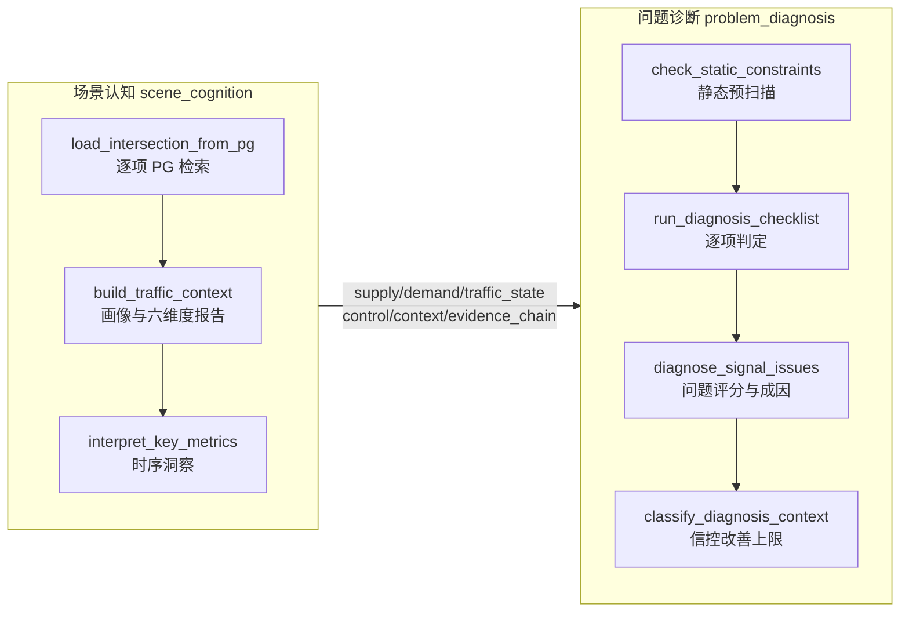

# 路口场景认知与问题诊断 · 检查单与判定逻辑

> **文档用途**：梳理本工程路口场景认知（scene_cognition）与问题诊断（problem_diagnosis）两阶段的检查单清单、数据回链关系及每项判定逻辑，供开发、专家排查与阈值校准使用。  
> **机器可读真源**：
> - 场景认知检查单：`intersection/common/scene_cognition_checklist.yaml`
> - 问题诊断检查单：`intersection/common/diagnosis_checklist.yaml`
> - 统一阈值：`intersection/common/thresholds.yaml`
> - 场景认知检索规则：`intersection/scene-cognition/references/checklist_rules.md`
> - 问题诊断判定细则：`intersection/problem-diagnosis/references/checklist_item_logic.md`

---

## 1. 两阶段关系概览



| 维度 | 场景认知 | 问题诊断 |
| --- | --- | --- |
| **目标** | 描述现状特征，组装六维度报告与内部画像 | 识别静态短板与动态信控问题，输出问题码与成因评分 |
| **检查单语义** | 数据**检索**是否成功（`has_data` / `no_data`） | 问题**是否触发**（`passed` / `triggered` / `no_data`） |
| **主脚本** | `load_intersection_from_pg.py`、`calculate_saturation.py`、`interpret_key_metrics.py` | `check_static_constraints.py`、`run_diagnosis_checklist.py`、`score_intersection_issues.py` |
| **输出** | `scenario_report`、内部画像、`checklist_queries`、`evidence_chain` | `checklist_queries`、`issues`、`cause_scores`、`control_improvement_ceiling` |

场景认知为诊断提供画像字段；诊断项通过 `profile_checklist_ref` 回链场景认知同源检查项（如 `inter_evaluation`、`turn_perf`）。

---

## 2. 场景认知检查单（21 项 + 1 专家项）

**执行顺序**：静态供给 → 动态运行 → 控制画像 → 环境上下文  
**检索脚本**：`load_intersection_from_pg.py`  
**状态约定**：

| 状态 | 含义 |
| --- | --- |
| `has_data` | 查询成功且 ≥1 条有效记录 |
| `no_data` | 查询成功但目标路口/时间片无记录 |
| `error` | SQL 异常或表不可用 |
| `skipped` | 前置条件不满足（如未解析 inter_id） |

### 2.1 静态供给（5 项）

#### `inter_basic_info` — 路口交叉道路等级、形态

| 项目 | 内容 |
| --- | --- |
| **类别** | static |
| **画像字段** | `supply_profile.inter_type`、`intersection_shape`、`leg_count`；`scenario_report.basicScenario.nodeAttributes` |
| **数据源** | `road6.dim_inter_info` + `dim_link_info` |
| **data_key** | `inter` |

**检索与处理逻辑**：
- 读取路口编号、名称、几何中心、控制机 ID。
- `road_level` 编码归一：41000 高速、43000 快速路、44000 主干、45000 次干、47000 普通道路等。
- 路口形态由 `inter_type` / `inter_proto` 与进口方向数归一为十字、T 型、Y 型、五叉、环岛、畸形。
- 复杂形态（环岛、畸形、多路、斜交、行人过街）写入 `static_flags`，供诊断识别供给约束。

**判定**：仅标记检索状态；不做问题触发。

---

#### `channelization` — 进口/出口/渠化

| 项目 | 内容 |
| --- | --- |
| **画像字段** | `supply_profile.approaches`、`exits`、`channelization` |
| **数据源** | `road6.dwd_tfc_rltn_wide_inter_ft_link` |
| **data_key** | `channelization` |

**检索与处理逻辑**：
- 按进口/出口 link 汇总车道功能（左/直/右/混行）、宽度、导向属性。
- 写入 `scenario_report.basicScenario.nodeAttributes.inboundLanes/outboundLanes`。

**判定**：仅标记检索状态；渠化与相位匹配在诊断阶段 `phase_channel_mismatch` 判定。

---

#### `lane_detail` — 车道明细

| 项目 | 内容 |
| --- | --- |
| **画像字段** | `supply_profile.lanes` |
| **数据源** | `road6.dwd_tfc_rltn_wide_inter_ft_lane` |
| **data_key** | `lane_detail` |

**检索与处理逻辑**：
- 车道级功能、宽度、长度、待行区等明细。
- 右转车道宽度 < 3.25m 时写入 `static_flags.right_turn_lane_narrow`。

**判定**：仅标记检索状态；宽度不足在诊断 `slow_traffic_facilities` 触发。

---

#### `adjacent_spacing` — 相邻路口间距、进口道路等级

| 项目 | 内容 |
| --- | --- |
| **画像字段** | `supply_profile.adjacent_inter_spacing_m`、`road_levels`、`road_grade_combination` |
| **数据源** | `dwd_tfc_rltn_wide_inter_ft_link` + `dim_link_info` |
| **data_key** | `adjacent_spacing` |

**检索与处理逻辑**：
- 每个进口 link 长度 = 上游路口到本路口沿路距离（`link_role=entrance` JOIN `length_m`）。
- `adjacent_inter_spacing_m` = 各进口 link 长度的**最小值**。
- 明细写入 `adjacent_inter_spacing_detail`；同步读取 `road_level` 归一到 `road_levels`。

**解读阈值**（场景认知标注，非诊断触发）：
- 间距 < **150m**（`static.adjacent_spacing_m`）→ `interpret_key_metrics` 标注短间距串联约束。

**判定**：仅标记检索状态；<150m 在诊断 `adjacent_spacing` 触发 `green_wave_break`。

---

#### `min_green_cfg` — 各方向最小绿

| 项目 | 内容 |
| --- | --- |
| **画像字段** | `control_profile.min_green_s`、`min_green_detail` |
| **数据源** | `xianchang.dws_turn_min_green_5min_mm` |
| **data_key** | `min_green` |

**检索与处理逻辑**：
- 按 `link_id + turn_dir_no` 去重取最小绿。
- 供空放诊断加权平均及配时特征展示。

**判定**：仅标记检索状态。

---

### 2.2 动态运行（8 项）

**时间片约定**：DWS 表按 `day_of_week` 过滤，不限定 `step_index`，拉取全天 5 分钟时序后聚合；转向流量/绿灯利用率取**全天均值**，饱和度/排队取**峰值**。

#### `turn_flow` — 转向流量

| 项目 | 内容 |
| --- | --- |
| **画像字段** | `demand_profile.movement_volume` |
| **数据源** | `xianchang.dws_inter_link_turn_flow_5min_mm` |
| **data_key** | `turn_flow` |

**聚合逻辑**：
- 按进口道 × 转向 × 时段（早高峰 07–09、白平峰 10–16、晚高峰 17–19）聚合，时段内取均值，换算 pcu/h。
- 转向占比 = 同进口同一时段各转向流量 / 进口总流量。

**判定**：仅标记检索状态；缺数据时标记 `missing_dws_coverage`。

---

#### `flow_correlate` — 转向流量溯源

| 项目 | 内容 |
| --- | --- |
| **画像字段** | `scenario_report.flowAndDemand.flowTrace` |
| **数据源** | `xianchang.dws_tfc_inter_turn_flow_correlate_m` |
| **data_key** | `flow_correlate` |

**聚合逻辑**：按 `trace_type=UPSTREAM/DOWNSTREAM` 分组，各组按占比取 TOP3 来源/去向。

---

#### `lane_flow` — 车道流量

| 项目 | 内容 |
| --- | --- |
| **画像字段** | `demand_profile.lane_volume` |
| **数据源** | `xianchang.dwd_tfc_lane_roadcross_flow_5mi`（按 `dt` 过滤） |
| **data_key** | `lane_flow` |

**用途**：计算 `lane_utilization_cv`，供诊断 `lane_flow_mismatch` 证据回链。

---

#### `turn_saturation` — 转向/相位饱和度

| 项目 | 内容 |
| --- | --- |
| **画像字段** | `traffic_state.movement_saturation` |
| **数据源** | `xianchang.dws_turn_saturation_5min_mm` |
| **data_key** | `turn_saturation` |

**计算口径**：`movement_saturation = min(1.5, movement_volume / movement_capacity)`

**解读阈值**（`interpret_key_metrics`）：
- 时序 ≥ **0.8**（`saturation.high`）→ 高饱和时段窗口
- 时序 ≥ **0.90**（`saturation.oversaturation`）→ 过饱和时段窗口

---

#### `inter_evaluation` — 路口综合评价

| 项目 | 内容 |
| --- | --- |
| **画像字段** | `traffic_state.saturation`、`imbalance_index`、`los` |
| **数据源** | `xianchang.dws_inter_evaluation_5min_mm` |
| **data_key** | `evaluation` |

**聚合逻辑**：取 `saturation_max`、`unbalance_index`、LOS（按时段取最差等级）。

**解读阈值**：
- 失衡指数时序 ≥ **0.35**（`imbalance.high`）→ 高失衡时段窗口
- 连续高饱和窗口用于诊断 `demand_pressure_perception`（≥0.8 连续 ≥2h）

**供需状态**（`build_traffic_context`）：
- saturation ≥ 0.90 → `oversaturated`
- saturation ≥ 0.8 → `near_saturated`
- saturation > 0 → `stable`

---

#### `turn_perf` — 排队/延误/停车/溢流

| 项目 | 内容 |
| --- | --- |
| **画像字段** | `traffic_state.queue_m`、`avg_delay_s`、`stop_count`、`spillback_risk` |
| **数据源** | `xianchang.dws_inter_dir_turn_perf_5min_mm` |
| **data_key** | `turn_perf` |

**聚合逻辑**：排队/饱和度按时段取 max；延误/停车按时段取 avg。

**解读阈值**：
- 排队 ≥ **100m**（`queue.long_queue_m`）→ 长排队时段窗口
- 延误指数 ≥ **2.0**（`delay.high_delay_index`）→ 高延误时段窗口
- `queue_storage_ratio = queue_m / storage_m`；≥ **0.80** 标注溢流风险升高

**数据质量**：缺 `turn_perf` 时写入 `quality_tags.missing_turn_perf_data`。

---

#### `green_utilization` — 绿灯利用率/空放

| 项目 | 内容 |
| --- | --- |
| **画像字段** | `traffic_state.green_utilization`、`empty_green_rate` |
| **数据源** | `xianchang.dws_turn_green_utilization_5min_mm` |
| **data_key** | `green_utilization` |

**解读阈值**：
- 利用率 < **0.60**（`green.low_utilization_cognition`）→ 低利用/空放风险时段窗口
- 空放率 = 100 − 绿灯利用率

**数据质量冲突**：空放率 ≥ 0.20 且利用率 ≥ 0.85 时标记 `metric_conflict_empty_green_high_utilization`。

---

#### `lane_capacity` / `lane_saturation_headway` — 通行能力与饱和流率

| item_id | 数据源 | 用途 |
| --- | --- | --- |
| `lane_capacity` | `dws_lane_capacity_5min_mm` | 分转向通行能力，`saturation = volume / capacity` |
| `lane_saturation_headway` | `dim_lane_saturation_headway` | 车道级饱和车头时距与饱和流率 |

**判定**：无能力值时不臆造饱和度，标记 `missing_required_metric`。

---

### 2.3 控制画像（4 项）

| item_id | 标签 | 画像字段 | 数据源 |
| --- | --- | --- | --- |
| `plan_cfg` | 当前方案/周期 | `control_profile.current_cycle_s`、`plan_no` | `dwd_ctl_inter_plan_cfg` |
| `stage_timing` | 阶段绿信比 | `control_profile.phase_splits`、`stage_detail` | `dwd_ctl_inter_plan_stage_timing` |
| `signal_lane_mapping` | 信号原子↔车道 | `audit.signal_lane_mapping` | `dwd_ctl_inter_signal_atom_lane_mapping` |
| `schedule_cfg` | 时段方案数 | `control_profile.time_plan_count` | `dwd_ctl_inter_schedule_cfg` |

**数据质量**：缺信号配时 → `missing_signal_profile`；缺周期 → `missing_current_cycle_s`。

---

### 2.4 环境与上下文（3 项 + 1 专家项）

#### `aoi_sources` — 周边交通发生源/吸引源

| 项目 | 内容 |
| --- | --- |
| **画像字段** | `context.aoi_sources` |
| **数据源** | `ods_amap_aoi_info` + `ods_amap_poi_info`，路口中心 **800m** 半径 |

**POI 筛选与类型归并**：

| 类型 | 筛选口径 |
| --- | --- |
| 医院 | `医疗保健服务` 中的综合/专科/诊所 |
| 学校 | `科教文化服务` 且 `category_l2=学校` |
| 商场 | `购物服务` 且 `category_l2=商场` |
| 园区 | 名称/分类含产业园、工业园、物流园、科技园 |
| 停车场出入口 | `category_l3` 为停车场出入口/入口/出口，或名称含入口/出口 |
| 公交站 | 类型=公交站 |

**输出字段**：类型、名称、方位/距离、影响时段、影响方式、出入口角色（POI）。

**下游用途**：诊断 `road_segment_interference`、`special_demand`、`attractor_demand_pressure`。

---

#### `complaint_records` / `field_survey` — 投诉台账与现场调研

| item_id | 数据源 | 判定 |
| --- | --- | --- |
| `complaint_records` | `dwd_tfc_complaint_inter_issue` | 写入 `context.complaints`、`context_tags` |
| `field_survey` | `dwd_tfc_field_survey_inter_issue` | 写入 `context.field_survey` |

诊断阶段：`public_complaint` 任一非空即触发。

---

#### `expert_strong_attractor` — 强吸引点上下文标签

| 项目 | 内容 |
| --- | --- |
| **经验 ID** | EXP-SCENE-003 |
| **requires_human_review** | true |
| **判定依据** | POI 标签、投诉、现场调研、施工/活动标签 |

**逻辑**：将学校、医院、商圈、景区、交通枢纽等强吸引点写入 `context_tags`，供诊断判断特殊需求与外部干扰。**运行时无自动 evaluator，需人工复核。**

---

### 2.5 场景认知综合判定逻辑

场景认知检查单**不做 pass/trigger 判定**，但以下确定性逻辑在画像组装阶段执行：

#### 压力等级 `pressure_level`

```
pressure_score = max(
  saturation - 0.6,           # saturation.pressure_baseline
  avg_delay / 120,            # delay.delay_pressure
  queue_storage_ratio,
  queue_m / 300,              # queue.queue_m_pressure
  spillback_risk,
  conflict_risk
)
```

| pressure_score | 等级 |
| --- | --- |
| ≥ 0.75 | high |
| ≥ 0.45 | medium |
| 其他 | low |

#### 数据质量标签 `quality_tags`（必写条件）

| 条件 | 标签 |
| --- | --- |
| 缺 volume/capacity/avg_delay_s | `missing_required_metric` |
| 缺 scope.level | `missing_scope_level` |
| 缺 turn_perf | `missing_turn_perf_data` |
| capacity ≤ 0 且有流量 | `invalid_capacity` |
| 检测器在线率 < 0.90 | `detector_online_rate_low` |
| 数据延迟 > 120s | `data_latency_high` |
| 缺信号配时 | `missing_signal_profile` |
| saturation < 0.6 但 delay ≥ 80 或 queue ≥ 200 | `metric_conflict_low_saturation_high_delay_queue` |

#### 拥堵空间形态（EXP-SCENE-005，`interpret_key_metrics`）

| 形态 | 判定线索 |
| --- | --- |
| 点状 | 单进口/转向长排队 |
| 线状 | 排队存储比 ≥ 0.80 或连续路段排队 |
| 面状 | 失衡指数 ≥ 0.35 且多方向高饱和 |

---

## 3. 问题诊断检查单（16 项 + 1 汇总项）

**执行顺序**：静态预扫描 → 静态项 → 动态项 → 特殊项 → `cause_scores` 汇总  
**主脚本**：`run_diagnosis_checklist.py`  
**状态约定**：

| 状态 | 含义 |
| --- | --- |
| `passed` | 有数据，未触发问题 |
| `triggered` | 有数据，命中问题/风险 |
| `no_data` | 缺少关键字段，无法判定 |
| `error` | 脚本异常 |

**画像读取优先级**：动态指标 `traffic_state` → `demand_profile` → `metrics_summary`；控制类读 `control_profile`；上下文读 `context_tags` + `context`。

---

### 3.0 静态预扫描（所有静态项共用）

`check_static_constraints.py` 在逐项检查前执行一次，产出 `static_scan.static_flags`：

| 扫描逻辑 | 产出 flag | 严重度 |
| --- | --- | --- |
| 漏斗效应 | `funnel_effect` | high |
| 进口多于出口 | `more_entrances_than_exits` | medium |
| 断面/车道不匹配 | `road_section_mismatch` | medium |
| 专用导向车道但相位 ≤2 | `phase_channel_mismatch` | high |
| 右转车道 < 3.25m | `right_turn_lane_narrow` | medium |
| 相邻间距 < 150m | `short_spacing_chain` | medium |
| 出入口距路口过近 | `driveway_too_close` | medium |
| 公交/出入口/强吸引点 | `bus_stop` / `driveway_interference` / `strong_attractor` | medium |
| 进口能力不足 | `approach_capacity_deficit` | medium |
| 流向 V/C > 1.0 | `movement_capacity_deficit` | high |
| 无非机动车道/斑马线过多/待行区不足 | 同名 code | medium |
| 学校/医院 POI | `special_poi_protection` | medium |

---

### 3.1 静态检查项（6 项）

#### `phase_channel_mismatch` — 相位相序与渠化是否匹配

| 项目 | 内容 |
| --- | --- |
| **问题码** | `phase_channel_mismatch` |
| **主要字段** | `channelization`、`stage_detail[].release_movements`、`phase_sequence` |
| **脚本** | `diagnosis_static_logic.analyze_phase_channel_match` |

**判定逻辑**（任一命中 → **触发**）：

| 规则 | 条件 |
| --- | --- |
| A | 阶段内对向一方放直行、另一方放左转，且任一方进口车道数 ≥ 3 |
| B | 阶段内两条垂直进口同时放直行 |
| C | 有左转专用道但无对应左转专用位；或左转仅与对向直行同放且该进口车道数 ≥ 3 |
| D | 有专用直/左车道，但全方案无对应转向放行 |

无渠化且无阶段/相序 → `no_data`。右转车流不纳入判定。

---

#### `lane_flow_mismatch` — 渠化设计与车流量是否匹配

| 项目 | 内容 |
| --- | --- |
| **问题码** | `lane_mismatch` |
| **阈值** | 左转占比 ≥ 0.25；直行占比 ≥ 0.60；结构偏差 ≥ 0.50；饱和度失衡 0.90/0.50 |

**判定逻辑**（任一进口命中 → **触发**）：

| 规则 | 条件 |
| --- | --- |
| A | 左转流量占比 ≥ 25% 且无左转专用道 |
| B | 直行占比 ≥ 60% 且有效直行车道 ≤ 1 且直行饱和度 ≥ 0.85 |
| C | 结构偏差指数（\|配置比 − 流量比\| 之和）≥ 0.50 |
| D | 同进口某转向饱和度 ≥ 0.90 且另一转向 ≤ 0.50 |

---

#### `funnel_effect` — 进出口漏斗效应

| 项目 | 内容 |
| --- | --- |
| **问题码** | `lane_mismatch` |
| **脚本** | `diagnosis_static_logic.analyze_funnel_effect` |

**判定逻辑**（任一对命中 → **触发**）：

| 规则 | 条件 |
| --- | --- |
| A | 进口直行车道数 > 对向出口车道总数 |
| B | 有进口的方向数 > 有出口的方向数 |

无 link 数据时回退 `static_flags` / `funnel_details`。

---

#### `adjacent_spacing` — 相邻路口间距过短

| 阈值 | **150m**（`static.adjacent_spacing_m`） |
| --- | --- |
| **问题码** | `green_wave_break` |
| **回链** | 场景认知 `adjacent_spacing` |

| 条件 | 结果 |
| --- | --- |
| 间距 ≤ 0 | no_data |
| 间距 < 150m 或 `short_spacing_chain` flag | **触发** |
| 否则 | passed |

---

#### `road_segment_interference` — 公交站点、出入口、强吸引点干扰

| 项目 | 内容 |
| --- | --- |
| **问题码** | `external_disturbance`；出入口类另加 `downstream_blockage` |
| **回链** | 场景认知 `aoi_sources`（800m AOI/POI） |

**证据映射**：
- 公交站 → `bus_stop`
- POI 出入口 / 停车场出入口 → `driveway_interference`
- 学校/医院/商圈/园区/查验口 → `strong_attractor`
- `driveway_spacing_m` 低于等级阈值（主干 100m / 次干 80m / 支路 50m）→ `driveway_too_close`

| 条件 | 结果 |
| --- | --- |
| 无 aoi_sources | no_data |
| 已检索无干扰 | passed |
| 存在任一干扰证据 | **触发** |

---

#### `slow_traffic_facilities` — 慢行设施与右转空间不足

| 项目 | 内容 |
| --- | --- |
| **问题码** | `pedestrian_protection_gap`；冲突高时加 `phase_sequence_conflict` |
| **阈值** | `conflict_risk` ≥ **0.60** |

**证据**：`no_bike_lane`、`excessive_crosswalks`、`bike_waiting_area_insufficient`、`right_turn_lane_narrow`、`pedestrian_conflict`、`bike_conflict`。

| 条件 | 结果 |
| --- | --- |
| 无证据且 conflict_risk = 0 | passed |
| 存在慢行不足证据 **或** conflict_risk ≥ 0.60 | **触发** |

---

### 3.2 动态检查项（7 项）

#### `demand_pressure_perception` — 高饱和持续提示需求压力

| 阈值 | 饱和度 ≥ **0.8** 连续 ≥ **2h** |
| --- | --- |
| **问题码** | —（提示性，不直接映射问题码） |
| **回链** | `inter_evaluation` 5min 时序 |

从 `inter_evaluation` 时序检测连续高饱和窗口；无时序且无预置时长 → `no_data`。

---

#### `spillback` — 排队溢出与锁死风险

| 阈值 | `spillback_risk` ≥ **0.80**；`queue_storage_ratio` ≥ **0.80** |
| --- | --- |
| **问题码** | `spillback` |
| **回链** | `turn_perf` |

若 queue_storage_ratio=0 但有 queue_m 和 storage_m：`ratio = queue_m / storage_m`。  
两者均为 0 → `no_data`；任一超阈 → **触发**。

---

#### `downstream_blockage` — 下游阻塞/出口干扰

| 项目 | 内容 |
| --- | --- |
| **问题码** | `downstream_blockage` |
| **回链** | `turn_perf` + 外部标签 |

**与 spillback 区别**：强调「溢流 + 外部扰动」组合。

| 条件 | 结果 |
| --- | --- |
| spillback=0 且无外部标签 | no_data |
| (spillback ≥ 0.80 **且** 存在外部标签) **或** 存在 construction/incident/driveway_interference | **触发** |

外部标签：`illegal_parking`、`driveway_interference`、`construction`、`incident`、`bus_stop`。

---

#### `service_imbalance` — 进口/相位服务失衡

| 阈值 | `imbalance_index` ≥ **0.30**；转向饱和度极差 ≥ **0.60** |
| --- | --- |
| **持续判定** | 连续 **15 分钟**（3 个 5min 步长）超阈 |
| **问题码** | `service_imbalance` |
| **回链** | `inter_evaluation`、`turn_saturation` 时序 |

无时序 → `no_data`；任一指标连续 15min 超阈 → **触发**。

---

#### `empty_green` — 空放/绿灯利用率偏低

| 阈值 | 分转向绿灯利用率 < **0.60** |
| --- | --- |
| **持续判定** | 连续 **15 分钟**低于阈值 |
| **问题码** | `empty_green` |
| **回链** | `green_utilization` 时序 |

**加权口径**：路口级 5min 利用率 = 各进口×转向利用率按 `green_time_plan`（回退 `min_green_time`）加权平均。  
优先按进口×转向判定；问题描述含时段 + 方向。

---

#### `cycle_timing` — 周期过长/过短

| 阈值 | 周期 > **190s** 或 < **60s** |
| --- | --- |
| **问题码** | `cycle_timing_issue` |
| **回链** | `plan_cfg` |

cycle ≤ 0 → `no_data`；超上下限 → **触发**。

---

#### `plan_granularity` — 配时方案精细度不足

| 阈值 | 时段方案数 ≤ **5**；时段波动指数 ≥ **0.35** |
| --- | --- |
| **问题码** | `plan_granularity` |
| **回链** | `schedule_cfg` |

三项均无证据 → `no_data`；方案数 ≤5 **或** 波动指数超阈 **或** 特殊场景未覆盖 → **触发**。

---

### 3.3 特殊检查项（3 项 + 1 专家项）

#### `attractor_demand_pressure` — 强吸引点超过承载能力

| 阈值 | 到达量/能力比：第1年 > **0.20**；第2年 > **0.40**；第3年 > **0.60** |
| --- | --- |
| **问题码** | `external_disturbance` |

| 条件 | 结果 |
| --- | --- |
| 无强吸引点且 ratio=0 | no_data |
| 有强吸引点 **且** (ratio=0 或 ratio > 对应年份阈值) | **触发** |
| 有强吸引点但 ratio 未超阈 | passed |

> ratio=0 且有强吸引点标签仍触发，表示定性识别到吸引点但缺量化数据。

---

#### `special_demand` — 学校/医院/公交/货运/应急/施工等特殊需求

| 问题码 | `pedestrian_protection_gap`、`external_disturbance` |
| --- | --- |
| **标签** | school、hospital、port、freight、bus_priority、emergency、construction |

无 POI 标签且无 static_poi → passed；存在任一 → **触发**。

---

#### `public_complaint` — 投诉或现场调研

| 问题码 | `public_complaint` |
| --- | --- |
| **回链** | `complaint_records`、`field_survey` |

complaints / field_survey / 标签 complaint 三者皆空 → passed；任一非空 → **触发**。

---

#### `expert_expert_rule` — 交通秩序与外部事件干扰

| 经验 ID | EXP-DIAG-003 |
| --- | --- |
| **requires_human_review** | true |

**运行时无自动 evaluator**，返回 `no_data`（摘要：「未实现检查项」），需人工参考专家经验判定。

---

### 3.4 成因汇总项

#### `cause_scores` — 拥堵成因六维评分

| 维度 | supply / demand / control / order / event / data_quality |
| --- | --- |

**计算逻辑**（全部检查项完成后）：
1. 遍历 `issues`，按问题码权重累加六维桶。
2. 存在 `quality_tags` → `data_quality` 加分。
3. `static_scan.has_structural_constraint=true` → `supply` 额外 +0.25。
4. 归一化到 0–1。

最高维 ≥ **25%** → triggered（提示主因维度）；否则 passed。

---

## 4. 场景认知 ↔ 问题诊断回链对照

| 诊断 item_id | profile_checklist_ref | 场景认知数据来源 |
| --- | --- | --- |
| `road_segment_interference` | `aoi_sources` | 800m AOI/POI 检索 |
| `demand_pressure_perception` | `inter_evaluation` | 路口评价 5min 时序 |
| `spillback` | `turn_perf` | 排队/溢流性能表 |
| `downstream_blockage` | `turn_perf` | 同上 + 外部标签 |
| `service_imbalance` | `inter_evaluation` | 失衡指数时序 |
| `empty_green` | `green_utilization` | 绿灯利用率时序 |
| `cycle_timing` | `plan_cfg` | 当前周期 |
| `plan_granularity` | `schedule_cfg` | 时段方案数 |
| `public_complaint` | `complaint_records` | 投诉台账 |

---

## 5. 诊断优先级与信控改善上限

### 5.1 专家排查建议顺序

1. **安全**：慢行保护不足 → `pedestrian_protection_gap`
2. **扩散**：`spillback` → `downstream_blockage`
3. **供需**：`demand_pressure_perception` → `attractor_demand_pressure`
4. **效率**：`service_imbalance` → `empty_green` → `cycle_timing`
5. **结构**：`lane_flow_mismatch` → `funnel_effect` → 路段侧干扰
6. **体验**：`public_complaint` → `special_demand`

### 5.2 信控优化上限 `control_improvement_ceiling`

| 条件 | 上限 |
| --- | --- |
| 结构性短板 ≥ 2 项且无动态高杠杆问题 | low |
| 公交站点、出入口、强吸引点等路段侧干扰主导 | none / low |
| 慢行设施不足或右转空间受限主导 | low |
| 动态失衡/空放/周期问题为主 | high |
| 外部干扰或秩序问题主导 | none / low |
| 数据关键字段缺失 | 降级并输出 uncertainty |

---

## 6. 阈值速查表

完整注释见 `intersection/common/thresholds.yaml`。

| 阈值键 | 值 | 场景认知用途 | 诊断用途 |
| --- | ---: | --- | --- |
| `saturation.high` | 0.80 | 高饱和时段窗口 | demand_pressure 连续高饱和 |
| `saturation.oversaturation` | 0.90 | 过饱和窗口、供需状态 | — |
| `saturation.pressure_baseline` | 0.60 | 压力等级计算基准 | — |
| `queue.long_queue_m` | 100 | 长排队时段窗口 | — |
| `queue.queue_storage_ratio_high` | 0.80 | 溢流风险标注 | spillback |
| `delay.high_delay_index` | 2.0 | 高延误时段窗口 | — |
| `green.low_utilization_cognition` | 0.60 | 低利用时段窗口 | — |
| `green.low_utilization_diagnosis` | 0.60 | — | empty_green |
| `imbalance.high` | 0.35 | 高失衡时段窗口 | — |
| `imbalance.diagnosis` | 0.30 | — | service_imbalance |
| `imbalance.movement_saturation_gap` | 0.60 | — | service_imbalance |
| `imbalance.sustained_minutes` | 15 | — | service_imbalance、empty_green |
| `spillback.risk_high` | 0.80 | 线状拥堵标注 | spillback、downstream_blockage |
| `conflict.risk_high` | 0.60 | — | slow_traffic_facilities |
| `static.adjacent_spacing_m` | 150 | 短间距标注 | adjacent_spacing |
| `static.right_turn_lane_width_m` | 3.25 | static_flags | slow_traffic_facilities |
| `static.driveway_spacing_*` | 100/80/50 | — | road_segment_interference |
| `channelization.left_turn_share_high` | 0.25 | — | lane_flow_mismatch 规则 A |
| `channelization.structure_deviation_index` | 0.50 | — | lane_flow_mismatch 规则 C |
| `demand.high_saturation_duration_h` | 2 | — | demand_pressure_perception |
| `cycle.max_s` / `cycle.min_s` | 190 / 60 | — | cycle_timing |
| `plan.min_time_plans` | 5 | — | plan_granularity |
| `plan.period_variation_index` | 0.35 | — | plan_granularity |
| `attractor.arrival_capacity_ratio_year1/2/3` | 0.20/0.40/0.60 | — | attractor_demand_pressure |
| `pressure.severity_high/medium` | 0.75/0.45 | pressure_level 分档 | — |
| `data_quality.detector_online_rate` | 0.90 | quality_tags | — |
| `data_quality.latency_s` | 120 | quality_tags | — |

---

## 7. 已从检查单移除的项（数据链路不稳定）

以下项在 `checklist_rules.md` 中注明已移除，脚本不再执行：

**静态**：转向车道长度、机非人冲突/等待区与清空、路口面积、公交线路集聚/靠站形态、路内停车或临停占道。

**动态**：需求超过通行能力（过饱和）、延误/停车偏高。

---

## 8. 专家排查实操清单

对某项结论存疑时，建议按以下步骤核对：

1. 查 `checklist_queries[].status`：区分「真通过」与「缺数据未判」。
2. 查 `evidence`：核对 metric、value、threshold 是否与现场一致。
3. 查 `static_constraints.static_flags`：静态项是否由预扫描 flag 驱动。
4. 查 `profile_checklist_ref`：回链场景认知阶段同源检查项。
5. 查 `uncertainty` / `quality_tags`：全局数据缺口与指标冲突。
6. 对照本文 §6 阈值表：判断是否需要调整 `thresholds.yaml` 或补采字段。

---

*文档版本：与 `scene_cognition_checklist.yaml`、`diagnosis_checklist.yaml` v1.0.0 对齐。*
