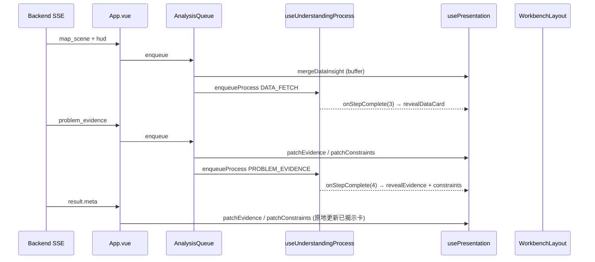

# frontend-v2 架构说明

## 定位

`frontend-v2` 在保留 v1 **叙事流水线**（`AnalysisQueue`、二次确认、Skill 固化）的前提下，采用 **GIS 主战场 + 推理证据侧栏 + 理解过程** 三栏工作台：

```
┌──────────────────────────┬─────────────────┬─────────────────┐
│  GIS 全屏（主战场）         │ 推理证据（Insight）│ 理解过程         │
│  · 分向/保护 Marker        │ · 运行数据（单卡）  │ · 8 步时间轴     │
│  · 渠化小窗（右下）         │ · 问题验证        │ · 打字动画       │
│  · HUD 指标（地图角）       │ · 治理边界        │                 │
└──────────────────────────┴─────────────────┴─────────────────┘
```

证据卡片贴在理解过程**左侧**，按流水线步骤**依次揭示**，出现后**常驻不消失**。

## 核心模块

| 模块 | 路径 | 职责 |
|------|------|------|
| Presentation Store | `composables/usePresentation.ts` | 证据缓冲、按步骤揭示、单卡合并 |
| WorkbenchLayout | `components/workbench/WorkbenchLayout.vue` | GIS \| 证据 \| 过程 三栏 |
| InsightStack | `components/insight/InsightStack.vue` | 证据卡纵向堆叠 |
| DataMetricsCard | `components/insight/DataMetricsCard.vue` | 运行数据（合并为一张） |
| EvidenceStackCard | `components/insight/EvidenceStackCard.vue` | 问题验证 |
| ConstraintStackCard | `components/insight/ConstraintStackCard.vue` | 治理边界 |
| ChannelizationMiniWindow | `components/channelization/ChannelizationMiniWindow.vue` | 渠化小窗 |
| MapStage | `components/MapStage.vue` | GIS + Marker + HUD |
| App | `App.vue` | SSE 编排、二次确认、Skill 固化 |

## 流水线步骤（8 步）

索引见 `constants.ts` → `STEP_INDICES`：

0 理解 → 1 路口 → 2 认知 → 3 数据 → **4 问题验证** → 5 规则 → 6 建议 → 7 固化

## 证据揭示时序（与理解过程对齐）

| 理解过程步骤 | 证据卡 | 触发时机 |
|-------------|--------|----------|
| 获取数据（3） | 运行数据 | 该步打字**结束**后揭示；此前指标仅写入 `dataInsightBuffer` |
| 问题验证（4） | 问题验证 + 治理边界 | 该步打字**结束**后揭示；此前仅 `patchEvidence` / `patchConstraints` |

**原则**：SSE / `result.meta` 只**缓冲数据**，不抢跑出卡；`useUnderstandingProcess.onStepComplete` 驱动 `revealInsightsForProcessStep`。

### 运行数据合并

多个 `map_scene` / `update_metrics` 的 HUD 指标合并为**一张**运行数据卡：按 `label` 去重更新，不重复追加同类型卡片。

### map_scene 处理顺序

```text
narration 入队 → applySceneHighlight（合并 HUD 到 buffer）→ await whenProcessIdle → pushMapAction
```

保证指标写入发生在对应旁白步骤完成之前，揭示发生在步骤 `onStepComplete` 之后。

## 数据流



## 与 v1 差异

- 端口默认 **5568**（v1 为 5567），可并行联调
- 证据/约束为**结构化侧栏卡片**，不再仅嵌入 Markdown 推理文本
- 渠化改为右下角小窗，GIS 始终全屏
- 保护方向 link 描边 + 地图 evidence/protected Marker

## 相关后端文档

- `backend/docs/FRONTEND_EVIDENCE_INTEGRATION.md`
- `backend/docs/API.md`
