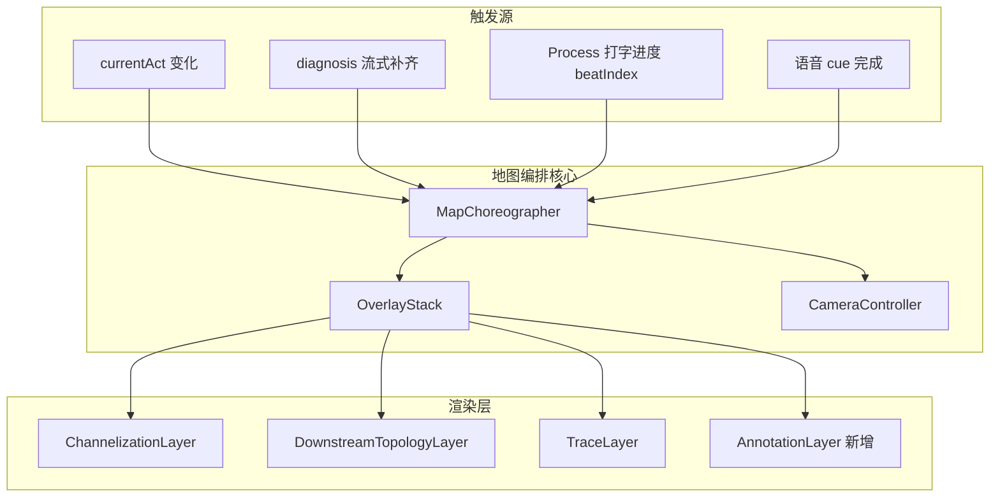

# 计划 29 · 地图运镜、特效与文字标注编排优化

> 需求：`needs/29-地图运镜与视觉编排优化.md`  
> 分支：`20260711160000-29-地图运镜与视觉编排优化`

---

## 一、现状诊断（代码级）

### 1.1 镜头

```text
act3 ──zoom 18, pitch 0──┐
act4 ──zoom 18, pitch 10─┤  五幕同质，观众感知「地图没动」
act6 ──zoom 18, pitch 10─┤
act7 ──zoom 18, pitch 45─┤
act8 ──zoom 18, pitch 20─┘
```

- `MapController.applyScene` 每次 `clear()` 后重绘（`MapController.ts:122`），需求 8 FR-7 未实现。
- `moveCamera` 仅 `flyTo` 中心点，**无 fitBounds**（多节点场景 act4/5/7）。
- `setPitch` 在 flyTo 前同步设置，**无 pitch 插值**，俯仰切换生硬。
- `panToVisualCenter` 固定 X 偏移 -120px，未随 fitBounds 结果调整。

### 1.2 标注与特效

| 能力 | 现状 | 剧本期望 |
|------|------|----------|
| 问题进口高亮 | 路口虚线框（全向） | 东向西进口道 + 直行箭头亮起 |
| 排队/饱和 | HUD 面板 + 径向 metric marker | 进口道旁 callout + 排队线 |
| 本路口 vs 下游 | 2 个 pulseMarker | 双节点 callout + 对比连线 + 指标 |
| 成因空间 | 同点堆叠 case_ref | 主因进口 + 下游 + 案例分散标注 |
| 控制范围 | 3 色 pulse + 虚线 | 控流点/保护点/风险边界/协调范围 |
| 配时预览 | 单 marker 文本 | 各相位 arm 上 Δ秒 badge |

### 1.3 叙事同步

- `AMapProvider` 在 `currentAct` 变化时一次性 `applyScene(..., replayCamera: true)`。
- Process 打字进度 (`useTimeline` / `ProcessPanel`) 与地图 **无耦合**。
- 语音 `voiceCueForAct` 与地图 beats **无对齐**。

---

## 二、设计原则

1. **真源驱动**：几何、坐标、指标、phase_id 一律来自后端；前端只做 layout offset（像素级）与动画。
2. **镜头服务叙事**：每幕至少一个**可辨识的镜头变化**（zoom / pitch / center / bounds 四选一以上）。
3. **分拍揭示**：地图不抢跑旁白；默认 2–4 拍/幕，每拍 300–600ms。
4. **层叠不硬切**：persistent + ephemeral 分层；换幕保留上下文，证据层差量更新。
5. **降级友好**：`prefers-reduced-motion`、缺坐标 `available:false` 时静态降级，不阻塞步骤推进。

---

## 三、架构



### 3.1 新增模块

| 模块 | 路径 | 职责 |
|------|------|------|
| `CameraController` | `map/CameraController.ts` | 从 `MapController.moveCamera` 抽出；支持 fitBounds、microDolly、pitchLerp |
| `OverlayStack` | `map/OverlayStack.ts` | id → overlay 注册表；diff/patch/fadeOut |
| `AnnotationLayer` | `map/AnnotationLayer.ts` | 统一渲染 AnnotationSpec（callout/badge/connector/zone） |
| `MapChoreographer` | `map/MapChoreographer.ts` | 读 beats 配置，调度 camera + overlay reveal |
| `mapChoreography.ts` | `config/mapChoreography.ts` | 各 act evidence stage 的 beats 定义 |
| `mapAnnotations.ts` | `map/mapAnnotations.ts` | 后端 map_scenes → AnnotationSpec[] 纯函数 |

### 3.2 MapController 瘦身

- `applyScene` 改为：`choreographer.runAct(scene, resp, opts)`。
- 保留 `draw*` 方法作数据源适配，逐步迁入 `AnnotationLayer`。

---

## 四、镜头语言详细设计

### 4.1 扩展 `amapUtils.ts`

```typescript
// 纯函数 + 单测
fitBoundsForNodes(map, nodes: LngLat[], padding: FitPadding): Promise<void>
microDollyToApproach(map, center, bearingDeg, zoomDelta): Promise<void>
lerpPitch(map, from, to, duration): Promise<void>
```

**fitBoundsForNodes**：收集 act 可见节点坐标 → `map.setBounds`（AMap `setBounds` + animation）→ `panToVisualCenter` 校正侧栏占位。

**microDollyToApproach**：从 `channelization_map.links` 中按 `ticket.direction` 选 inLink bearing，offset center 沿 bearing 反方向 30–50m，zoom +0.3（上限 18.5）。

### 4.2 分幕运镜表（更新 ACT_DEFS / camera_movement.md）

| 幕 | kind | zoom | pitch | 新增运镜 |
|----|------|------|-------|----------|
| act3 | lane | 18 | 0→15 | drill + microDolly(进口) + pitchLerp |
| act4 | lane | 17.8 | 12 | fitBounds(目标, 下游) 或 pan 下游 40% |
| act5 | trace | 17 | 50 | fitBounds(溯源网络) + 默认展开 top share 标签 |
| act6 | lane | 18 | 10 | microDolly(进口) + 略增 contrast |
| act7 | control | 17.5 | 45 | fitBounds(控制点集) |
| act8 | lane | 18 | 20 | 保持中心，channelization highlight 驱动 |
| act9 | corridor | 17 | 50 | smoothPullback + 溯源层 opacity 淡出 |

> act4 zoom 从 18 降至 17.8 是为 fitBounds 留出双节点构图空间，仍 ≥ ARTERIAL 语义（局部对比，非干线抬升）。

### 4.3 pitch 插值

- 换幕时若 `|Δpitch| > 5`：在首个 flyTo 的 duration 内分 3 步 `setPitch`（requestAnimationFrame），避免与 zoom 动画冲突。

---

## 五、标注体系

### 5.1 AnnotationSpec（前端类型）

```typescript
type AnnotationSpec = {
  id: string
  kind: 'callout' | 'badge' | 'connector' | 'zone' | 'pulse'
  position: [number, number] | null  // null → zone 用 path
  path?: [number, number][]
  title: string
  subtitle?: string
  value?: string
  severity?: 'high' | 'medium' | 'low'
  color?: string
  layout?: 'above' | 'right' | 'offset'
  offsetPx?: [number, number]
  persistent?: boolean  // 跨幕保留
}
```

### 5.2 后端契约扩展（`act_map_enrichment.py`）

| 字段 | 用途 | 真源 |
|------|------|------|
| `diagnosis_compare.connector_path` | 目标→下游对比连线 | 已有 turn_traces.path 或 dim_link |
| `diagnosis_compare.metric_diff` | 排队/饱和 diff 文案 | metrics vs pd.metrics |
| `cause_spatial.annotations[].layout_index` | 案例径向分散 0..n | 规则生成，坐标仍用真源点+offset 语义 |
| `control_scope_map.risk_boundary` | 风险区域 polygon | 若有协调节点 coord 序列则连线闭合，否则省略 |
| `plan_preview.phase_changes[].arm_bearing` | 渠化 arm 匹配 | timing.phase_stage_id → channelization arm angle |

**禁止**：无 coord 时编造 polygon；`risk_boundary.available: false` 降级。

### 5.3 渠化层增强（`ChannelizationLayer`）

- `highlightArm(direction, movement)`：arm 边线加粗 + 箭头动画（CSS `@keyframes arm-flow`）。
- `badgeOnArm(arm, text, severity)`：act8 plan_preview 调用。
- act3 进入时自动 `highlightArm(ticket.direction, ticket.movement)`。

---

## 六、分拍编排（mapChoreography.ts）

```typescript
export const CHOREOGRAPHY: Record<EvidenceStage, Beat[]> = {
  overflow_validation: [
    { at: 'camera', action: 'drillAndMicroDolly' },
    { at: 'beat', index: 0, action: 'reveal', layers: ['channelization', 'approachHighlight'] },
    { at: 'beat', index: 1, action: 'reveal', layers: ['metricCallouts'] },
    { at: 'beat', index: 2, action: 'reveal', layers: ['diagnosisCompare'] },
  ],
  downstream_topology: [
    { at: 'camera', action: 'fitBoundsTargetDownstream' },
    { at: 'beat', index: 0, action: 'reveal', layers: ['downstreamTopology'] },
    { at: 'beat', index: 1, action: 'reveal', layers: ['diagnosisCompare'] },
  ],
  // ... flow_trace / cause_annotation / control_scope / plan_output
}
```

**beat index 来源**：`ProcessPanel` 已有打字段落数组 → 暴露 `narrationBeatIndex` 至 store；或按 `lines.length` 与 `typedCharCount` 估算。

**与语音对齐**：每幕最后一拍可在 `waitForVoiceBarrier` 之后触发（需求 26 R5），避免标注先于语音结论。

---

## 七、OverlayStack 生命周期

```typescript
class OverlayStack {
  patch(specs: AnnotationSpec[], opts: { fadeMs?: number }): void
  remove(ids: string[], fadeMs?: number): void
  clearEphemeral(): void  // 仅移除 persistent=false
  dispose(): void
}
```

**applyScene 新流程**：

1. 计算本幕 policy + specs
2. `overlayStack.patch(specs)` — 差量
3. `cameraController.run(scene)` — 若 `replayCamera && !userInteracted`
4. `choreographer.startBeats()` — 分拍 reveal

**跨幕 persistent**：`intersectionFrame`（虚线框）、`channelization L0` 标记 `persistent: true`，act3–8 不 remove。

---

## 八、分阶段实施

### Phase 1 · 镜头与 fitBounds（高感知，3d）

- [x] `amapUtils`: `fitBoundsForPoints`, `microDollyToApproach`（`lerpPitch` 仍待）
- [x] act4/5/7 fitBounds + act3 microDolly（仍嵌在 `MapController`，未抽 `CameraController`）
- [x] 更新 `camera_movement.md` + 相关 camera 单测
- [x] act3 `ChannelizationLayer.highlightApproach`

### Phase 2 · 标注统一（3d）

- [ ] `AnnotationLayer` + `mapAnnotations.ts`
- [ ] 重构 `drawDiagnosisCompare` / `drawCauseAnnotations` / `drawPlanPreview`
- [ ] 后端 enrichment 扩展 + pytest
- [ ] `capture_frontend_mock.py` 重采 fixture

### Phase 3 · 分拍编排（2d）

- [ ] `mapChoreography.ts` + `MapChoreographer`
- [ ] store 暴露 `narrationBeatIndex`
- [ ] ProcessPanel → store beat 同步

### Phase 4 · OverlayStack 过渡（2d）

- [ ] 实现 diff/fade；移除 applyScene 硬 clear
- [ ] persistent 层策略
- [ ] 流式 patch 单测

---

## 九、测试

```bash
# 后端
PYTHONPATH=. .venv/bin/python -m pytest tests/test_act_map_enrichment.py -q

# 前端
cd frontend && npm test -- camera map-choreography overlay-stack map-annotations
cd frontend && npm run build
```

**手动验收**：`VITE_MOCK=1` 跑通 Case1 九幕，录屏 act3→act8 切换；核对 zoom 指示器与 fitBounds 构图。

---

## 十、风险与降级

| 风险 | 缓解 |
|------|------|
| fitBounds 与侧栏占位冲突 | fitBounds 后强制 `panToVisualCenter(-120)` |
| AMap setBounds API 差异 | 封装 + 单测 mock；失败时回退 flyTo 中心 |
| beats 与 SSE 到达顺序竞态 | beat 仅前端门控；数据未到则 skip 该 layer |
| 性能（多层动画） | act 切换 dispose 粒子；reduced-motion 关闭 rAF |

---

## 十一、文档同步

- `docs/design/camera_movement.md` — 增补 §fitBounds / §microDolly / §choreography
- `docs/design/interaction_logic.md` — §地图分拍揭示
- `docs/剧本字段-API对照.md` — 新增 map_scenes 字段
